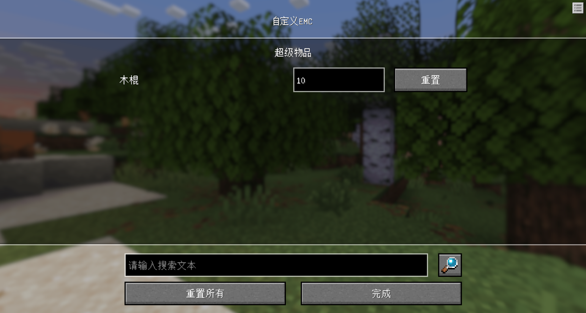

## <center>索引</center>

|                          接口                           |<div style="width: 3.5em">端</div>|描述|
|:-----------------------------------------------------:|:-:|:-:|
|                 [OpenTips](#opentips)                 |<font color=blue>客户端</font>|打开提示弹窗|
|                [CloseTips](#closetips)                |<font color=blue>客户端</font>|关闭提示窗口|
|        [RegisterDebugTool](#registerdebugtool)        |<font color=blue>客户端</font>|注册自定义调试工具|
|       [CreateFormByJsonId](#createformbyjsonid)       |<font color=blue>客户端</font>|根据配置文件创建自定义表单|
|          [CreateTipsTitle](#createtipstitle)          |<font color=blue>客户端</font>|创建并显示一个提示标题|
|       [CreateEntityChatUI](#createentitychatui)       |<font color=blue>客户端</font>|创建实体自言自语UI|
|        [OpenDebugToolMenu](#opendebugtoolmenu)        |<font color=blue>客户端</font>|打开指定调试工具的菜单|
|       [CloseDebugToolMenu](#closedebugtoolmenu)       |<font color=blue>客户端</font>|关闭已打开的调试工具的菜单|
| [RegisterModSettingConfig](#registermodsettingconfig) |<font color=blue>客户端</font>|注册模组设置配置|

------------

### <a id="opentips"></a>OpenTips
<font color=blue>客户端</font><br>
- 描述<br>
  打开提示弹窗

- 参数<br>

|参数名|数据类型|说明|
|:-:|:-:|:-:|
|Object|object|触发事件所返回的函数所在的实例，传入示例：clientApi.GetSystem(config.ModName, config.ClientSystemName)|
|Title|str|标题|
|Content|str|内容|
|LeftButtonText|str|左边按钮显示的文字|
|LeftButton|str|左边按钮触发事件所返回的函数名称，默认为None，则不显示按钮|
|RightButtonText|str|右边按钮显示的文字|
|RightButton|str|右边触发事件所返回的函数名称，默认为None，则不显示按钮|
|CloseButton|str|默认关闭按钮，默认为Left，可选Right,None，表示左边的按钮是关闭|

- 返回值<br>
无

- 备注<br>
无

- 示例
```python
self.LA = self.GetLASys('密钥')
self.LA.OpenTips(self, '无法设置', '这个模组没有设置内容', LeftButtonText='我知道了', LeftButton='CloseTips')
```
------------

### <a id="closetips"></a>CloseTips
<font color=blue>客户端</font><br>
- 描述<br>
  关闭提示窗口

- 参数<br>
无

- 返回值<br>
无

- 备注<br>
无

- 示例
无

------------
### <a id="registerdebugtool"></a>RegisterDebugTool
<font color=blue>客户端</font><br>
- 描述<br>
  注册自定义调试工具

- 参数

|参数名|数据类型|说明|
|:-:|:-:|:-:|
|Name|str|工具名称|
|IconPath|str|工具图标路径|
|Info|str|工具介绍信息，支持富文本|
|Plat|str|适用平台|
|Version|str|版本号|
|ToolMenu|dictlist|工具菜单列表|

- 返回值<br>
无

- 备注<br>
  - 工具菜单列表数据介绍：

  |参数名|数据类型|说明|
  |:-:|:-:|:-:|
  |ButtonName|str|菜单名称|
  |ModName|str|函数所在脚本模组名称|
  |ClientSystemName|str|函数所在脚本模组客户端名称|
  |FunctionName|str|函数名称(接收一个可能的参数)|

  - 函数名称(接收一个可能的参数)<br>
  执行该菜单函数会有两种方式：快捷键方式、触控点击方式。当触控点击方式时会返回一个'Button'(str)参数用于区分操作方式。如果是快捷键方式，则需要关闭快捷键模式，则添加如下代码：

```python
if not args:
  self.LA.OpenDebugToolsKeyBinding()
```

- 示例
```python
def ClientInit(self):
  self.LA.RegisterDebugTool('新增工具', 'textures/ui/research_2', '简单的介绍', '不支持IOS', '1.0.0', [
      {
          'ModName': 'Demo',
          'ClientSystemName': 'DemoClientSystem',
          'ButtonName': '发送消息按钮',
          'FunctionName': 'Msg'
      },
      {
          'ModName': 'Demo',
          'ClientSystemName': 'DemoClientSystem',
          'ButtonName': '弹出提示按钮',
          'FunctionName': 'OpenTips'
      }
  ])

def Msg(self, *args):
  if not args:
    self.LA.OpenDebugToolsKeyBinding()
```
------------
### <a id="createformbyjsonid"></a>CreateFormByJsonId
<font color=blue>客户端</font><br>
- 描述<br>
  根据配置文件创建自定义表单

- 参数

|参数名|数据类型|说明|
|:-:|:-:|:-:|
|JsonId|str|配置组件JsonId|
|ExtraData|dict|额外参数、用于继承该配置表单加以修改，默认为None|

- 返回值<br>
无

- 备注<br>
  - 额外参数、用于继承该配置表单加以修改

  |参数名|数据类型|说明|
  |:-:|:-:|:-:|
  |Title|str|表单名称|
  |CommitName|str|提交按钮名称|
  |CommitFunction|function, str|提交函数实例、提交函数名称|
  |Content|list|与表单配置组件一样的key, value|

- 示例
```python
self.CreateFormByJsonId('form/output_building_form', {
  'Title': '新表单',
  'Content': [
    {
      'key': 'name',
      'type': 'input_text',
      'infomation': '实体名称'
    }
  ]
})
```
------------
### <a id="createtipstitle"></a>CreateTipsTitle
<font color=blue>客户端</font><br>
- 描述<br>
  创建并显示一个提示标题

- 参数

|参数名|数据类型|说明|
|:-:|:-:|:-:|
|Content|str|提示标题显示内容|
|SoundName|str|提示标题显示时播放的音效，默认为random.levelup|

- 返回值<br>
无

- 备注<br>
无

- 示例
无
------------
### <a id="createentitychatui"></a>CreateEntityChatUI
<font color=blue>客户端</font><br>
- 描述<br>
  创建实体自言自语UI

- 参数

|参数名|数据类型|说明|
|:-:|:-:|:-:|
|EntityId|str|实体id|
|Content|str|说话的文字内容|
|StopTimer|float|关闭延时，默认为3|
|SoundName|str|播放音效名称，默认为None|
|Scale|int|大小类型，可选0, 1，默认为1|
|Offset|tuple|偏移坐标，默认为(0, 1, 0)|

- 返回值<br>
    实体UI Object (object)

- 备注<br>
无

- 示例
无
------------
### <a id="opendebugtoolmenu"></a>OpenDebugToolMenu
<font color=blue>客户端</font><br>
- 描述<br>
  打开指定调试工具的菜单

- 参数

|参数名|数据类型|说明|
|:-:|:-:|:-:|
|DebugDict|dict|该调试工具的数据|

- 返回值<br>
无

- 备注<br>
无

- 示例
无
------------
### <a id="closedebugtoolmenu"></a>CloseDebugToolMenu
<font color=blue>客户端</font><br>
- 描述<br>
  关闭已打开的调试工具的菜单

- 参数<br>
无

- 返回值<br>
无

- 备注<br>
无

- 示例
无

------------
### <a id="registermodsettingconfig"></a>RegisterModSettingConfig
<font color=blue>客户端</font><br>
- 描述<br>
  注册模组设置配置

- 参数

|参数名|数据类型|说明|
|:-:|:-:|:-:|
|LingmienAetherModName|str|InitLingmienAetherMod接口中的ModName|
|SettingConfigDict|dict|设置配置数据|

- 返回值<br>
无

- 备注<br>
  - SettingConfigDict设置配置数据说明
  
  |参数名|   数据类型   |                 说明                  |
  |:-:|:--------:|:-----------------------------------:|
  |Title|   str    |               设置标题名称                |
  |ModName|   str    |      脚本模组名称，固定使用config.ModName      |
  |ClientSystemName|   str    | 脚本客户端名称，固定使用config.ClientSystemName |
  |CloseFunctionName|   str    |         保存数据后触发的该模组客户端函数名称          |
  |SettingList| dictlist |               设置配置列表                |

  - SettingList设置配置列表中的dict说明
  
  - 开关按钮
  
  |参数名| 数据类型 |                              说明                               |
  |:-:|:----:|:-------------------------------------------------------------:|
  |Name| str  |                           该项设置的中文名称                           |
  |Key| str  | 该项设置的存储Key，用于[获取](/docs/data.md#getmodconfigvalue)，须在该模组设置中唯一 |
  |ControlType| str  |               可选button, button_locked(锁定，无法交互)               |
  |ValueType| bool |                           固定填写为bool                           |
  |DefaultValue| bool |                            默认是否开启                             |
  | IsSaveServer | bool |         该项设置的控件是否存储并用于服务端(用于同步联机状态下所有玩家的设置)，默认为False          |
  |IsOnce| bool |                    该项设置的控件是否为一行一个，默认为False                    |
  |Tips| str  |              该项设置的提示信息，默认为None(此项为1.2.1.5版本后生效)               |

  - 选项按钮

  |参数名| 数据类型 |                              说明                               |
  |:-:|:----:|:-------------------------------------------------------------:|
  |Name| str  |                           该项设置的中文名称                           |
  |Key| str  | 该项设置的存储Key，用于[获取](/docs/data.md#getmodconfigvalue)，须在该模组设置中唯一 |
  |ControlType| str  |               可选button, button_locked(锁定，无法交互)               |
  |ValueType| list  |                           固定填写为list                           |
  |DefaultValue| list  |      候选项其中第一个选项则为默认值       |
  | IsSaveServer | bool |         该项设置的控件是否存储并用于服务端(用于同步联机状态下所有玩家的设置)，默认为False          |
  |IsOnce| bool |                    该项设置的控件是否为一行一个，默认为False                    |
  |Tips| str  |              该项设置的提示信息，默认为None(此项为1.2.1.5版本后生效)               |

  - 滑动条按钮

  |参数名| 数据类型 |                              说明                               |
  |:-:|:----:|:-------------------------------------------------------------:|
  |Name| str  |                           该项设置的中文名称                           |
  |Key| str  | 该项设置的存储Key，用于[获取](/docs/data.md#getmodconfigvalue)，须在该模组设置中唯一 |
  |ControlType| str  |                          固定填写为slider                          |
  |ValueType| any  |                         可选float, int                          |
  |DefaultValue| any  |                        0~1的浮点数代表滑动条百分比                        |
  | IsSaveServer | bool |         该项设置的控件是否存储并用于服务端(用于同步联机状态下所有玩家的设置)，默认为False          |
  |IsOnce| bool |                    该项设置的控件是否为一行一个，默认为False                    |
  |Tips| str  |              该项设置的提示信息，默认为None(此项为1.2.1.5版本后生效)               |
  |ValueLimit| list |    表示实际值范围，例如[30, 100]则只会设置30~100之间的值     |

  - 表单按钮

  |参数名| 数据类型 |                              说明                               |
  |:-:|:----:|:-------------------------------------------------------------:|
  |Name| str  |                           该项设置的中文名称                           |
  |Key| str  | 该项设置的存储Key，用于[获取](/docs/data.md#getmodconfigvalue)，须在该模组设置中唯一 |
  |ControlType| str  |                           固定填写为form                           |
  |DefaultValue| list  |                           表单的JsonId                           |
  | IsSaveServer | bool |         该项设置的控件是否存储并用于服务端(用于同步联机状态下所有玩家的设置)，默认为False          |
  |IsOnce| bool |                    该项设置的控件是否为一行一个，默认为False                    |
  |Tips| str  |              该项设置的提示信息，默认为None(此项为1.2.1.5版本后生效)               |

  - 函数按钮

  |参数名|   数据类型   |                              说明                               |
  |:-:|:--------:|:-------------------------------------------------------------:|
  |Name|   str    |                           该项设置的中文名称                           |
  |Key|   str    | 该项设置的存储Key，用于[获取](/docs/data.md#getmodconfigvalue)，须在该模组设置中唯一 |
  |ControlType|   str    |                         固定填写为function                         |
  |IsOnce|   bool   |                    该项设置的控件是否为一行一个，默认为False                    |
  |Tips|   str    |              该项设置的提示信息，默认为None(此项为1.2.1.5版本后生效)               |
  |FunctionInstance| function |                 绑定该按钮点击事件函数(携带一个参数：本函数按钮dict)                 |

  - 数据列表按钮，只支持纯数字，自带搜索功能。

  

  |        参数名         | 数据类型 |                              说明                               |
  |:------------------:|:----:|:-------------------------------------------------------------:|
  |        Name        | str  |                           该项设置的中文名称                           |
  |        Key         | str  | 该项设置的存储Key，用于[获取](/docs/data.md#getmodconfigvalue)，须在该模组设置中唯一 |
  |    ControlType     | str  |                         固定填写为dictlist                         |
  |       DictList        | list |                             数据列表                              |

    - 数据列表

  |     参数名     | 数据类型 |                    说明                    |
  |:-----------:|:----:|:----------------------------------------:|
  |    Type     | str  |              可选title, list               |
  |     Value     | str  |            当Type为title的时候需填写             |
  | Name | str  |            当Type为title的时候需填写             |
  |  Key   | str | 当Type为title的时候需填写，存储数据Key，本dictlist内需要唯一 |
  |  DefaultValue   | str |          当Type为title的时候需填写，默认值           |

```python
Accessibility = {
  'Title': '辅助功能设置',
  'ModName': config.ModName,
  'ClientSystemName': config.ClientSystemName,
  'CloseFunctionName': 'CloseVideoSetting',  # 关闭该设置时，输出的函数
  'SettingList': [
      {
          'Name': '自定义EMC',
          'Key': 'CustomItemEMC',
          'ControlType': 'dictlist',
          'DictList': [
              {
                  'Type': 'title',
                  'Value': '超级物品'
              },
              {
                  'Name': '木棍',
                  'Type': 'list',
                  'Key': 'stick',
                  'DefaultValue': 10
              },
              {
                  'Name': '泥土',
                  'Type': 'list',
                  'Key': 'dirt',
                  'DefaultValue': 5
              }
          ],
      }
  ]
}
# 假设是上面这样的数据列表，那么获取数据时会返回(如果用户修改了)
print LASystem.GetModConfigValue(config.ModName, 'CustomItemEMC')
# 结果如下
Result = {
  'sitck': 10,
  'dirt': 5
}
```

  - 单行输入按钮

  |        参数名         | 数据类型 |                              说明                               |
  |:------------------:|:----:|:-------------------------------------------------------------:|
  |        Name        | str  |                           该项设置的中文名称                           |
  |        Key         | str  | 该项设置的存储Key，用于[获取](/docs/data.md#getmodconfigvalue)，须在该模组设置中唯一 |
  |    ControlType     | str  |                          固定填写为input                           |
  |       Title        | str  |                             输入框标题                             |
  |       IsOnce       | bool |                    该项设置的控件是否为一行一个，默认为False                    |
  |        Tips        | str  |              该项设置的提示信息，默认为None(此项为1.2.1.5版本后生效)               |
  | CommitFunctionName | str  |      绑定提交按钮点击事件函数(携带一个参数：本函数按钮dict和Key为Content的输入框内容str)      |

  - 子菜单按钮
  
  |参数名| 数据类型 |                                          说明                                          |
  |:-:|:----:|:------------------------------------------------------------------------------------:|
  |Name| str  |                                      该项设置的中文名称                                       |
  |Key| str  |            该项设置的存储Key，用于[获取](/docs/data.md#getmodconfigvalue)，须在该模组设置中唯一             |
  |ControlType| str  |                                      固定填写为menu                                       |
  |IsOnce| bool |                               该项设置的控件是否为一行一个，默认为False                                |
  |Tips| str  |                          该项设置的提示信息，默认为None(此项为1.2.1.5版本后生效)                          |
  |SettingConfigList| dict |               填写的内容为SettingConfigDict用于创建子设置项               |

- 示例
```python
def ClientInit(self):
    LASystem.RegisterModSettingConfig('测试', {
        'Title': '模组设置',
        'ModName': config.ModName,
        'ClientSystemName': config.ClientSystemName,
        'CloseFunctionName': 'SetModSettingConfig',
        'SettingList': [
            {
                'Name': '子设置...',
                'Key': 'MouseSetting',
                'ControlType': 'menu',
                'SettingConfigList': {
                  'Title': '这是一个子设置',
                  'ModName': config.ModName,
                  'ClientSystemName': config.ClientSystemName,
                  'CloseFunctionName': 'SetModSettingConfig',
                  'SettingList': [
                    {
                        'Name': '浮点滑动条',
                        'Key': 'DemoFloatSlider',
                        'ControlType': 'slider',
                        'ValueType': float,
                        'ValueLimit': [0, 5],
                        'DefaultValue': 0.35
                    },
                  ]
                }
            },
            {
                'Name': '画质等级',
                'Key': 'Qul',
                'ControlType': 'button',
                'ValueType': list,
                'DefaultValue': ['中画质', '高画质', '低画质']
            },
            {
                'Name': '开启光影',
                'Key': 'IsShader',
                'ControlType': 'button',
                'ValueType': bool,
                'DefaultValue': True
            },
            {
                'Name': '画质亮度',
                'Key': 'Light',
                'ControlType': 'slider',
                'ValueType': int,
                'ValueLimit': [0, 100],
                'DefaultValue': 0.45
            },
        ]
    })

def SetModSettingConfig(self, Data):
    print Data

```