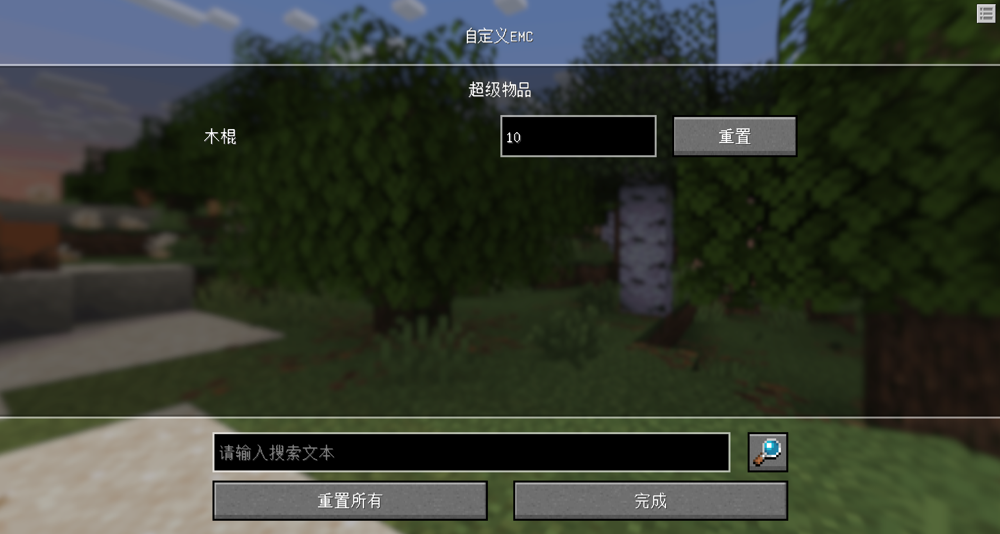

## <center>索引</center>
- [前往附件](#前往附件)

|接口|<div style="width: 3.5em">端</div>|描述|
|:-:|:-:|:-:|
|[InitLingmienAetherMod](#initlingmienaethermod)|<font color=red>服务端</font>|[必用]注册灵免以太模组信息|
|[SetIsDisable](#setisdisable)|<font color=red>服务端</font>|服务端设置，需要在服务端初始化后直接调用|
|[RegisterDebugTool](#registerdebugtool)|<font color=blue>客户端</font>|注册自定义调试工具|
|[CreateFormByJsonId](#createformbyjsonid)|<font color=blue>客户端</font>|根据配置文件创建自定义表单|
|[GetServerIsDisable](#getserverisdisable)|<font color=blue>客户端</font>|获取服务端设置信息|
|[AddObjectFunction](#addobjectfunction)|<font color=blue>客户端</font>|给实例添加函数库|
|[GetLingmienAetherManifest](#getlingmienaethermanifest)|<font color=blue>客户端</font>|获取灵免以太函数库清单|
|[UseServerApi](#useserverapi)|<font color=blue>客户端</font>|使用服务端接口|
|[UseClientApi](#useclientapi)|<font color=red>服务端</font>|使用客户端接口，但无法获得返回值|
|[GetIsStart](#getisstart)|<font color=blue>客户端</font>|获取玩家是否处于进入游戏状态(这里指进入灵免以太主界面后是否点击了"单人游戏")|
|[BindGameHighTickFunction](#bindgamehightickfunction)|<font color=blue>客户端</font>|绑定游戏高Tick函数|
|[Lerp](#lerp)|<font color=blue>客户端</font>|常规非线性计算|
|[SLerp](#slerp)|<font color=blue>客户端</font>|角度形非线性计算|
|[GetLingmienAetherMod](#getlingmienaethermod)|<font color=red>服务端</font>|获取已注册的灵免以太模组数据|
|[GetTwoPosLength](#gettwoposlength)|<font color=orange>双端</font>|获取目标坐标与第一坐标之间的距离|
|[DeltaDateTime](#deltadatetime)|<font color=orange>双端</font>|计算日期差值,FirstDate-SecondDate|
|[SplitListByQuantity](#splitlistbyquantity)|<font color=orange>双端</font>|按数量拆分list|
|[SortListByNumberMagnitude](#sortlistbynumbermagnitude)|<font color=orange>双端</font>|根据数字排序由Dict元素组成的List--[{}, {}, ...]|
|[SortDictByNumberMagnitude](#sortdictbynumbermagnitude)|<font color=orange>双端</font>|据数字排序由Dict元素组成的Dict--{'x':{}, 'y':{}, ...}|
|[GetDictExtremeValueKey](#getdictextremevaluekey)|<font color=orange>双端</font>|获取Dict中指定Key的极值对应的键--{'x':float, 'y':float, ...}|
|[GetPlatForm](#getplatform)|<font color=red>服务端</font>|获取服务端运行环境|
|[BindKeyPress](#bindkeypress)|<font color=blue>客户端</font>|绑定或取消绑定键盘按键|
|[BindGamepadTriggerPress](#bindgamepadtriggerpress)|<font color=blue>客户端</font>|绑定手柄扳机，右扳机将会屏蔽原版攻击逻辑|
|[BindGamepadKeyPress](#bindgamepadkeypress)|<font color=blue>客户端</font>|绑定手柄按键|
|[GetPlayerCtrl](#getplayerctrl)|<font color=blue>客户端</font>|获取玩家的操控模式|
|[ResetAutoCtrl](#resetautoctrl)|<font color=blue>客户端</font>|重置到自动控制模式|
|[QueryGet](#queryget)|<font color=blue>客户端</font>|获取自定义Molang函数的值|
|[QueryMolangGet](#querymolangget)|<font color=blue>客户端</font>|获取原版Molang函数的值|
|[QuerySet](#queryset)|<font color=blue>客户端</font>|设置自定义Molang函数的值|
|[Msg](#msg)|<font color=blue>客户端</font>|发送消息|
|[ServerMsg](#servermsg)|<font color=red>服务端</font>|发送消息|
|[RegisterEntityChat](#registerentitychat)|<font color=red>服务端</font>|注册实体自定义聊天|
|[ModelAnimationControllerInit](#modelanimationcontrollerinit)|<font color=blue>客户端</font>|骨骼模型动画控制器系统初始化|
|[ModelAnimationControllerTick](#modelanimationcontrollertick)|<font color=blue>客户端</font>|骨骼模型动画控制器逻辑运行|
|[ModelAnimationControllerTranslateState](#modelanimationcontrollertranslatestate)|<font color=blue>客户端</font>|骨骼模型动画控制器转化新状态并播放动画等|
|[GetModelAnimationControllerStateDictByStateName](#getmodelanimationcontrollerstatedictbystatename)|<font color=blue>客户端</font>|获取骨骼模型动画控制器的状态dict|
|[PlayModelAnimation](#playmodelanimation)|<font color=blue>客户端</font>|播放骨骼模型动画|
|[GetModelAnimationControllerStateTransitionResult](#getmodelanimationcontrollerstatetransitionresult)|<font color=blue>客户端</font>|获取骨骼模型动画控制器状态转化结果dict|
|[EvaluateMolangExpression](#evaluatemolangexpression)|<font color=blue>客户端</font>|获取骨骼模型动画控制器状态的条件转化结果|
|[BindPlayerStartFunction](#bindplayerstartfunction)|<font color=blue>客户端</font>|绑定玩家点击灵免以太主界面进入游戏后的函数|
|[CreateDefaultUI](#createdefaultui)|<font color=blue>客户端</font>|常规UI注册并创建|
|[CreateUIByEntity](#createuibyentity)|<font color=blue>客户端</font>|常规实体UI注册并创建|
|[RegisterUI](#registerui)|<font color=blue>客户端</font>|注册UI，不要重复注册损耗性能！|
|[OpenTips](#opentips)|<font color=blue>客户端</font>|打开提示弹窗|
|[CloseTips](#closetips)|<font color=blue>客户端</font>|关闭提示窗口|
|[GetLingmienAetherUIObject](#getlingmienaetheruiobject)|<font color=blue>客户端</font>|获取灵免以太主界面UI实例|
|[GetUIObject](#getuiobject)|<font color=blue>客户端</font>|获取UI实例|
|[SetButtonUpEvent](#setbuttonupevent)|<font color=blue>客户端</font>|设置按钮弹起回调事件|
|[SetButtonDownEvent](#setbuttondownevent)|<font color=blue>客户端</font>|设置按钮按下回调事件|
|[CloseVisibleAndOpenVisible](#closevisibleandopenvisible)|<font color=blue>客户端</font>|关闭一个控件显示和显示另一个控件|
|[ResetAnimation](#resetanimation)|<font color=blue>客户端</font>|重制UI动画|
|[SetLabelText](#setlabeltext)|<font color=blue>客户端</font>|获取或设置文本控件文字|
|[SetProgressBarValue](#setprogressbarvalue)|<font color=blue>客户端</font>|设置进度条控件的比例|
|[SetImagePath](#setimagepath)|<font color=blue>客户端</font>|设置图像控件显示的图片路径|
|[SetItemRender](#setitemrender)|<font color=blue>客户端</font>|设置物品渲染控件显示的物品内容|
|[SetImageAndTextColor](#setimageandtextcolor)|<font color=blue>客户端</font>|设置图像控件或文本控件的颜色|
|[SetEditText](#setedittext)|<font color=blue>客户端</font>|获取或设置输入框控件文字|
|[SetUIVisible](#setuivisible)|<font color=blue>客户端</font>|获取或设置UI控件的显示|
|[OpenLA](#openla)|<font color=blue>客户端</font>|模拟打开灵免以太主界面|
|[GetScrollViewChildPath](#getscrollviewchildpath)|<font color=blue>客户端</font>|获取滚动列表控件的子控件路径(无法通过绝对路径获取，只能使用该接口，然后使用相对路径获取其绑定的子控件内容)|
|[GetCloneListByDemoPath](#getclonelistbydemopath)|<font color=blue>客户端</font>|根据复制的UI路径获取该Demo复制后的结果列表|
|[CloneUIControl](#cloneuicontrol)|<font color=blue>客户端</font>|复制并粘贴UI到指定路径并指定名字|
|[DeleteUIControl](#deleteuicontrol)|<font color=blue>客户端</font>|删除UI控件|
|[GetScrollViewChildPath](#getscrollviewchildpath)|<font color=blue>客户端</font>|获取滚动列表控件的子控件路径(无法通过绝对路径获取，只能使用该接口，然后使用相对路径获取其绑定的子控件内容)|
|[GetCloneListByDemoPath](#getclonelistbydemopath)|<font color=blue>客户端</font>|根据复制的UI路径获取该Demo复制后的结果列表|
|[CloneUIControl](#cloneuicontrol)|<font color=blue>客户端</font>|复制并粘贴UI到指定路径并指定名字|
|[DeleteUIControl](#deleteuicontrol)|<font color=blue>客户端</font>|删除UI控件|
|[QueryInit](#queryinit)|<font color=blue>客户端</font>|自定义Molang注册并创建|
|[CameraMotionRun](#cameramotionrun)|<font color=blue>客户端</font>|普通视角摇晃运行|
|[ResetCameraMotion](#resetcameramotion)|<font color=blue>客户端</font>|重置镜头跟随|
|[HighCameraMotionRun](#highcameramotionrun)|<font color=blue>客户端</font>|高处视角摇晃运行|
|[GetDeltaCameraMotion](#getdeltacameramotion)|<font color=blue>客户端</font>|获取玩家摄像机运动单位差值|
|[SetPerspective](#setperspective)|<font color=blue>客户端</font>|获取或设置玩家人称视角|
|[ComputePitchYaw](#computepitchyaw)|<font color=blue>客户端</font>|根据两个坐标，计算目标坐标相对于主坐标的俯仰角，偏航角|
|[CameraLookAtTargetRun](#cameralookattargetrun)|<font color=blue>客户端</font>|玩家看向目标坐标视角运动器|
|[GetFrictionAllData](#getfrictionalldata)|<font color=blue>客户端</font>|获取本接口的所有参数|
|[SetPlayerFriction](#setplayerfriction)|<font color=blue>客户端</font>|设置玩家是否有摩擦力|
|[FrictionMath](#frictionmath)|<font color=blue>客户端</font>|摩擦力计算|
|[FrictionPlay](#frictionplay)|<font color=blue>客户端</font>|在客户端Tick调用，用于实现摩擦力效果|
|[ResetFriction](#resetfriction)|<font color=blue>客户端</font>|重置摩擦力|
|[SetPlayerGameMode](#setplayergamemode)|<font color=red>服务端</font>|获取或设置玩家游戏模式|
|[GetPlayerName](#getplayername)|<font color=orange>双端</font>|获取玩家名称|
|[GetPlayerFps](#getplayerfps)|<font color=blue>客户端</font>|获取玩家当前FPS|
|[GetPlayerDimension](#getplayerdimension)|<font color=orange>双端</font>|获取玩家所在维度|
|[GetPlayerPing](#getplayerping)|<font color=orange>双端</font>|获取玩家延迟|
|[SetPlayerRender](#setplayerrender)|<font color=orange>双端</font>|设置玩家自定义渲染，自动广播给所有玩家|
|[ResetPlayerRender](#resetplayerrender)|<font color=orange>双端</font>|重置玩家自定义渲染，自动广播给所有玩家|
|[RealPlaySfx](#realplaysfx)|<font color=blue>客户端</font>|真正的特效播放，不广播则只能自己看到|
|[PlaySfxToEveryBody](#playsfxtoeverybody)|<font color=blue>客户端</font>|播放特效(自动广播)|
|[WorldPlaySfx](#worldplaysfx)|<font color=blue>客户端</font>|真正的在世界中特效播放，不广播则只能自己看到|
|[WorldSfxToEveryBody](#worldsfxtoeverybody)|<font color=blue>客户端</font>|在世界中播放特效(自动广播)|
|[AreaSfx](#areasfx)|<font color=blue>客户端</font>|创建区域包围盒特效|
|[ClearAreaSfx](#clearareasfx)|<font color=blue>客户端</font>|销毁区域包围盒特效|
|[PlaySound](#playsound)|<font color=red>服务端</font>|播放音效(全局)|
|[PlayUISound](#playuisound)|<font color=red>服务端</font>|播放音效(个人)|
|[GetAndAttackRadiusEntities](#getandattackradiusentities)|<font color=red>服务端</font>|获取攻击者周围实体列表并攻击造成伤害|
|[RegisterEntityAbility](#registerentityability)|<font color=red>服务端</font>|注册自定义功能实体|
|[SummonEntityByName](#summonentitybyname)|<font color=red>服务端</font>|根据实体名生成实体|
|[GetEntityPos](#getentitypos)|<font color=orange>双端</font>|获取实体三维坐标|
|[GetAttrMaxValue](#getattrmaxvalue)|<font color=orange>双端</font>|获取实体属性最大值|
|[GetAttrValue](#getattrvalue)|<font color=orange>双端</font>|获取实体属性当前值|
|[SetAttrValue](#setattrvalue)|<font color=red>服务端</font>|修改实体属性当前值或最大值|
|[SetImmuneDamage](#setimmunedamage)|<font color=red>服务端</font>|设置实体无敌|
|[GetOneBlockMaxPos](#getoneblockmaxpos)|<font color=red>服务端</font>|根据XZ来获取顶部方块坐标|
|[GetBlockDictByPos](#getblockdictbypos)|<font color=red>服务端</font>|根据坐标获取方块数据|
|[CheckAndSetBlockByPos](#checkandsetblockbypos)|<font color=red>服务端</font>|根据坐标放置方块，区块未加载则无法放置方块，因此需要使用SetBlockPosList|
|[SetChestReward](#setchestreward)|<font color=red>服务端</font>|设置奖励箱内容|
|[BindCustomBlockInteractFunction](#bindcustomblockinteractfunction)|<font color=red>服务端</font>|绑定自定义方块交互事件函数|
|[BindOnStandOnBlockFunction](#bindonstandonblockfunction)|<font color=red>服务端</font>|绑定实体踩上方块事件函数，触发后会持续Tick执行|
|[BindStepOnBlockFunction](#bindsteponblockfunction)|<font color=red>服务端</font>|绑定实体刚刚踩上方块事件函数|
|[CheckChunkAndSummonEntity](#checkchunkandsummonentity)|<font color=red>服务端</font>|检测区块是否加载并生成实体|
|[GetRecentlyTargetId](#getrecentlytargetid)|<font color=orange>双端</font>|获取某实体(客户端为本玩家)最近的实体Id|
|[GetEntityNameByEntityId](#getentitynamebyentityid)|<font color=orange>双端</font>|根据实体id获取实体名称|
|[SetEntityOnFire](#setentityonfire)|<font color=red>服务端</font>|获取或设置实体当前着火状态|
|[GetEntityChineseName](#getentitychinesename)|<font color=orange>双端</font>|获取实体中文名称|
|[GetEntitySize](#getentitysize)|<font color=orange>双端</font>|获取实体碰撞箱大小|
|[SetEntityScale](#setentityscale)|<font color=red>服务端</font>|设置或获取实体大小倍率|
|[GetRadiusEntities](#getradiusentities)|<font color=orange>双端</font>|获取实体Id的周围的实体列表|
|[SetModRenderAttrByKey](#setmodrenderattrbykey)|<font color=red>服务端</font>|设置存储于实体数据新的值(仅限于本存档)|
|[GetModRenderAttrByKey](#getmodrenderattrbykey)|<font color=orange>双端</font>|获取存储于实体数据的值|
|[LocalConfigData](#localconfigdata)|<font color=blue>客户端</font>|存储或获取本地存储数据|
|[GetModConfigValue](#getmodconfigvalue)|<font color=blue>客户端</font>|获取模组设置的值，没有则返回None|
|[BindPlayerOnHandItemFunction](#bindplayeronhanditemfunction)|<font color=red>服务端</font>|绑定玩家手持某物品的事件函数，需要切换物品后才会触发|
|[CreateLootItem](#createlootitem)|<font color=red>服务端</font>|生成掉落物|
|[ExchangePlayerInv](#exchangeplayerinv)|<font color=red>服务端</font>|交换玩家背包物品位置|
|[GetPlayerSelectInv](#getplayerselectinv)|<font color=red>服务端</font>|获取玩家当前所选择的槽位|
|[GetItemDictByInv](#getitemdictbyinv)|<font color=red>服务端</font>|根据背包类型、槽位来获取物品数据信息|
|[GetAllLoadItems](#getallloaditems)|<font color=red>服务端</font>|获取已经加载的物品id|
|[PlayerUseLA](#playerusela)|<font color=orange>双端</font>|模拟玩家使用灵免以太控制中心物品|
|[StopPlayerUseLA](#stopplayerusela)|<font color=orange>双端</font>|模拟玩家停止使用灵免以太控制中心物品|
|[SetPlayerSelectItem](#setplayerselectitem)|<font color=red>服务端</font>|设置玩家选中的物品槽位|
|[ClearPlayerOnHandItem](#clearplayeronhanditem)|<font color=red>服务端</font>|清除玩家主手物品|
|[GetAllItemDict](#getallitemdict)|<font color=orange>双端</font>|获取类型所有物品数据|
|[SetItemLayer](#setitemlayer)|<font color=red>服务端</font>|设置物品层级贴图|
|[SetPlayerItemByInvPos](#setplayeritembyinvpos)|<font color=red>服务端</font>|根据背包槽位设置玩家物品|
|[RemovePlayerItemByInvPos](#removeplayeritembyinvpos)|<font color=red>服务端</font>|根据背包槽位删除玩家物品|
|[SetPlayerDataInLobby](#setplayerdatainlobby)|<font color=red>服务端</font>|设置联机大厅玩家/服务器存储数据|
|[GetPlayerDataInLobby](#getplayerdatainlobby)|<font color=red>服务端</font>|获取联机大厅玩家/服务器存储数据|
|[BindPlayerBuyItemFunction](#bindplayerbuyitemfunction)|<font color=red>服务端</font>|绑定联机大厅玩家购买商品事件函数|
|[GetPlayerLobbyUID](#getplayerlobbyuid)|<font color=red>服务端</font>|获取玩家联机大厅UID|
|[RegisterCustomLobbyNotice](#registercustomlobbynotice)|<font color=red>服务端</font>|注册自定义联机大厅公告|
|[RegisterLobbyMenuButton](#registerlobbymenubutton)|<font color=blue>客户端</font>|注册自定义联机大厅菜单按钮|
|[RebindMenuButtonFunction](#rebindmenubuttonfunction)|<font color=blue>客户端</font>|重新绑定菜单按钮触发函数|
|[SelectNotice](#selectnotice)|<font color=blue>客户端</font>|打开指定标题公告活动界面|
|[RegisterCustomLobbyPriceType](#registercustomlobbypricetype)|<font color=red>服务端</font>|注册自定义联机大厅货币类型|
|[AddPlayerCoinInLobby](#addplayercoininlobby)|<font color=red>服务端</font>|为已注册的货币进行添加或减少，仅限于联机大厅|
|[RegisterCustomLobbyStore](#registercustomlobbystore)|<font color=red>服务端</font>|注册自定义联机大厅商品，需要提前注册货币|
|[SetLobbyMenuVisible](#setlobbymenuvisible)|<font color=blue>客户端</font>|设置联机大厅菜单是否显示|
|[OpenStoreInLobby](#openstoreinlobby)|<font color=blue>客户端</font>|打开联机大厅商店界面|
|[RegisterCustomLobbyRank](#registercustomlobbyrank)|<font color=red>服务端</font>|注册联机大厅排行榜|
|[RegisterOPPlayerUIDInLobby](#regosteropplayeruidinlobby)|<font color=red>服务端</font>|注册联机大厅管理员UID|
|[GetCustomFeatureRulesPos](#getcustomfeaturerulespos)|<font color=red>服务端</font>|获取特征规则坐标|
|[GetCustomFeatureRulesByPos](#getcustomfeaturerulesbypos)|<font color=red>服务端</font>|根据当前坐标获取离自己最近的多结构自定义特征Id|
|[PlaceBuildingByJsonId](#placebuildingbyjsonid)|<font color=blue>客户端</font>|根据配置组件放置建筑|
|[PausePlaceBuilding](#pauseplacebuilding)|<font color=blue>客户端</font>|暂停建筑建造|
|[ContinuePlaceBuilding](#continueplacebuilding)|<font color=blue>客户端</font>|继续建筑建造|
|[OpenPlaceBuildingList](#openplacebuildinglist)|<font color=blue>客户端</font>|打开建筑建造列表管理界面|
|[CreateTipsTitle](#createtipstitle)|<font color=blue>客户端</font>|创建并显示一个提示标题|
|[CreateEntityChatUI](#createentitychatui)|<font color=blue>客户端</font>|创建实体自言自语UI|
|[OpenDebugToolMenu](#opendebugtoolmenu)|<font color=blue>客户端</font>|打开指定调试工具的菜单|
|[CloseDebugToolMenu](#closedebugtoolmenu)|<font color=blue>客户端</font>|关闭已打开的调试工具的菜单|
| [RegisterModSettingConfig](#registermodsettingconfig) |<font color=blue>客户端</font>|注册模组设置配置|

------------

### <a id="initlingmienaethermod"></a>InitLingmienAetherMod
<font color=red>服务端</font><br>
- 描述<br>
  [必用]注册灵免以太模组信息

- 参数

|参数名|数据类型|说明|
|:-:|:-:|:-:|
|ModData|dict|模组信息|

- 返回值<br>
  无

- 备注<br>
ModData(dict)说明

|参数名|数据类型|说明|
|:-:|:-:|:-:|
|ModName|str|模组名称|
|Version|str|模组版本号|
|LogoPath|str|logo路径，从textures开始(选填)|
|Content|str|模组简介|

效果图：


- 示例
```python {16}
def __init__(self, namespace, systemNam)：
  ...
  self.LA = self.GetLASys('密钥')

@Event.ClientEvent('UiInitFinished')
def UiInitFinished(self, *args)
  ModData = {
      'ModName': 'Lingmien Aether',
      'Version': '1.0.2',
      'LogoPath': 'textures/ui/LA/logo_text',
      'Content': 'Lingmien Aether(灵免以太)'
                  '\n版本：1.0.2'
                  '\n制作人员：大肥免开发组\n'
                  '\nLAAPI Mod前置组件管理器',
  }
  self.LA.UseServerApi('InitLingmienAetherMod', [ModData])
```
### <a id="setisdisable"></a>SetIsDisable
<font color=red>服务端</font><br>
- 描述<br>
  服务端设置，需要在服务端初始化后直接调用

- 参数

|参数名|数据类型|说明|
|:-:|:-:|:-:|
|Type|str|设置类型|
|Bool|bool|是否启用，默认为None|

- 返回值<br>
  该设置的布尔值(bool)

- 备注<br>
  - ##### 设置类型：

  |参数名|数据类型|默认值|说明|
  |:-:|:-:|:-:|:-:|
  |AntiCheatUseServerApi|bool|True|联机大厅、网络游戏UseServerApi反作弊|
  |AntiCheatPing|bool|True|联机大厅、网络游戏弱网反作弊|
  |IsStartUI|bool|True|是否启用灵免以太主界面，禁用后主界面相关接口及功能将失效|
  |IsLobby|bool|Auto|是否为联机大厅、网络游戏环境|

- 示例
```python {1,4}
def __init__(self, namespace, systemName):
    ...
    self.LA = self.GetLASys('密钥')
    self.LA.SetIsDisable('IsStartUI', False)
```
------------
### <a id="registerdebugtool"></a>RegisterDebugTool
<font color=blue>客户端</font><br>
- 描述<br>
  注册自定义调试工具

- 参数

|参数名|数据类型|说明|
|:-:|:-:|:-:|
|Name|str|工具名称|
|IconPath|str|工具图标路径|
|Info|str|工具介绍信息，支持富文本|
|Plat|str|适用平台|
|Version|str|版本号|
|ToolMenu|dictlist|工具菜单列表|

- 返回值<br>
无

- 备注<br>
  - 工具菜单列表数据介绍：

  |参数名|数据类型|说明|
  |:-:|:-:|:-:|
  |ButtonName|str|菜单名称|
  |ModName|str|函数所在脚本模组名称|
  |ClientSystemName|str|函数所在脚本模组客户端名称|
  |FunctionName|str|函数名称(接收一个可能的参数)|

  - 函数名称(接收一个可能的参数)<br>
  执行该菜单函数会有两种方式：快捷键方式、触控点击方式。当触控点击方式时会返回一个'Button'(str)参数用于区分操作方式。如果是快捷键方式，则需要关闭快捷键模式，则添加如下代码：

```python
if not args:
  self.LA.OpenDebugToolsKeyBinding()
```

- 示例
```python
def ClientInit(self):
  self.LA.RegisterDebugTool('新增工具', 'textures/ui/research_2', '简单的介绍', '不支持IOS', '1.0.0', [
      {
          'ModName': 'Demo',
          'ClientSystemName': 'DemoClientSystem',
          'ButtonName': '发送消息按钮',
          'FunctionName': 'Msg'
      },
      {
          'ModName': 'Demo',
          'ClientSystemName': 'DemoClientSystem',
          'ButtonName': '弹出提示按钮',
          'FunctionName': 'OpenTips'
      }
  ])

def Msg(self, *args):
  if not args:
    self.LA.OpenDebugToolsKeyBinding()
```
------------
### <a id="createformbyjsonid"></a>CreateFormByJsonId
<font color=blue>客户端</font><br>
- 描述<br>
  根据配置文件创建自定义表单

- 参数

|参数名|数据类型|说明|
|:-:|:-:|:-:|
|JsonId|str|配置组件JsonId|
|ExtraData|dict|额外参数、用于继承该配置表单加以修改，默认为None|

- 返回值<br>
无

- 备注<br>
  - 额外参数、用于继承该配置表单加以修改

  |参数名|数据类型|说明|
  |:-:|:-:|:-:|
  |Title|str|表单名称|
  |CommitName|str|提交按钮名称|
  |CommitFunction|function, str|提交函数实例、提交函数名称|
  |Content|list|与表单配置组件一样的key, value|

- 示例
```python
self.CreateFormByJsonId('form/output_building_form', {
  'Title': '新表单',
  'Content': [
    {
      'key': 'name',
      'type': 'input_text',
      'infomation': '实体名称'
    }
  ]
})
```
------------

### <a id="getserverisdisable"></a>GetServerIsDisable
<font color=blue>客户端</font><br>
- 描述<br>
  获取服务端设置信息

- 参数

|参数名|数据类型|说明|
|:-:|:-:|:-:|
|Type|str|设置类型|

- 返回值<br>
  该设置的布尔值(bool)

- 备注<br>
  [设置类型列表](#设置类型)

- 示例
空
------------

### <a id="addobjectfunction"></a>AddObjectFunction
<font color=blue>客户端</font><br>
- 描述<br>
  给实例添加函数库

- 参数

|参数名|数据类型|说明|
|:-:|:-:|:-:|
|Manifest|list|函数库清单|

- 返回值<br>
  无

- 备注<br>
```python
def QuerySet(Value):
  pass

Manifest = [
  ('QuerySet', QuerySet, False, None, None),
  ...
]
```
tuple说明

|参数位置|数据类型|说明|
|:-:|:-:|:-:|
|0|str|添加后的函数名字|
|1|function|添加后的函数名字|
|2|bool|是否拥有装饰器(已废弃，请填写为False)|
|3|object|监听装饰器(已废弃，请填写为None)|
|4|str|事件名(已废弃，请填写为None)|

- 示例
空
------------

### <a id="getlingmienaethermanifest"></a>GetLingmienAetherManifest
<font color=blue>客户端</font><br>
- 描述<br>
  获取灵免以太函数库清单

- 参数<br>
无

- 返回值<br>
  灵免以太函数库清单(list)

- 备注<br>
  能够直接在非灵免以太客户端实例中直接使用一些接口，双端往返类型的通常不支持。

- 示例
```python
self.LA = self.GetLASys('密钥')
LingmienAetherManifest = self.LA.GetLingmienAetherManifest()
self.AddObjectFunction(LingmienAetherManifest)
```
------------

### <a id="useserverapi"></a>UseServerApi
<font color=blue>客户端</font><br>
- 描述<br>
  使用服务端接口，但无法获得返回值

- 参数<br>

|参数名|数据类型|说明|
|:-:|:-:|:-:|
|ApiName|str|服务端接口名称|
|ArgsList|list|服务端接口参数列表|

- 返回值<br>
  ApiId，用于获取接口返回值 (str)

- 备注<br>
该接口禁止在联机大厅、网络游戏中执行！

- 示例
```python
self.LA = self.GetLASys('密钥')
ApiId = self.LA.UseServerApi('PlaySound', [playerId, 'random.click'])
# 需要考虑玩家延迟，已防无法获取到返回值
ApiId = self.LA.UseServerApi('GetItemDictByInv', [playerId, 0, 0])
Ping = self.LA.GetPlayerPing(playerId)
# 由于ping单位为毫秒，因此使用0.02倍率计时器来进行获取
compTimer.AddTimer(0.02 * Ping, self.CallBack, ApiId)

def CallBack(self, ApiId):
  # 获取返回值
  self.LA.GetModRenderAttrByKey(playerId, ApiId)
```
------------

### <a id="useclientapi"></a>UseClientApi
<font color=red>服务端</font><br>
- 描述<br>
  使用客户端接口，但无法获得返回值

- 参数<br>

|参数名|数据类型|说明|
|:-:|:-:|:-:|
|ApiName|str|客户端接口名称|
|ArgsList|list|客户端接口参数列表|
|PlayerId|str|指定客户端玩家Id，默认为None，则广播所有客户端使用该接口|

- 返回值<br>
无

- 备注<br>
无

- 示例
无
------------

### <a id="getisstart"></a>GetIsStart
<font color=blue>客户端</font><br>
- 描述<br>
  获取玩家是否处于进入游戏状态(这里指进入灵免以太主界面后是否点击了"单人游戏")

- 参数<br>
无

- 返回值<br>
玩家是否处于进入游戏状态 (bool)

- 备注<br>
无

- 示例
无
------------

### <a id="bindgamehightickfunction"></a>BindGameHighTickFunction
<font color=blue>客户端</font><br>
- 描述<br>
  绑定游戏高Tick函数

- 参数<br>

|参数名|数据类型|说明|
|:-:|:-:|:-:|
|FunctionInstance|function|函数(无参数)，例如self.CreateMsg，不要填写成self.CreateMsg()样式|
|IsAdd|bool|是否是添加绑定，默认为True，则为添加类型反之为删除|

- 返回值<br>
无

- 备注<br>
原版MC每秒20Tick，网易MC脚本每秒30Tick，该Tick的基准以玩家当前Fps为准

- 示例
```python {7}
def __init__(self, namespace, systemName):
  ...
  self.LA = self.GetLASys('密钥')

@Event.ClientEvent('UiInitFinished')
  def UiInitFinished(self, *args):
    self.LA.BindGameHighTickFunction(self.CreateMsg)

def CreateMsg(self):
    self.LA.Msg('高刷Tick')
```
------------

### <a id="lerp"></a>Lerp
<font color=blue>客户端</font><br>
- 描述<br>
  常规非线性计算

- 参数<br>

|参数名|数据类型|说明|
|:-:|:-:|:-:|
|Start|float|开始数值|
|End|float|结束数值|
|Factor|float|非线性系数|

- 返回值<br>
线性插值后的结果 (float)

- 备注<br>
无

- 示例
无
------------

### <a id="slerp"></a>SLerp
<font color=blue>客户端</font><br>
- 描述<br>
  角度形非线性计算

- 参数<br>

|参数名|数据类型|说明|
|:-:|:-:|:-:|
|Start|float|开始角度|
|End|float|结束角度|
|Factor|float|非线性系数|

- 返回值<br>
线性插值后的结果 (float)

- 备注<br>
无

- 示例
无
------------

### <a id="getlingmimenaethermod"></a>GetLingmienAetherMod
<font color=red>服务端</font><br>
- 描述<br>
  获取已注册的灵免以太模组数据

- 参数<br>
无

- 返回值<br>
  灵免以太模组数据 (dict)

- 备注<br>
无

- 示例
无
------------

### <a id="gettwoposlength"></a>GetTwoPosLength
<font color=red>服务端</font><br>
- 描述<br>
  获取目标坐标与第一坐标之间的距离

- 参数<br>

|参数名|数据类型|说明|
|:-:|:-:|:-:|
|FirstPos|tuple|第一三维坐标|
|TargetPos|tuple|目标三维坐标|

- 返回值<br>
  距离 (float)

- 备注<br>
无

- 示例
无
------------

### <a id="deltadatetime"></a>DeltaDateTime
<font color=orange>双端</font><br>
- 描述<br>
  计算日期差值,FirstDate-SecondDate

- 参数<br>

|参数名|数据类型|说明|
|:-:|:-:|:-:|
|FirstDate|str|格式为%Y-%m-%d %H:%M:%S|
|SecondDate|str|格式为%Y-%m-%d %H:%M:%S|

- 返回值<br>
  差值(datetime), <type 'datetime.timedelta'>

- 备注<br>
无

- 示例
无
------------

### <a id="splitlistbyquantity"></a>SplitListByQuantity
<font color=orange>双端</font><br>
- 描述<br>
  按数量拆分list

- 参数<br>

|参数名|数据类型|说明|
|:-:|:-:|:-:|
|List|list|需要拆分的List|
|Number|int|拆分结果：几个元素为一个新变量|

- 返回值<br>
  处理完毕之后的list (list)

- 备注<br>
无

- 示例
无
------------

### <a id="sortlistbynumbermagnitude"></a>SortListByNumberMagnitude
<font color=orange>双端</font><br>
- 描述<br>
  根据数字排序由Dict元素组成的List--[{}, {}, ...]

- 参数<br>

|参数名|数据类型|说明|
|:-:|:-:|:-:|
|List|list|需要排序的List|
|Key|str|按List内的哪个Key排序，没有则填None|
|IsPositiveSequence|bool|是否为正序|

- 返回值<br>
  处理完毕之后的list (list)

- 备注<br>
无

- 示例
无
------------

### <a id="sortdictbynumbermagnitude"></a>SortDictByNumberMagnitude
<font color=orange>双端</font><br>
- 描述<br>
  据数字排序由Dict元素组成的Dict--{'x':{}, 'y':{}, ...}

- 参数<br>

|参数名|数据类型|说明|
|:-:|:-:|:-:|
|Dict|dict|需要排序的Dict|
|Key|str|需要排序的Dict中的Dict的Key|
|IsPositiveSequence|bool|是否为正序|
|Num|int|排出多少个|

- 返回值<br>
  处理完毕之后的dictlist (list)

- 备注<br>
无

- 示例
无
------------

### <a id="getdictextremevaluekey"></a>GetDictExtremeValueKey
<font color=orange>双端</font><br>
- 描述<br>
  获取Dict中指定Key的极值对应的键--{'x':float, 'y':float, ...}

- 参数<br>

|参数名|数据类型|说明|
|:-:|:-:|:-:|
|Dict|dict|需要获取的Dict|
|Key|str|用于比较的目标Key，字典中该Key的值用于比较|
|FindMax|bool|是否寻找最大值，默认为True|

- 返回值<br>
  极值对应的键 (any)

- 备注<br>
无

- 示例
无
------------

### <a id="getplatform"></a>GetPlatForm
<font color=red>服务端</font><br>
- 描述<br>
  获取服务端运行环境

- 参数<br>
无

- 返回值<br>
  运行环境 0：Windows平台；1：IOS；2：Android；-1：其他，例如联机大厅，阿波罗等linux服务器 (int)

- 备注<br>
无

- 示例
无
------------

### <a id="bindkeypress"></a>BindKeyPress
<font color=blue>客户端</font><br>
- 描述<br>
  绑定或取消绑定键盘按键

- 参数<br>

|参数名|数据类型|说明|
|:-:|:-:|:-:|
|Key|str|绑定的按键编号|
|IsDown|bool|是否按下时触发，取消绑定时，该参数无意义|
|Object|object|[可用，但现已不推荐]该函数所在的客户端实例，取消绑定时，该参数无意义|
|FunctionName|str|[可用，但现已不推荐]触发的函数名称(无参数)，取消绑定时，该参数无意义|
|ScreenName|str|只在该界面名称下触发，默认为None，则不根据界面情况执行，取消绑定时，该参数无意义|
|IsAdd|bool|是否是添加绑定，默认为True，则为添加类型反之为删除|
|FunctionInstance|function|函数(无参数)，例如self.CreateMsg，不要填写成self.CreateMsg()样式，默认为None|

- 返回值<br>
是否成功 (bool)

- 备注<br>
按键编号
```python
class KeyBoardType:
	KEY_GOBACK = 4			# 旧版本遗留，已弃用
	KEY_MOUSE_LEFT = -99 	# 鼠标左键
	KEY_MOUSE_RIGHT = -98 	# 鼠标右键
	KEY_MOUSE_Middle = -97 	# 鼠标中键

	KEY_BACKSPACE = 8		# Backspace键	
	KEY_TAB = 9				# Tab键
	KEY_RETURN = 13			# 回车键
	KEY_PAUSE = 19			# PAUSE键

	KEY_LSHIFT = 16			# SHIFT键		
	KEY_CONTROL = 17		# CONTROL键
	KEY_MENU = 18			# ALT键
	KEY_CAPS_LOCK = 20		# CAPS LOCK键(大小写键)
	KEY_ESCAPE = 27			# Esc键
	KEY_SPACE = 32			# 空格键
	KEY_PG_UP = 33			# Page Up键
	KEY_PG_DOWN = 34		# Page Down键
	KEY_END = 35			# End键
	KEY_HOME = 36			# Home键

	KEY_LEFT = 37			# 方向左键(←)
	KEY_UP = 38				# 方向上键(↑)
	KEY_RIGHT = 39			# 方向右键(→)
	KEY_DOWN = 40			# 方向下键(↓)
	KEY_INSERT = 45			# Insert键
	KEY_DELETE = 46			# Delete键

	KEY_0 = 48				# 数字0(大键盘不是小键盘，48~57同)
	KEY_1 = 49				# 数字1
	KEY_2 = 50				# 数字2
	KEY_3 = 51				# 数字3
	KEY_4 = 52				# 数字4
	KEY_5 = 53				# 数字5
	KEY_6 = 54				# 数字6
	KEY_7 = 55				# 数字7
	KEY_8 = 56				# 数字8
	KEY_9 = 57				# 数字9

	KEY_A = 65				# A键
	KEY_B = 66				# B键
	KEY_C = 67				# C键
	KEY_D = 68				# D键
	KEY_E = 69				# E键				
	KEY_F = 70				# F键
	KEY_G = 71				# G键
	KEY_H = 72				# H键
	KEY_I = 73				# I键
	KEY_J = 74				# J键
	KEY_K = 75				# K键
	KEY_L = 76				# L键
	KEY_M = 77				# M键
	KEY_N = 78				# N键
	KEY_O = 79				# O键
	KEY_P = 80				# P键
	KEY_Q = 81				# Q键
	KEY_R = 82				# R键
	KEY_S = 83				# S键
	KEY_T = 84				# T键
	KEY_U = 85				# U键
	KEY_V = 86				# V键
	KEY_W = 87				# W键
	KEY_X = 88				# X键
	KEY_Y = 89				# Y键
	KEY_Z = 90				# Z键

	KEY_NUMPAD0 = 96		# 数字0(小键盘，96~111同)
	KEY_NUMPAD1 = 97		# 数字1
	KEY_NUMPAD2 = 98		# 数字2
	KEY_NUMPAD3 = 99		# 数字3
	KEY_NUMPAD4 = 100		# 数字4
	KEY_NUMPAD5 = 101		# 数字5
	KEY_NUMPAD6 = 102		# 数字6
	KEY_NUMPAD7 = 103		# 数字7
	KEY_NUMPAD8 = 104		# 数字8
	KEY_NUMPAD9 = 105		# 数字9
	KEY_MULTIPLY = 106		# 乘号键(×)
	KEY_ADD = 107			# 加号键(+)

	KEY_SUBTRACT = 109		# 减号键(-)
	KEY_DECIMAL = 110		# 小数点(.)
	KEY_DIVIDE = 111		# 除法键(/)
	KEY_F1 = 112			# 功能键F1
	KEY_F2 = 113			# 功能键F2
	KEY_F3 = 114			# 功能键F3
	KEY_F4 = 115			# 功能键F4
	KEY_F5 = 116			# 功能键F5
	KEY_F6 = 117			# 功能键F6
	KEY_F7 = 118			# 功能键F7
	KEY_F8 = 119			# 功能键F8
	KEY_F9 = 120			# 功能键F9
	KEY_F10 = 121			# 功能键F10
	KEY_F11 = 122			# 功能键F11
	KEY_F12 = 123			# 功能键F12
	KEY_F13 = 124			# 功能键F13

	KEY_NUM_LOCK = 144		# Num Lock键
	KEY_SCROLL = 145		# Scroll Lock键

	KEY_SEMICOLON = 186		# : ; 键
	KEY_EQUALS = 187		# = + 键
	KEY_COMMA = 188			# , < 键
	KEY_MINUS = 189			# - _ 键
	KEY_PERIOD = 190		# . > 键
	KEY_SLASH = 191			# / ? 键
	KEY_GRAVE = 192			# ` ~ 键

	KEY_LBRACKET = 219		# [ { 键
	KEY_BACKSLASH = 220		# \ | 键
	KEY_RBRACKET = 221		# ] } 键
	KEY_APOSTRAPHE = 222	# ' " 键
```

- 示例
```python {15,16,20,23}
  def __init__(self, namespace, systemName):
      ...
      self.LA = self.GetLASys('密钥')

  @Event.ClientEvent('UiInitFinished')
  def UiInitFinished(self, *args):
      ModData = {
          'ModName': '测试模组',
          'Version': '1.0.0',
          'LogoPath': 'textures/ui/LA/logo_text',
          'Content': '测试模组'
                      '\n这只是一个灵免以太测试用的模组',
      }
      self.LA.UseServerApi('InitLingmienAetherMod', [ModData])
      self.LA.BindKeyPress('49', True, self, 'Press1')
      self.LA.BindKeyPress('50', True, self, 'Press2')

  def Press1(self):
      self.LA.Msg('我按下了1，下次再按就没有用了')
      self.LA.BindKeyPress('49', False, self, '123123', IsAdd=False)

  def Press2(self):
      self.LA.Msg('我按下了2')
```
------------

### <a id="bindgamepadtriggerpress"></a>BindGamepadTriggerPress
<font color=blue>客户端</font><br>
- 描述<br>
  绑定手柄扳机，右扳机将会屏蔽原版攻击逻辑

- 参数<br>

|参数名|数据类型|说明|
|:-:|:-:|:-:|
|GamepadTriggerKey|int|0: 左扳机, 1: 右扳机|
|Object|object|[可用，但现已不推荐]客户端实例，传入None则为取消绑定|
|FunctionName|str|[可用，但现已不推荐]触发的函数名称(1参数'Up','Down',表示扳机类型)，传入None则为取消绑定|
|Type|str|绑定类型'Up'扳机抬起，扳机按下'Down'，默认为'Down'，'Up'部分手柄不兼容！|
|FunctionInstance|function|函数(1参数'Up','Down',表示按键类型)，例如self.CreateMsg，不要填写成self.CreateMsg()样式，默认为None|

- 返回值<br>
无

- 备注<br>
手柄示意图


- 示例
```python {17}
  def __init__(self, namespace, systemName):
      ...
      self.LA = self.GetLASys('密钥')

  @Event.ClientEvent('UiInitFinished')
  def UiInitFinished(self, *args):
      ModData = {
          'ModName': '测试模组',
          'Version': '1.0.0',
          'LogoPath': 'textures/ui/LA/logo_text',
          'Content': '测试模组'
                      '\n这只是一个灵免以太测试用的模组',
      }
      self.LA.UseServerApi('InitLingmienAetherMod', [ModData])
      self.LA.BindKeyPress('49', True, self, 'Press1')
      self.LA.BindKeyPress('50', True, self, 'Press2')
      self.LA.BindGamepadTriggerPress(1, self, 'Gamepad', 'Down')

  def Press1(self):
      self.LA.Msg('我按下了1，下次再按就没有用了')
      self.LA.BindKeyPress('49', False, self, '123123', IsAdd=False)

  def Gamepad(self, Type):
    self.LA.Msg('右扳机{0}'.format(Type))
```
------------

### <a id="bindgamepadkeypress"></a>BindGamepadKeyPress
<font color=blue>客户端</font><br>
- 描述<br>
  绑定手柄按键

- 参数<br>

|参数名|数据类型|说明|
|:-:|:-:|:-:|
|GamepadKey|int|仅支持以下几个，其他的控制存在冲突 2: B, 3: X, 4: Y, 9: LS, 10: RS, 11: LB, 12: RB, 13: VIEW|
|Object|object|[可用，但现已不推荐]客户端实例，传入None则为取消绑定|
|FunctionName|str|[可用，但现已不推荐]触发的函数名称(1参数'Up','Down')，传入None则为取消绑定|
|FunctionInstance|function|函数(1参数'Up','Down',表示按键类型)，例如self.CreateMsg，不要填写成self.CreateMsg()样式，默认为None|

- 返回值<br>
无

- 备注<br>
手柄示意图


- 示例
无
------------
### <a id="getplayerctrl"></a>GetPlayerCtrl
<font color=blue>客户端</font><br>
- 描述<br>
  获取玩家的操控模式

- 参数<br>
无

- 返回值<br>
操作模式(0键鼠,1触控,2手柄) (int)

- 备注<br>
无

- 示例
无

------------
### <a id="resetautoctrl"></a>ResetAutoCtrl
<font color=blue>客户端</font><br>
- 描述<br>
  重置到自动控制模式

- 参数<br>
无

- 返回值<br>
无

- 备注<br>
无

- 示例
无
------------

### <a id="queryget"></a>QueryGet
<font color=blue>客户端</font><br>
- 描述<br>
  获取自定义Molang函数的值

- 参数

|参数名|数据类型|说明|
|:-:|:-:|:-:|
|QueryName|str|函数名称|

- 返回值<br>
  自定义Molang函数的值(float)

- 备注<br>
  无

- 示例
空
------------

### <a id="querymolangget"></a>QueryMolangGet
<font color=blue>客户端</font><br>
- 描述<br>
  获取原版Molang函数的值

- 参数

|参数名|数据类型|说明|
|:-:|:-:|:-:|
|QueryName|str|函数名称|

- 返回值<br>
  原版Molang函数的值(float)

- 备注<br>
  无

- 示例
空
------------

### <a id="queryset"></a>QuerySet
<font color=blue>客户端</font><br>
- 描述<br>
  设置自定义Molang函数的值

- 参数

|参数名|数据类型|说明|
|:-:|:-:|:-:|
|QueryName|str|函数名称|
|Value|float|对应函数的值|

- 返回值<br>
  设置的值(float)

- 备注<br>
  无

- 示例
空
------------

### <a id="msg"></a>Msg
<font color=blue>客户端</font><br>
- 描述<br>
  发送消息，服务端需以MsgEvent监听

- 参数

|参数名|数据类型|说明|
|:-:|:-:|:-:|
|Msg|str|消息内容|

- 返回值<br>
  无

- 备注<br>
  无

- 示例
空
------------

### <a id="servermsg"></a>ServerMsg
<font color=red>服务端</font><br>
- 描述<br>
  发送消息

- 参数

|参数名|数据类型|说明|
|:-:|:-:|:-:|
|PlayerId|str|玩家id|
|Msg|str|消息内容|

- 返回值<br>
  无

- 备注<br>
  无

- 示例
空
------------

### <a id="registerentitychat"></a>RegisterEntityChat
<font color=red>服务端</font><br>
- 描述<br>
  注册实体自定义聊天，需要在服务端初始化时调用

- 参数

|参数名|数据类型|说明|
|:-:|:-:|:-:|
|EntityName|str|实体IdStr名称，例如"minecraft:zombie"|
|JsonId|str|配置组件JsonId|

- 返回值<br>
  无

- 备注<br>
  无

- 示例
空
------------

### <a id="modelanimationcontrollerinit"></a>ModelAnimationControllerInit
<font color=blue>客户端</font><br>
- 描述<br>
  骨骼模型动画控制器系统初始化，目前一个骨骼模型只支持一个动画控制器和单个动画

- 参数

|参数名|数据类型|说明|
|:-:|:-:|:-:|
|dfmJsonDict|dict|jsondict|

- 返回值<br>
  返回初始动画名(list)

- 备注<br>
  - 将会使用自定义Attr存储于玩家身上，key为ModelAnimationController
  - 服务端需要有名为ModelAnimationControllerInitEvent的监听客户端事件
  - 将传参args中的PLayerId AttrValue 以key为ModelAnimationController存入

- 示例
空
------------

### <a id="modelanimationcontrollertick"></a>ModelAnimationControllerTick
<font color=blue>客户端</font><br>
- 描述<br>
  骨骼模型动画控制器逻辑运行，需要Tick化，当动画存在translation变化的时候，才会进行广播通信

- 参数

|参数名|数据类型|说明|
|:-:|:-:|:-:|
|*args|tuple|逻辑运行参数|

- 返回值<br>
  无

- 备注<br>
  - 服务端需要有名为ModelAnimationControllerTranslateStateEvent的监听客户端事件用于修改Attr和广播
  - 事件参数：PlayerId，ModAttrKey，NewState，StateDict

- 示例
空
------------

### <a id="modelanimationcontrollertranslatestate"></a>ModelAnimationControllerTranslateState
<font color=blue>客户端</font><br>
- 描述<br>
  骨骼模型动画控制器转化新状态并播放动画等， 需要进行服务端广播后客户端接收调用

- 参数

|参数名|数据类型|说明|
|:-:|:-:|:-:|
|PlayerId|str|玩家id|

- 返回值<br>
  无

- 备注<br>
  无

- 示例
空
------------

### <a id="getmodelanimationcontrollerstatedictbystatename"></a>GetModelAnimationControllerStateDictByStateName
<font color=blue>客户端</font><br>
- 描述<br>
  获取骨骼模型动画控制器的状态dict

- 参数

|参数名|数据类型|说明|
|:-:|:-:|:-:|
|StateName|str|状态名称|
|StateList|list|状态dict列表|

- 返回值<br>
  返回该状态dict(dict)

- 备注<br>
  无

- 示例
空
------------

### <a id="playmodelanimation"></a>PlayModelAnimation
<font color=blue>客户端</font><br>
- 描述<br>
  播放骨骼模型动画

- 参数

|参数名|数据类型|说明|
|:-:|:-:|:-:|
|PlayerId|str|玩家id|
|AnimationName|str|动画名称|

- 返回值<br>
  无

- 备注<br>
  无

- 示例
空
------------

### <a id="getmodelanimationcontrollerstatetransitionresult"></a>GetModelAnimationControllerStateTransitionResult
<font color=blue>客户端</font><br>
- 描述<br>
  获取骨骼模型动画控制器状态转化结果dict，目前只适合简单的动画控制器，不能使用简写，必须使用标准表达式

- 参数

|参数名|数据类型|说明|
|:-:|:-:|:-:|
|DictList|list|动画控制器transitions的dictlist条件|

- 返回值<br>
  返回所有条件结果dict(dict)

- 备注<br>
  无

- 示例
空
------------

### <a id="evaluatemolangexpression"></a>EvaluateMolangExpression
<font color=blue>客户端</font><br>
- 描述<br>
  获取骨骼模型动画控制器状态的条件转化结果

- 参数

|参数名|数据类型|说明|
|:-:|:-:|:-:|
|expression|str|转化条件|

- 返回值<br>
  该条件结果(bool)

- 备注<br>
  无

- 示例
空
------------
### <a id="bindplayerstartfunction"></a>BindPlayerStartFunction
:::warning{title=注意}
请使用该接口绑定函数，在绑定的函数中创建UI，以防止界面混乱！
:::
<font color=blue>客户端</font><br>
- 描述<br>
  绑定玩家点击灵免以太主界面进入游戏后的函数

- 参数

|参数名|数据类型|说明|
|:-:|:-:|:-:|
|FunctionInstance|function|函数(无参数)，例如self.CreateMsg，不要填写成self.CreateMsg()样式|
|IsAdd|bool|是否是添加绑定，默认为True，则为添加类型反之为删除|

- 返回值<br>
  无

- 备注<br>
  无

- 示例
空
------------
### [](@createdefaultui)CreateDefaultUI
<font color=blue>客户端</font><br>
- 描述<br>
常规UI注册并创建
- 参数

|参数名|数据类型|说明|
|:-:|:-:|:-:|
|ModName|str|模组名称|
|UiName|str|UI界面名称|
|ScriptsName|str|脚本文件夹名称|
|AllValue|bool|'/all'界面是否显示|

- 返回值<br>
是否成功(bool)

- 备注<br>
需要在对应路径创建ui脚本文件，命名为{UIName}.py，这里的{UIName}为`界面编辑器`中新建的***界面名称***。
:::warning{title=注意}
`界面编辑器`制作的UI需要有一个名为`all`的`panel`类型控件，推荐将所有的UI内容放置于`all`下面。
:::

<Tree>
  <ul>
    <li>
      ***Scripts<small>脚本文件夹</small>
      <ul>
      <li>***Common<ul>
        <li>__init__.py</li>
        <li>config.py</li>
      </ul></li>
      <li>ModClient<small>客户端文件夹</small><ul>
        <li>uiScript<small>UI脚本文件夹</small><ul>
          <li>__init__.py</li>
          <li>{UIName}.py<small>对应{UIName}的脚本文件</small></li>
        </ul></li>
        <li>__init__.py</li>
        <li>ClientEventList</li>
        <li>ClientLingmienAether.py</li>
        <li>EventApi.py</li>
        <li>GlobalClientSystem.py</li>
      </ul></li>
      <li>ModServer<small>服务端文件夹</small><ul>
        <li>...</li>
      </ul></li>
      <li>__init__.py</li>
      <li>modMain.py</li>
      </ul>
    </li>
  </ul>
</Tree>

假设UIName为demo,则demo.py文件样式:
:::info{title=提示}
其中拥有两个常用的继承函数:<br>
Create: UI创建成功时调用该函数<br>
Update: UI创建后的Tick函数
:::

```python {6,10-11,13-14}
# -*- coding: utf-8 -*-
import mod.client.extraClientApi as clientApi

ScreenNode = clientApi.GetScreenNodeCls()  # 获得ScreenNode类

class demoScreen(ScreenNode):   # 固定名称 {UIName}Screen
  def __init__(self, namespace, name, param):
    ScreenNode.__init__(self, namespace, name, param)

  def Create(self):
    pass
    
  def Update(self):
    pass
```

- 示例
```python
@Event.ClientEvent('UiInitFinished')
def UIInit(self, *args):
  self.LA.CreateDefaultUI('mymod', 'myui', 'mymodscriptsname', True)
```
------------
### <a id="createuibyentity"></a>CreateUIByEntity
:::error{title=注意}
同CreateDefaultUI接口需要UI脚本文件

实体UI需要用一个大的面板类型控件装下里面的内容，且大的面板控件需要使用绝对尺寸px，而子控件需要使用百分比尺寸。
:::
<font color=blue>客户端</font><br>
- 描述<br>
  常规实体UI创建，需要使用RegisterUI注册UI才能创建

- 参数

|参数名|数据类型|说明|
|:-:|:-:|:-:|
|ModName|str|模组名称|
|UiName|str|Ui界面名称|
|EntityId|str|绑定实体|
|Scale|int|是否动态缩放头顶UI的大小|
|Offset|tuple|xyz偏移|

- 返回值<br>
  该实体UI实例，注意：GetUIObject无法获取实error体UI类型 (object)

- 备注<br>
  - Scale值为(0 / 1)，意为绑定实体的UI是否会自动根据实体与本地玩家的距离动态缩放大小，默认值为1，即会动态缩放头顶UI的大小。
  - 实体UI需要用一个大的面板类型控件装下里面的内容，且大的面板控件需要使用绝对尺寸px，而子控件需要使用百分比尺寸。

- 示例
空

------------
### <a id="registerui"></a>RegisterUI
:::warning{title=注意}
不要重复注册损耗性能！
:::
<font color=blue>客户端</font><br>
- 描述<br>
  注册UI，不要重复注册损耗性能！

- 参数

|参数名|数据类型|说明|
|:-:|:-:|:-:|
|ModName|str|模组名称|
|UiName|str|Ui界面名称|
|ScriptsName|str|脚本文件夹名称|

- 返回值<br>
  无

- 备注<br>
  无

- 示例
空
------------

### <a id="opentips"></a>OpenTips
<font color=blue>客户端</font><br>
- 描述<br>
  打开提示弹窗

- 参数<br>

|参数名|数据类型|说明|
|:-:|:-:|:-:|
|Object|object|触发事件所返回的函数所在的实例，传入示例：clientApi.GetSystem(config.ModName, config.ClientSystemName)|
|Title|str|标题|
|Content|str|内容|
|LeftButtonText|str|左边按钮显示的文字|
|LeftButton|str|左边按钮触发事件所返回的函数名称，默认为None，则不显示按钮|
|RightButtonText|str|右边按钮显示的文字|
|RightButton|str|右边触发事件所返回的函数名称，默认为None，则不显示按钮|
|CloseButton|str|默认关闭按钮，默认为Left，可选Right,None，表示左边的按钮是关闭|

- 返回值<br>
无

- 备注<br>
无

- 示例
```python
self.LA = self.GetLASys('密钥')
self.LA.OpenTips(self, '无法设置', '这个模组没有设置内容', LeftButtonText='我知道了', LeftButton='CloseTips')
```
------------

### <a id="closetips"></a>CloseTips
<font color=blue>客户端</font><br>
- 描述<br>
  关闭提示窗口

- 参数<br>
无

- 返回值<br>
无

- 备注<br>
无

- 示例
无
------------

### <a id="getlingmienaetheruiobject"></a>GetLingmienAetherUIObject
<font color=blue>客户端</font><br>
- 描述<br>
  获取灵免以太主界面UI实例

- 参数<br>
无

- 返回值<br>
返回灵免以太主界面UI实例 (object)

- 备注<br>
无

- 示例
无
------------

### <a id="getuiobject"></a>GetUIObject
<font color=blue>客户端</font><br>
- 描述<br>
  获取UI实例

- 参数<br>

|参数名|数据类型|说明|
|:-:|:-:|:-:|
|ModName|str|模组名称|
|UIName|str|UI名称|

- 返回值<br>
返回对应UI实例 (object)

- 备注<br>
无

- 示例
无
------------

### <a id="setbuttonupevent"></a>SetButtonUpEvent
<font color=blue>客户端</font><br>
- 描述<br>
  设置按钮弹起回调事件

- 参数<br>

|参数名|数据类型|说明|
|:-:|:-:|:-:|
|UIObject|object|UI实例|
|ButtonPath|str|按钮类型控件路径|
|FuncName|str|回调函数名称，需要有一个参数接收事件返回的dict参数|
|FuncObject|object|回调函数所在的实例，默认为None，则调用UI实例中的函数|

- 返回值<br>
是否成功 (bool)

- 备注<br>
无

- 示例
无
------------

### <a id="setbuttondownevent"></a>SetButtonDownEvent
<font color=blue>客户端</font><br>
- 描述<br>
  设置按钮按下回调事件

- 参数<br>

|参数名|数据类型|说明|
|:-:|:-:|:-:|
|UIObject|object|UI实例|
|ButtonPath|str|按钮类型控件路径|
|FuncName|str|回调函数名称，需要有一个参数接收事件返回的dict参数|
|FuncObject|object|回调函数所在的实例，默认为None，则调用UI实例中的函数|

- 返回值<br>
是否成功 (bool)

- 备注<br>
无

- 示例
无
------------

### <a id="closevisibleandopenvisible"></a>CloseVisibleAndOpenVisible
<font color=blue>客户端</font><br>
- 描述<br>
  关闭一个控件显示和显示另一个控件

- 参数<br>

|参数名|数据类型|说明|
|:-:|:-:|:-:|
|UIObject|object|UI实例|
|ClosedPath|str|关闭显示的控件路径|
|OpenedPath|str|开启显示的控件路径|

- 返回值<br>
无

- 备注<br>
无

- 示例
无
------------

### <a id="resetanimation"></a>ResetAnimation
<font color=blue>客户端</font><br>
- 描述<br>
  重制UI动画

- 参数<br>

|参数名|数据类型|说明|
|:-:|:-:|:-:|
|UIObject|object|UI实例|
|Path|str|控件路径|

- 返回值<br>
无

- 备注<br>
无

- 示例
无
------------

### <a id="setlabeltext"></a>SetLabelText
<font color=blue>客户端</font><br>
- 描述<br>
  获取或设置文本控件文字

- 参数<br>

|参数名|数据类型|说明|
|:-:|:-:|:-:|
|UIObject|object|UI实例|
|LabelPath|str|文本类型控件路径|
|Text|str|需要设置的文字，默认为None，则不设置，返回当前文本控件的文字|

- 返回值<br>
  当前文本控件的文字 (str)

- 备注<br>
无

- 示例
无

------------

### <a id="setprogressbarvalue"></a>SetProgressBarValue
<font color=blue>客户端</font><br>
- 描述<br>
  设置进度条控件的比例

- 参数<br>

|参数名|数据类型|说明|
|:-:|:-:|:-:|
|UIObject|object|UI实例|
|ProgressPath|str|进度条类型控件路径|
|Percent|float|需要设置进度条的比例，1为100%|

- 返回值<br>
无

- 备注<br>
无

- 示例
无
------------

### <a id="setimagepath"></a>SetImagePath
<font color=blue>客户端</font><br>
- 描述<br>
  设置图像控件显示的图片路径

- 参数<br>

|参数名|数据类型|说明|
|:-:|:-:|:-:|
|UIObject|object|UI实例|
|ImagePath|str|图像类型控件路径|
|TexturePath|str|需要设置图像所显示的图片路径，例如'textures/ui/LingmienAether'|

- 返回值<br>
无

- 备注<br>
无

- 示例
无
------------

### <a id="SetItemRender"></a>SetItemRender
<font color=blue>客户端</font><br>
- 描述<br>
  设置物品渲染控件显示的物品内容

- 参数<br>

|参数名|数据类型|说明|
|:-:|:-:|:-:|
|UIObject|object|UI实例|
|ItemRenderPath|str|物品渲染类型控件路径|
|ItemName|str|物品名称，例如'minecraft:stick'|
|AuxValue|int|物品特殊值，默认为0(选填)|

- 返回值<br>
  是否成功 (bool)

- 备注<br>
无

- 示例
无
------------

### <a id="setimageandtextcolor"></a>SetImageAndTextColor
<font color=blue>客户端</font><br>
- 描述<br>
  设置图像控件或文本控件的颜色

- 参数<br>

|参数名|数据类型|说明|
|:-:|:-:|:-:|
|UIObject|object|UI实例|
|UIPath|str|图像控件或文本控件的路径|
|Color|tuple|颜色RGB(r, g, b)，取值[0, 1]表示各色泽的百分比，及1=255|

- 返回值<br>
无

- 备注<br>
无

- 示例
无
------------

### <a id="setedittext"></a>SetEditText
<font color=blue>客户端</font><br>
- 描述<br>
  获取或设置输入框控件文字

- 参数<br>

|参数名|数据类型|说明|
|:-:|:-:|:-:|
|UIObject|object|UI实例|
|EditPath|str|输入框类型控件路径|
|Text|str|需要设置的文字，默认为None，则不设置，返回当前文本控件的文字|

- 返回值<br>
  当前文本控件的文字 (str)

- 备注<br>
无

- 示例
无
------------

### <a id="setuivisible"></a>SetUIVisible
<font color=blue>客户端</font><br>
- 描述<br>
  获取或设置UI控件的显示

- 参数<br>

|参数名|数据类型|说明|
|:-:|:-:|:-:|
|UIObject|object|UI实例|
|ControlPath|str|控件路径|
|IsVisible|str|是否显示，默认为None，则不设置，返回当前UI控件是否显示|

- 返回值<br>
  当前UI控件是否显示 (bool)

- 备注<br>
无

- 示例
无
------------

### <a id="openla"></a>OpenLA
<font color=blue>客户端</font><br>
- 描述<br>
  模拟打开灵免以太主界面

- 参数<br>
无

- 返回值<br>
无

- 备注<br>
无

- 示例
无
------------

### <a id="getscrollviewchildpath"></a>GetScrollViewChildPath
<font color=blue>客户端</font><br>
- 描述<br>
  获取滚动列表控件的子控件路径

- 参数<br>

|参数名|数据类型|说明|
|:-:|:-:|:-:|
|UIObject|object|UI实例|
|ScrollViewPath|str|滚动列表控件类型的路径|

- 返回值<br>
  子控件路径 (str)

- 备注<br>
无法通过绝对路径获取，只能使用该接口，然后使用相对路径获取其绑定的子控件内容

- 示例
无
------------

### <a id="getclonelistbydemopath"></a>GetCloneListByDemoPath
<font color=blue>客户端</font><br>
- 描述<br>
  根据复制的UI路径获取该Demo复制后的结果列表

- 参数<br>

|参数名|数据类型|说明|
|:-:|:-:|:-:|
|DemoPath|str|复制的UI路径|

- 返回值<br>
  复制的ResultName列表 (list)

- 备注<br>
无

- 示例
无
------------

### <a id="cloneuicontrol"></a>CloneUIControl
<font color=blue>客户端</font><br>
- 描述<br>
  复制并粘贴UI到指定路径并指定名字

- 参数<br>

|参数名|数据类型|说明|
|:-:|:-:|:-:|
|UIObject|object|UI实例|
|DemoPath|str|复制的UI路径|
|ResultPath|str|粘贴的UI路径，会粘贴在该目录下|
|ResultNameList|list|粘贴后重命名的名字列表(不能重复)|
|IsClear|bool|是否清理之前所Clone的同Demo的内容，默认为True|

- 返回值<br>
  粘贴后的UI路径数据，key为粘贴后重命名的名字 (dict)

- 备注<br>
无

- 示例
```python
def CloneModList(self, *args):
    ModDataDict = ModAttr.GetAttr(GlobalConfig.ModDataAttrKey)
    ModNameList = ModDataDict.keys()
    ScrollViewPath = self.LA.GetScrollViewChildPath(self, '/all/mod/left/scoreview')
    ResultPath = ScrollViewPath + '/list'
    DemoPath = ScrollViewPath + '/list/demo'
    ClonePathDict = self.LA.CloneUIControl(self, DemoPath, ResultPath, ModNameList)
    # 根据所返回的UI路径数据，对粘贴后的内容进行修改
    for ModName, ClonePanelPath in ClonePathDict.items():
        ModData = ModDataDict[ModName]
        UIEvent.SetButtonUpEvent(self, ClonePanelPath + '/button', 'SelectModList')
        self.GetBaseUIControl(ClonePanelPath + '/title').asLabel().SetText(ModName)
        self.GetBaseUIControl(ClonePanelPath + '/title/version').asLabel().SetText(ModData.get('Version', '未知'))
        self.GetBaseUIControl(ClonePanelPath).SetVisible(True, False)
```
------------

### <a id="deleteuicontrol"></a>DeleteUIControl
<font color=blue>客户端</font><br>
- 描述<br>
  删除UI控件

- 参数<br>

|参数名|数据类型|说明|
|:-:|:-:|:-:|
|UIObject|object|UI实例|
|DeletePath|str|删除的UI路径|
- 返回值<br>
无

- 备注<br>
无

- 示例
无
------------

### <a id="queryinit"></a>QueryInit
<font color=blue>客户端</font><br>
- 描述<br>
  自定义Molang注册并创建，需要在客户端事件'OnLocalPlayerStopLoading'下使用

- 参数

|参数名|数据类型|说明|
|:-:|:-:|:-:|
|PlayerId|str|玩家id|
|QueryName|str|函数名称|
|InitValue|float|函数初始数值|

- 返回值<br>
  无

- 备注<br>
  会自动补全为query.mod.xxx

- 示例
空
------------

### <a id="cameramotionrun"></a>CameraMotionRun
<font color=blue>客户端</font><br>
- 描述<br>
  普通视角摇晃运行，使用客户端Tick直接调用

- 参数

|参数名|数据类型|说明|
|:-:|:-:|:-:|
|FloatingCoefficient|float|浮动系数|
|ResetCoefficient|float|重置系数|
|MotionLimit|float|跟随限度(角度)|
|LinearCoefficient|float|线性系数(0~1)|
|AppressLimit|float|趋近限度(0~1)|
|FloatingSppedLimit|float|速度限度|

- 返回值<br>
  DefaultCameraRot_z, MotionBlurRot_y (tuple)

- 备注<br>
  正为左，负为右，用于调用自定义Molang，MotionBlurRot_y为动态模糊所用

- 示例
空
------------

### <a id="resetcameramotion"></a>ResetCameraMotion
<font color=blue>客户端</font><br>
- 描述<br>
  重置镜头跟随

- 参数

|参数名|数据类型|说明|
|:-:|:-:|:-:|
|无|无|无|

- 返回值<br>
  是否设置成功(bool)

- 备注<br>
  无

- 示例
空
------------

### <a id="highcameramotionrun"></a>HighCameraMotionRun
<font color=blue>客户端</font><br>
- 描述<br>
  高处视角摇晃运行，使用客户端Tick直接调用

- 参数

|参数名|数据类型|说明|
|:-:|:-:|:-:|
|FloatingCoefficient|float|浮动系数|
|MotionLimit|float|跟随限度(角度)|
|LinearCoefficient|float|线性系数(0~1)|
|AppressLimit|float|趋近限度(0~1)|

- 返回值<br>
  无

- 备注<br>
  无

- 示例
空
------------

### <a id="getdeltacameramotion"></a>GetDeltaCameraMotion
<font color=blue>客户端</font><br>
- 描述<br>
  获取玩家摄像机运动单位差值

- 参数

|参数名|数据类型|说明|
|:-:|:-:|:-:|
|IsAbs|bool|是否返回绝对值|

- 返回值<br>
  DeltaRot_x, DeltaRot_y, DeltaRot_z (tuple)

- 备注<br>
  后续可加其他参数调整

- 示例
空
------------

### <a id="setperspective"></a>SetPerspective
<font color=blue>客户端</font><br>
- 描述<br>
  获取或设置玩家人称视角

- 参数

|参数名|数据类型|说明|
|:-:|:-:|:-:|
|NewPerspective|int|设置新的人称，默认为None，则效果为Get|

- 返回值<br>
  返回最新的人称结果 (int)

- 备注<br>
  空

- 示例
空
------------

### <a id="computepitchyaw"></a>ComputePitchYaw
<font color=blue>客户端</font><br>
- 描述<br>
  根据两个坐标，计算目标坐标相对于主坐标的俯仰角，偏航角

- 参数

|参数名|数据类型|说明|
|:-:|:-:|:-:|
|MainPos|tuple|主坐标|
|TargetPos|tuple|目标坐标|

- 返回值<br>
  俯仰角，偏航角 (tuple)

- 备注<br>
  空

- 示例
空
------------

### <a id="cameralookattargetrun"></a>CameraLookAtTargetRun
<font color=blue>客户端</font><br>
- 描述<br>
  玩家看向目标坐标视角运动器，使用客户端Tick直接调用

- 参数

|参数名|数据类型|说明|
|:-:|:-:|:-:|
|TargetPos|tuple|目标三维坐标|
|SmoothingFactor|float|非线性系数(选填)|
|OffsetPitch|float|俯仰角偏移角度(选填)|
|OffsetYaw|float|偏航角偏移角度(选填)|

- 返回值<br>
  无

- 备注<br>
  空

- 示例
空
------------

### <a id="getfrictionalldata"></a>GetFrictionAllData
<font color=blue>客户端</font><br>
- 描述<br>
  获取本接口的所有参数

- 参数

|参数名|数据类型|说明|
|:-:|:-:|:-:|
|无|无|无|

- 返回值<br>
  {
    "MoveTime": MoveTime,
    "StartMove": StartMove,
    "LastMotionData": LastMotionData,
    "PlayerMotion": PlayerMotion
  }

- 备注<br>
  无

- 示例
空
------------

### <a id="setplayerfriction"></a>SetPlayerFriction
<font color=blue>客户端</font><br>
- 描述<br>
  设置玩家是否有摩擦力

- 参数

|参数名|数据类型|说明|
|:-:|:-:|:-:|
|Bool|bool|是否有摩擦力|

- 返回值<br>
  无

- 备注<br>
  无

- 示例
空
------------

### <a id="frictionmath"></a>FrictionMath
<font color=blue>客户端</font><br>
- 描述<br>
  摩擦力计算，过一段时间后(0.01s)，使用AddTimer调用ResetFriction

- 参数

|参数名|数据类型|说明|
|:-:|:-:|:-:|
|IsStartMove|bool|是否正在移动|

- 返回值<br>
  无

- 备注<br>
  需要在客户端Tick调用FrictionPlay

- 示例
空
------------

### <a id="frictionplay"></a>FrictionPlay
<font color=blue>客户端</font><br>
- 描述<br>
  在客户端Tick调用，用于实现摩擦力效果

- 参数

|参数名|数据类型|说明|
|:-:|:-:|:-:|
|无|无|无|

- 返回值<br>
  无

- 备注<br>
  无

- 示例
空
------------

### <a id="resetfriction"></a>ResetFriction
<font color=blue>客户端</font><br>
- 描述<br>
  重置摩擦力

- 参数

|参数名|数据类型|说明|
|:-:|:-:|:-:|
|IsOccupy|bool|是否有其他优先级内容占用|

- 返回值<br>
  Bool, None 是否需要再次Reset

- 备注<br>
  无

- 示例
空
------------

### <a id="setplayergamemode"></a>SetPlayerGameMode
<font color=red>服务端</font><br>
- 描述<br>
获取或设置玩家游戏模式

- 参数

|参数名|数据类型|说明|
|:-:|:-:|:-:|
|PlayerId|str|玩家id|
|GameMode|int|游戏模式，默认为None，则不设置，返回当前玩家游戏模式|

- 返回值<br>
  当前玩家游戏模式 (int)

- 备注<br>
无

- 示例
空
------------

### <a id="getplayername"></a>GetPlayerName
<font color=orange>双端</font><br>
- 描述<br>
获取玩家名称

- 服务端参数

|参数名|数据类型|说明|
|:-:|:-:|:-:|
|PlayerId|str|玩家id|

- 客户端参数

|参数名|数据类型|说明|
|:-:|:-:|:-:|

- 返回值<br>
  玩家名称 (str)

- 备注<br>
无

- 示例
空
------------

### <a id="getplayerfps"></a>GetPlayerFps
<font color=blue>客户端</font><br>
- 描述<br>
获取玩家当前FPS

- 参数

|参数名|数据类型|说明|
|:-:|:-:|:-:|

- 返回值<br>
  玩家当前FPS (float)

- 备注<br>
无

- 示例
空
------------
### <a id="getplayerdimension"></a>GetPlayerDimension
<font color=orange>双端</font><br>
- 描述<br>
获取玩家所在维度

- 服务端参数

|参数名|数据类型|说明|
|:-:|:-:|:-:|
|PlayerId|str|玩家id|

- 客户端参数
无

- 返回值<br>
  维度id (int)

- 备注<br>
无

- 示例
空
------------

### <a id="getplayerping"></a>GetPlayerPing
<font color=orange>双端</font><br>
- 描述<br>
获取玩家延迟

- 服务端参数

|参数名|数据类型|说明|
|:-:|:-:|:-:|
|PlayerId|str|玩家id|

- 客户端参数

|参数名|数据类型|说明|
|:-:|:-:|:-:|
|PlayerId|str|玩家id|

- 返回值<br>
  玩家当前延迟(单位:ms) (int)

- 备注<br>
无

- 示例
空
------------

### <a id="setplayerrender"></a>SetPlayerRender
<font color=orange>双端</font><br>
- 描述<br>
设置玩家[自定义渲染](http://1.94.129.175:8000/docs/component-customplayerrender#%E8%87%AA%E5%AE%9A%E4%B9%89%E7%8E%A9%E5%AE%B6%E6%B8%B2%E6%9F%93)，自动广播给所有玩家

- 服务端参数

|参数名|数据类型|说明|
|:-:|:-:|:-:|
|JsonId|str|配置组件JsonId|
|PlayerId|str|渲染的玩家id|

- 客户端参数

|参数名|数据类型|说明|
|:-:|:-:|:-:|
|JsonId|str|配置组件JsonId|
|PlayerId|str|渲染的玩家id，默认为该客户端玩家id|

- 返回值<br>
  无

- 备注<br>
无

- 示例
空
------------

### <a id="resetplayerrender"></a>ResetPlayerRender
<font color=orange>双端</font><br>
- 描述<br>
重置玩家[自定义渲染](http://1.94.129.175:8000/docs/component-customplayerrender#%E8%87%AA%E5%AE%9A%E4%B9%89%E7%8E%A9%E5%AE%B6%E6%B8%B2%E6%9F%93)，自动广播给所有玩家

- 服务端参数

|参数名|数据类型|说明|
|:-:|:-:|:-:|
|JsonId|str|需要重置的配置组件JsonId|
|PlayerId|str|渲染的玩家id|

- 客户端参数

|参数名|数据类型|说明|
|:-:|:-:|:-:|
|JsonId|str|需要重置的配置组件JsonId|
|PlayerId|str|渲染的玩家id，默认为该客户端玩家id|

- 返回值<br>
  无

- 备注<br>
无

- 示例
空
------------

### <a id="realplaysfx"></a>RealPlaySfx
<font color=blue>客户端</font><br>
- 描述<br>
  真正的特效播放，不广播则只能自己看到

- 参数

|参数名|数据类型|说明|
|:-:|:-:|:-:|
|PlayerId|str|特效绑定的实体Id，现在将不再局限于玩家Id|
|SfxId|str|特效Id|
|FaceCamara|bool|是否面向摄像机|
|Offset|tuple|特效偏移三维相对坐标|
|Rot|tuple|特效旋转三维坐标|
|Scale|tuple|特效大小倍数三维坐标|
|DestroyTimer|float|特效销毁时间，默认为None|
|IsJson|bool|是否为json预设特效，默认为False|
|IsParticle|bool|是否为中国版粒子特效，默认为False|

- 返回值<br>
  无

- 备注<br>
  无

- 示例
空
------------
### <a id="playsfxtoeverybody"></a>PlaySfxToEveryBody
<font color=blue>客户端</font><br>
- 描述<br>
  播放特效(自动广播)

- 参数

|参数名|数据类型|说明|
|:-:|:-:|:-:|
|SfxList|dictlist|特效列表|

- 返回值<br>
  无

- 备注<br>
  特效dict数据示例

```python
SfxList = [
  {
    'Id': str,  # 特效Id
    'SfxTimer': float,  # 特效播放延迟
    'EntityId': str, # 特效绑定的实体Id
    'FaceCamera': bool, # 是否面向摄像机
    'Offset': tuple(float, float, float),    # 特效偏移
    'Rot': tuple(float, float, float),   # 特效旋转
    'Scale': tuple(float, float, float),    # 特效大小
    'DestroyTimer': float,     # 特效销毁时间
    'IsJson': bool,  # 是否为json预设特效
    'IsParticle': bool    # 是否为中国版粒子特效
  },
  ...
]
```

- 示例
空
------------

### <a id="worldplaysfx"></a>WorldPlaySfx
<font color=blue>客户端</font><br>
- 描述<br>
  真正的在世界中特效播放，不广播则只能自己看到

- 参数

|参数名|数据类型|说明|
|:-:|:-:|:-:|
|SfxId|str|特效Id|
|Pos|tuple|特效三维坐标|
|Rot|tuple|特效旋转三维坐标|
|Scale|tuple|特效大小倍数三维坐标|
|FaceCamara|bool|是否面向摄像机|
|DestroyTimer|float|特效销毁时间，默认为None|
|IsJson|bool|是否为json预设特效，默认为False|
|IsParticle|bool|是否为中国版粒子特效，默认为False|

- 返回值<br>
  无

- 备注<br>
  无

- 示例
空
------------
### <a id="worldsfxtoeverybody"></a>WorldSfxToEveryBody
<font color=blue>客户端</font><br>
- 描述<br>
  在世界中播放特效(自动广播)

- 参数

|参数名|数据类型|说明|
|:-:|:-:|:-:|
|SfxList|dictlist|特效列表|

- 返回值<br>
  无

- 备注<br>
  特效dict数据示例

```python
SfxList = [
  {
    'Id': str,  # 特效Id
    'SfxTimer': float,  # 特效播放延迟
    'FaceCamera': bool, # 是否面向摄像机
    'Pos': tuple(float, float, float),    # 特效坐标
    'Rot': tuple(float, float, float),   # 特效旋转
    'Scale': tuple(float, float, float),    # 特效大小
    'DestroyTimerTime': float,     # 特效销毁时间
    'IsJson': bool,  # 是否为json预设特效
    'IsParticle': bool    # 是否为中国版粒子特效
  },
  ...
]
```

- 示例
空
------------

### <a id="areasfx"></a>AreaSfx
<font color=blue>客户端</font><br>
- 描述<br>
  创建区域包围盒特效

- 参数

|参数名|数据类型|说明|
|:-:|:-:|:-:|
|FirstPos|str|起始三维坐标|
|SecondPos|str|终点三维坐标|
|EffectJson|bool|序列帧特效JsonId，必须为16x16贴图序列帧特效，贴图总缩放系数为(1, 1, 1)|
|SaveKey|tuple|包围盒特效存储Key，唯一|

- 返回值<br>
  无

- 备注<br>
  无

- 示例
空
------------

### <a id="clearareasfx"></a>ClearAreaSfx
<font color=blue>客户端</font><br>
- 描述<br>
  销毁区域包围盒特效

- 参数

|参数名|数据类型|说明|
|:-:|:-:|:-:|
|SaveKey|str|包围盒特效存储Key，唯一|

- 返回值<br>
  无

- 备注<br>
  无

- 示例
空
------------

### <a id="playsound"></a>PlaySound
<font color=red>服务端</font><br>
- 描述<br>
  播放音效(全局)

- 参数

|参数名|数据类型|说明|
|:-:|:-:|:-:|
|PlayerId|str|玩家id|
|SoundName|str|音效名称|
|ClearStop|bool|是否清除同名播放音效，防止音效重叠，默认为False|

- 返回值<br>
  无

- 备注<br>
  无

- 示例
空
------------

### <a id="playuisound"></a>PlayUISound
<font color=red>服务端</font><br>
- 描述<br>
  播放音效(个人)

- 参数

|参数名|数据类型|说明|
|:-:|:-:|:-:|
|PlayerId|str|玩家id|
|SoundName|str|音效名称|
|ClearStop|bool|是否清除同名播放音效，防止音效重叠，默认为False|

- 返回值<br>
  无

- 备注<br>
  无

- 示例
空
------------

### <a id="getandattackradiusentities"></a>GetAndAttackRadiusEntities
<font color=red>服务端</font><br>
- 描述<br>
  获取实体Id周围的实体列表且是否直接执行攻击

- 参数

|参数名|数据类型|说明|
|:-:|:-:|:-:|
|AttackId|str|攻击者实体Id|
|Radius|float|攻击范围|
|IsCanSee|bool|是否需要可视才能攻击|
|IsAttack|bool|是否直接执行攻击，默认不执行攻击|
|Damage|int|伤害，默认为0|
|BetweenAngle|float|攻击角度范围，默认为0.0|

- 返回值<br>
  处理完毕后的实体id字典(dict)

- 备注<br>
  无

- 示例
空
------------

### <a id="registerentityability"></a>RegisterEntityAbility
<font color=red>服务端</font><br>
- 描述<br>
  注册自定义功能实体，需要在服务端初始化时调用

- 参数

|参数名|数据类型|说明|
|:-:|:-:|:-:|
|EntityName|str|实体IdStr名称，例如"minecraft:zombie"|
|JsonId|str|配置组件JsonId|

- 返回值<br>
  生成的实体Id (str)

- 备注<br>
  无

- 示例
空
------------

### <a id="summonentitybyname"></a>SummonEntityByName
<font color=red>服务端</font><br>
- 描述<br>
  根据实体名生成实体

- 参数

|参数名|数据类型|说明|
|:-:|:-:|:-:|
|EntityName|str|实体IdStr名称，例如"minecraft:zombie"|
|EntityPos|tuple|实体生成的三维坐标|
|EntityRot|tuple|实体生成的二维朝向默认为(0, 0)|
|DimensionId|int|实体生成的维度，默认为0，即主世界|

- 返回值<br>
  生成的实体Id (str)

- 备注<br>
  无

- 示例
空
------------

### <a id="getentitypos"></a>GetEntityPos
<font color=orange>双端</font><br>
- 描述<br>
  获取实体三维坐标

- 参数

|参数名|数据类型|说明|
|:-:|:-:|:-:|
|EntityId|str|实体Id|

- 返回值<br>
  实体三维坐标(tuple)

- 备注<br>
  无

- 示例
空
------------

### <a id="getattrmaxvalue"></a>GetAttrMaxValue
<font color=orange>双端</font><br>
- 描述<br>
  获取实体属性最大值

- 参数

|参数名|数据类型|说明|
|:-:|:-:|:-:|
|EntityId|str|实体Id|
|AttrKey|int|实体属性Key|

- 返回值<br>
  该属性最大值（float）

- 备注<br>
  实体属性Key：
```python
class AttrType(object):
	HEALTH = 0              # 生命值, 原版的值范围为[0,20]
	SPEED = 1               # 移速, 原版的值范围为[0,+∞]
	DAMAGE = 2              # 攻击力, 原版的值范围为[1,1]
	UNDERWATER_SPEED = 3    # 水里的移速, 原版的值范围为[0,+∞]
	HUNGER = 4              # 饥饿值, 原版的值范围为[0,20]
	SATURATION = 5          # 饱和值, 原版的值范围为[0,20]
	ABSORPTION = 6          # 伤害吸收生命值，详见备注, 原版的值范围为[0,16]
	LAVA_SPEED = 7          # 岩浆里的移速, 原版的值范围为[0,+∞]
	LUCK = 8                # 幸运值，原版的值范围为[-1024,1024]
	FOLLOW_RANGE = 9		# 跟随方块数(一般指怪的仇恨范围), 原版值范围为[1,2024]，默认值为16
	KNOCKBACK_RESISTANCE = 10	# 击退抵抗，原版值范围为[1,+∞]，默认最大值为1
	JUMP_STRENGTH = 11		# 跳跃力(指骑乘后跳跃可跳跃的高度)，原版值范围为[0,+∞]
	ARMOR = 12				# 护甲值，取决于身上穿戴的护甲总防御量
```

- 示例
空
------------

### <a id="getattrvalue"></a>GetAttrValue
<font color=orange>双端</font><br>
- 描述<br>
  获取实体属性当前值

- 参数

|参数名|数据类型|说明|
|:-:|:-:|:-:|
|EntityId|str|实体Id|
|AttrKey|int|实体属性Key|

- 返回值<br>
  该属性当前值（float）

- 备注<br>
  实体属性Key：
```python
class AttrType(object):
	HEALTH = 0              # 生命值, 原版的值范围为[0,20]
	SPEED = 1               # 移速, 原版的值范围为[0,+∞]
	DAMAGE = 2              # 攻击力, 原版的值范围为[1,1]
	UNDERWATER_SPEED = 3    # 水里的移速, 原版的值范围为[0,+∞]
	HUNGER = 4              # 饥饿值, 原版的值范围为[0,20]
	SATURATION = 5          # 饱和值, 原版的值范围为[0,20]
	ABSORPTION = 6          # 伤害吸收生命值，详见备注, 原版的值范围为[0,16]
	LAVA_SPEED = 7          # 岩浆里的移速, 原版的值范围为[0,+∞]
	LUCK = 8                # 幸运值，原版的值范围为[-1024,1024]
	FOLLOW_RANGE = 9		# 跟随方块数(一般指怪的仇恨范围), 原版值范围为[1,2024]，默认值为16
	KNOCKBACK_RESISTANCE = 10	# 击退抵抗，原版值范围为[1,+∞]，默认最大值为1
	JUMP_STRENGTH = 11		# 跳跃力(指骑乘后跳跃可跳跃的高度)，原版值范围为[0,+∞]
	ARMOR = 12				# 护甲值，取决于身上穿戴的护甲总防御量
```

- 示例
空
------------

### <a id="setattrvalue"></a>SetAttrValue
<font color=red>服务端</font><br>
- 描述<br>
  修改实体属性当前值或最大值

- 参数

|参数名|数据类型|说明|
|:-:|:-:|:-:|
|EntityId|str|实体Id|
|AttrKey|int|实体属性Key|
|NewValue|float|该属性新的当前值，默认为None，不执行|
|MaxValue|float|该属性新的最大值，默认为None，不执行|

- 返回值<br>
  无

- 备注<br>
  实体属性Key：
```python
class AttrType(object):
	HEALTH = 0              # 生命值, 原版的值范围为[0,20]
	SPEED = 1               # 移速, 原版的值范围为[0,+∞]
	DAMAGE = 2              # 攻击力, 原版的值范围为[1,1]
	UNDERWATER_SPEED = 3    # 水里的移速, 原版的值范围为[0,+∞]
	HUNGER = 4              # 饥饿值, 原版的值范围为[0,20]
	SATURATION = 5          # 饱和值, 原版的值范围为[0,20]
	ABSORPTION = 6          # 伤害吸收生命值，详见备注, 原版的值范围为[0,16]
	LAVA_SPEED = 7          # 岩浆里的移速, 原版的值范围为[0,+∞]
	LUCK = 8                # 幸运值，原版的值范围为[-1024,1024]
	FOLLOW_RANGE = 9		# 跟随方块数(一般指怪的仇恨范围), 原版值范围为[1,2024]，默认值为16
	KNOCKBACK_RESISTANCE = 10	# 击退抵抗，原版值范围为[1,+∞]，默认最大值为1
	JUMP_STRENGTH = 11		# 跳跃力(指骑乘后跳跃可跳跃的高度)，原版值范围为[0,+∞]
	ARMOR = 12				# 护甲值，取决于身上穿戴的护甲总防御量
```

- 示例
空
------------

### <a id="setimmunedamage"></a>SetImmuneDamage
<font color=red>服务端</font><br>
- 描述<br>
  设置实体无敌

- 参数

|参数名|数据类型|说明|
|:-:|:-:|:-:|
|EntityId|str|实体Id|
|Bool|bool|是否无敌|
|Timer|float|结束无敌时长，默认为None|

- 返回值<br>
  无

- 备注<br>
  无

- 示例
```python {3}
self.LA = self.GetLASys('密钥')
# 5.5秒后结束无敌
self.LA.UseServerApi('SetImmuneDamage', [playerId, True, 5.5])
```
------------

### <a id="getoneblockmaxpos"></a>GetOneBlockMaxPos
<font color=red>服务端</font><br>
- 描述<br>
  根据XZ来获取顶部方块坐标

- 参数

|参数名|数据类型|说明|
|:-:|:-:|:-:|
|PosX|float|X坐标|
|PosZ|float|Z坐标|
|DimensionId|int|实体生成的维度，默认为0，即主世界|
|Times|flointat|计算次数，即精细程度，默认为8，精度为1.2格|

- 返回值<br>
  顶部方块三维坐标 (tuple)

- 备注<br>
  无

- 示例
```python {4}
self.SummonMobFeatureList = []
self.LA = self.GetLASys('密钥')
BossPos = compFeature.LocateNeteaseFeatureRule("custom:heifengshan2_{0}_106aa1e63ed7409d8a05acd27f34bc49".format(591), 0, compPos.GetPos())
UpBossPos = self.LA.GetOneBlockMaxPos(BossPos[0] + 8, BossPos[2] + 8)
Bool = self.CheckChunkAndSummonEntity(UpBossPos, 'dfm:lingxuzi', self.SummonMobFeatureList)
```
------------

### <a id="getblockdictbypos"></a>GetBlockDictByPos
<font color=red>服务端</font><br>
- 描述<br>
  根据坐标获取方块数据

- 参数

|参数名|数据类型|说明|
|:-:|:-:|:-:|
|BlockPos|tuple|方块三维坐标|
|DimensionId|int|方块所在的维度，默认为0，即主世界|

- 返回值<br>
  方块数据 (dict)

  |Key|数据类型|说明|
  |:-:|:-:|:-:|
  |name|str|方块id|
  |aux|int|方块特殊值|

- 备注<br>
  无

- 示例
无
------------

### <a id="checkandsetblockbypos"></a>CheckAndSetBlockByPos
<font color=red>服务端</font><br>
- 描述<br>
  根据坐标放置方块，区块未加载则无法放置方块，因此需要使用SetBlockPosList

- 参数

|参数名|数据类型|说明|
|:-:|:-:|:-:|
|BlockPos|tuple|方块三维坐标|
|BlockName|str|块id，例如"minecraft:diamond_block"|
|BlockAux|int|方块特殊值，默认为0|
|DimensionId|int|方块所在的维度，默认为0，即主世界|
|Type|int|方块防止类型，0：替换，1：销毁，2：保留，默认为0|
|IsLegacy|bool|是否设置为传统的aux，建议设置为True，即aux对应的state不随着版本迭代而变化。默认为False|
|UpdateNeighbors|bool|是否给相邻的方块触发方块更新 (opens new window)以及BlockNeighborChangedServerEvent事件。默认为True触发。若选择不触发可节省约30%的性能消耗。|
|SetBlockPosList|list|生成方块坐标列表，用于防止重复放置方块。如果坐标在此列表内，则不生成，默认为[]|

- 返回值<br>
  是否防止成功 (bool)

- 备注<br>
  无

- 示例
```python
self.LA.CheckAndSetBlockByPos((1000, 200, 1000), 'minecraft:diamond_block')
```
------------

### <a id="setchestreward"></a>SetChestReward
<font color=red>服务端</font><br>
- 描述<br>
  设置奖励箱内容

- 参数

|参数名|数据类型|说明|
|:-:|:-:|:-:|
|BlockPos|tuple|方块三维坐标|
|LootTablePath|str|战利品json文件路径，例如"loot_tables/entities/zombie.json"|
|DimensionId|int|方块所在的维度，默认为0，即主世界|
|IsSpilt|bool|是否随机分类堆叠，默认为True|

- 返回值<br>
  是否设置成功 (bool)

- 备注<br>
  - 仅支持未打开过的箱子，若箱子已经打开过，则设置失败。维度需要已经加载。
  - 如有玩家在相应维度上，则算维度已加载，若完全没玩家在对应维度上，则维度未加载。

- 示例
无
------------

### <a id="bindcustomblockinteractfunction"></a>BindCustomBlockInteractFunction
<font color=red>服务端</font><br>
- 描述<br>
  绑定自定义方块交互事件函数，值得注意的是，键鼠、手柄的交互可以长按将会一直执行事件！

- 参数

|参数名|数据类型|说明|
|:-:|:-:|:-:|
|BlockName|str|自定义方块id，例如"dfm:fengche"|
|FunctionInstance|function|函数(一个dict参数)，例如self.CreateMsg，不要填写成self.CreateMsg()|
|IsAdd|bool|是否是添加绑定，默认为True，则为添加类型反之为删除|
|IsCoolDown|bool|交互是否有微小延迟，防止PC端交互Tick通信造成卡顿，默认为False|

- 返回值<br>
  无

- 备注<br>
  所绑定的函数接收的一个dict参数如下

  |Key|数据类型|说明|
  |:-:|:-:|:-:|
  |PlayerId|str|交互的玩家id|
  |BlockPos|tuple|交互的方块三维坐标|

- 示例
无
------------

### <a id="bindonstandonblockfunction"></a>BindOnStandOnBlockFunction
<font color=red>服务端</font><br>
- 描述<br>
  绑定踩上方块事件函数，触发后会持续Tick执行

- 参数

|参数名|数据类型|说明|
|:-:|:-:|:-:|
|BlockName|str|自定义方块id，例如"dfm:fengche"|
|FunctionInstance|function|函数(一个dict参数)，例如self.CreateMsg，不要填写成self.CreateMsg()|
|IsAdd|bool|是否是添加绑定，默认为True，则为添加类型反之为删除|

- 返回值<br>
  无

- 备注<br>
  - 自定义方块需要添加netease:on_stand_on组件，并为True
  - 所绑定的函数接收的一个dict参数如下

  |Key|数据类型|说明|
  |:-:|:-:|:-:|
  |DimensionId|int|踩上方块所在的维度|
  |BlockPos|tuple|踩上方块的三维坐标|
  |EntityId|str|踩上方块的实体id|

- 示例
无
------------

### <a id="bindsteponblockfunction"></a>BindStepOnBlockFunction
<font color=red>服务端</font><br>
- 描述<br>
  绑定刚刚踩上方块事件函数

- 参数

|参数名|数据类型|说明|
|:-:|:-:|:-:|
|BlockName|str|自定义方块id，例如"dfm:fengche"|
|FunctionInstance|function|函数(一个dict参数)，例如self.CreateMsg，不要填写成self.CreateMsg()|
|IsAdd|bool|是否是添加绑定，默认为True，则为添加类型反之为删除|

- 返回值<br>
  无

- 备注<br>
  - 自定义方块需要添加netease:on_step_on组件，并为True
  - 所绑定的函数接收的一个dict参数如下

  |Key|数据类型|说明|
  |:-:|:-:|:-:|
  |DimensionId|int|踩上方块所在的维度|
  |BlockPos|tuple|踩上方块的三维坐标|
  |EntityId|str|踩上方块的实体id|

- 示例
无
------------

### <a id="checkchunkandsummonentity"></a>CheckChunkAndSummonEntity
<font color=red>服务端</font><br>
- 描述<br>
  检测区块是否加载并生成实体

- 参数

|参数名|数据类型|说明|
|:-:|:-:|:-:|
|Pos|tuple|需要生成实体的三维坐标|
|EntityStr|str|实体id名称，如"minecraft:zombie"|
|SummonMobPosList|list|生成实体坐标列表，用于防止重复生成生物。如果坐标在此列表内，则不生成，默认为[]|

- 返回值<br>
  是否生成成功 (bool)

- 备注<br>
  无

- 示例
```python {5}
self.SummonMobFeatureList = []
self.LA = self.GetLASys('密钥')
BossPos = compFeature.LocateNeteaseFeatureRule("custom:heifengshan2_{0}_106aa1e63ed7409d8a05acd27f34bc49".format(591), 0, compPos.GetPos())
UpBossPos = self.LA.GetOneBlockMaxPos(BossPos[0] + 8, BossPos[2] + 8)
Bool = self.CheckChunkAndSummonEntity(UpBossPos, 'dfm:lingxuzi', self.SummonMobFeatureList)
```
------------

### <a id="getrecentlytargetid"></a>GetRecentlyTargetId
<font color=orange>双端</font><br>
- 描述<br>
  获取某实体(客户端为本玩家)最近的实体Id

- 服务端参数

|参数名|数据类型|说明|
|:-:|:-:|:-:|
|EntityId|str|实体Id|
|Radius|int|检索距离|

- 客户端参数

|参数名|数据类型|说明|
|:-:|:-:|:-:|
|Radius|int|检索距离|

- 返回值<br>
  最近的实体Id，没有则返回None (str)

- 备注<br>
  无

- 示例
```python {2}
self.LA = self.GetLASys('密钥')
EntityId = self.TargetEntityId if self.TargetEntityId else self.LA.GetRecentlyTargetId(PlayerId, 16)
```
------------

### <a id="getentitynamebyentityid"></a>GetEntityNameByEntityId
<font color=orange>双端</font><br>
- 描述<br>
  根据实体id获取实体名称

- 参数

|参数名|数据类型|说明|
|:-:|:-:|:-:|
|EntityId|str|实体Id|

- 返回值<br>
  实体名称，如"minecraft:zombie" (str)

- 备注<br>
  无

- 示例
无
------------

### <a id="setentityonfire"></a>SetEntityOnFire
<font color=red>服务端</font><br>
- 描述<br>
  获取或设置实体当前着火状态

- 参数

|参数名|数据类型|说明|
|:-:|:-:|:-:|
|EntityId|str|实体Id|
|Timer|int|着火时间，默认为0，则不着火，返回获取实体当前着火状态|
|Damage|int|着火伤害，默认为0，则不着火，返回获取实体当前着火状态|

- 返回值<br>
  实体是否着火 (bool)

- 备注<br>
  无

- 示例
无
------------

### <a id="getentitychinesename"></a>GetEntityChineseName
<font color=orange>双端</font><br>
- 描述<br>
  获取实体中文名称

- 参数

|参数名|数据类型|说明|
|:-:|:-:|:-:|
|EntityName|str|实体IdStr名称，例如"minecraft:zombie"|

- 返回值<br>
  实体名称 (str)

- 备注<br>
  无

- 示例
无
------------

### <a id="getentitysize"></a>GetEntitySize
<font color=orange>双端</font><br>
- 描述<br>
  获取实体碰撞箱大小

- 参数

|参数名|数据类型|说明|
|:-:|:-:|:-:|
|EntityId|str|实体id|

- 返回值<br>
  宽、高的二维元组 (tuple)

- 备注<br>
  无

- 示例
无
------------
### <a id="seteneityscale"></a>SetEntityScale
<font color=red>服务端</font><br>
- 描述<br>
  设置或获取实体大小倍率

- 参数

|参数名|数据类型|说明|
|:-:|:-:|:-:|
|EntityId|str|实体id|
|Scale|float|实体大小倍率，默认为None|

- 返回值<br>
  该实体大小倍率(优先返回修改后) (float)

- 备注<br>
  无

- 示例
无
------------
### <a id="getradiusentities"></a>GetRadiusEntities
<font color=orange>双端</font><br>
- 描述<br>
  获取实体Id的周围的实体列表

- 参数

|参数名|数据类型|说明|
|:-:|:-:|:-:|
|EntityId|str|实体id|
|Radius|int|范围|
|BetweenAngle|float|攻击角度范围，默认为360.0|
|IsCanSee|bool|是否需要可视，默认为True|
|IsRemoveMe|bool|输出结果排除自己，默认为True|
|EntityType|str|默认为None则搜索所有实体，示例：ItemEntity([填写参考](https://mc.163.com/dev/mcmanual/mc-dev/mcdocs/1-ModAPI/%E6%9E%9A%E4%B8%BE%E5%80%BC/EntityType.html))|

- 返回值<br>
  符合条件的周围实体列表 (list)

- 备注<br>
  无

- 示例
无
------------

### <a id="setmodrenderattrbykey"></a>SetModRenderAttrByKey
<font color=red>服务端</font><br>
- 描述<br>
  设置存储于实体数据新的值(仅限于本存档)

- 参数

|参数名|数据类型|说明|
|:-:|:-:|:-:|
|EntityId|str|实体id|
|DataKey|str|数据Key|
|Value|dict|数据值|

- 返回值<br>
  无

- 备注<br>
  无

- 示例
空
------------

### <a id="getmodrenderattrbykey"></a>GetModRenderAttrByKey
<font color=orange>双端</font><br>
- 描述<br>
  获取存储于实体数据的值

- 参数

|参数名|数据类型|说明|
|:-:|:-:|:-:|
|EntityId|str|实体id|
|DataKey|str|数据Key|

- 返回值<br>
  SetModRenderAttrByKey存储的数据(dict)

- 备注<br>
  无

- 示例
空
------------

### <a id="localconfigdata"></a>LocalConfigData
<font color=blue>客户端</font><br>
- 描述<br>
  存储或获取本地存储数据

- 参数

|参数名|数据类型|说明|
|:-:|:-:|:-:|
|Key|str|数据的名称，用于区别不同的本地数据|
|Dict|dict|数据内容，默认为None则为获取并返回该Key的数据，反之不为None则是存储数据|
|IsGlobal|bool|为True时是全局配置，否则为存档配置，默认为False|

- 返回值<br>
  存储或获取本地存储数据 (dict)

- 备注<br>
  无

- 示例
空
------------

### <a id="getmodconfigvalue"></a>GetModConfigValue
<font color=blue>客户端</font><br>
- 描述<br>
  获取模组设置的值

- 参数

|参数名|数据类型|说明|
|:-:|:-:|:-:|
|ModName|str|指config.ModName|
|Key|str|对应设置配置数据中的[Key](/docs/ability.md#registermodsettingconfig)|

- 返回值<br>
  模组设置的值，没有则返回None (bool, float, int, str)

- 备注<br>
  无

- 示例
空
------------

### <a id="bindplayeronhanditemfunction"></a>BindPlayerOnHandItemFunction
<font color=red>服务端</font><br>
- 描述<br>
  绑定玩家手持某物品的事件函数，需要切换物品后才会触发

- 参数

|参数名|数据类型|说明|
|:-:|:-:|:-:|
|ItemName|str|物品名称，例如'minecraft:stick'|
|FunctionInstance|function|函数(一个dict参数)，例如self.CreateMsg，不要填写成self.CreateMsg()样式|
|IsAdd|bool|是否是添加绑定，默认为True，则为添加类型反之为删除|

- 返回值<br>
  无

- 备注<br>
  - 所绑定的函数接收的一个dict参数如下

  |Key|数据类型|说明|
  |:-:|:-:|:-:|
  |PlayerId|str|玩家id|
  |ItemDict|dict|物品数据|

- 示例
无
------------

### <a id="createlootitem"></a>CreateLootItem
<font color=red>服务端</font><br>
- 描述<br>
  生成掉落物

- 参数

|参数名|数据类型|说明|
|:-:|:-:|:-:|
|ItemName|str|物品名称，例如'minecraft:stick'|
|ItemPos|tuple|物品生成三维坐标|
|Count|int|物品生成数量|
|ItemAuxValue|int|物品特殊值，默认为0(选填)|
|ShowInHand|bool|物品是否可以显示在手上，默认为True(选填)|
|EnChantData|list|物品原版附魔信息list(tuple(EnchantType, int))，默认为[](选填)|
|ModEnchantData|list|物品自定义附魔信息list(tuple(CustomEnchantType, int))，默认为[](选填)|
|CustomTips|str|物品自定义提示信息，默认为None(选填)|
|ExtraId|str|物品自定义标识符，用于保存数据区分物品，默认为None(选填)|
|UserData|dict|用户数据，用于区分旗帜物品，默认为{}(选填)|
|Durability|int|物品耐久度，默认为None(选填)|
|DimensionId|int|掉落物生成维度，默认为0，即主世界|

- 返回值<br>
  掉落物实体Id (str)

- 备注<br>
  无

- 示例
无
------------

### <a id="exchangeplayerinv"></a>ExchangePlayerInv
<font color=red>服务端</font><br>
- 描述<br>
交换玩家背包物品位置

- 参数

|参数名|数据类型|说明|
|:-:|:-:|:-:|
|PlayerId|str|玩家id|
|FirstInv|int|一号物品槽位|
|SecondInv|int|二号物品槽位|

- 返回值<br>
  无

- 备注<br>
无

- 示例
空
------------
### <a id="getplayerselectinv"></a>GetPlayerSelectInv
<font color=red>服务端</font><br>
- 描述<br>
获取玩家当前所选择的槽位

- 参数

|参数名|数据类型|说明|
|:-:|:-:|:-:|
|PlayerId|str|玩家id|

- 返回值<br>
  槽位 (int)

- 备注<br>
无

- 示例
空
------------
### <a id="getitemdictbyinv"></a>GetItemDictByInv
<font color=orange>双端</font><br>
- 描述<br>
根据背包类型、槽位来获取物品数据信息

- 服务端参数

|参数名|数据类型|说明|
|:-:|:-:|:-:|
|PlayerId|str|玩家id|
|Type|int|背包类型0:物品栏及背包, 1:副手, 2:主手, 3:盔甲栏|
|TypeInv|int|对应类型的槽位|

- 客户端参数

|参数名|数据类型|说明|
|:-:|:-:|:-:|
|Type|int|背包类型0:物品栏及背包, 1:副手, 2:主手, 3:盔甲栏|
|TypeInv|int|对应类型的槽位|

- 返回值<br>
  物品数据信息 (dict)

- 备注<br>
[物品信息字典](https://mc.163.com/dev/mcmanual/mc-dev/mcguide/20-%E7%8E%A9%E6%B3%95%E5%BC%80%E5%8F%91/10-%E5%9F%BA%E6%9C%AC%E6%A6%82%E5%BF%B5/1-%E6%88%91%E7%9A%84%E4%B8%96%E7%95%8C%E5%9F%BA%E7%A1%80%E6%A6%82%E5%BF%B5.html#%E7%89%A9%E5%93%81%E4%BF%A1%E6%81%AF%E5%AD%97%E5%85%B8#%E7%89%A9%E5%93%81%E4%BF%A1%E6%81%AF%E5%AD%97%E5%85%B8)

- 示例
空
------------
### <a id="getallloaditems"></a>GetAllLoadItems
<font color=red>服务端</font><br>
- 描述<br>
获取已经加载的物品id

- 参数

|参数名|数据类型|说明|
|:-:|:-:|:-:|
|Flag|bool|True获取所有物品，False仅获取注册到创造栏的物品，默认为True|

- 返回值<br>
  已经加载的物品id列表 (list)

- 备注<br>
无

- 示例
空
------------
### <a id="playerusela"></a>PlayerUseLA
<font color=orange>双端</font><br>
- 描述<br>
模拟玩家使用灵免以太控制中心物品

- 服务端参数

|参数名|数据类型|说明|
|:-:|:-:|:-:|
|PlayerId|str|玩家id|

- 客户端参数
无

- 返回值<br>
无

- 备注<br>
无

- 示例
空
------------
### <a id="stopplayerusela"></a>StopPlayerUseLA
<font color=orange>双端</font><br>
- 描述<br>
模拟玩家停止使用灵免以太控制中心物品

- 服务端参数

|参数名|数据类型|说明|
|:-:|:-:|:-:|
|PlayerId|str|玩家id|

- 客户端参数
无

- 返回值<br>
无

- 备注<br>
无

- 示例
空
------------
### <a id="setplayerselectitem"></a>SetPlayerSelectItem
<font color=red>服务端</font><br>
- 描述<br>
设置玩家选中的物品槽位

- 参数

|参数名|数据类型|说明|
|:-:|:-:|:-:|
|PlayerId|str|玩家id|
|NewInv|str|新的槽位|

- 返回值<br>
  是否成功 (bool)

- 备注<br>
无

- 示例
空
------------
### <a id="clearplayeronhanditem"></a>ClearPlayerOnHandItem
<font color=red>服务端</font><br>
- 描述<br>
清除玩家主手物品

- 参数

|参数名|数据类型|说明|
|:-:|:-:|:-:|
|PlayerId|str|玩家id|

- 返回值<br>
  是否成功 (bool)

- 备注<br>
无

- 示例
空
------------
### <a id="getallitemdict"></a>GetAllItemDict
<font color=orange>双端</font><br>
- 描述<br>
获取类型所有物品数据

- 服务端参数

|参数名|数据类型|说明|
|:-:|:-:|:-:|
|PlayerId|str|玩家id|
|Type|int|背包类型0:物品栏及背包, 1:副手, 2:主手, 3:盔甲栏|

- 客户端参数

|参数名|数据类型|说明|
|:-:|:-:|:-:|
|Type|int|背包类型0:物品栏及背包, 1:副手, 2:主手, 3:盔甲栏|

- 返回值<br>
  物品信息列表 dictlist (list)

- 备注<br>
[物品信息字典](https://mc.163.com/dev/mcmanual/mc-dev/mcguide/20-%E7%8E%A9%E6%B3%95%E5%BC%80%E5%8F%91/10-%E5%9F%BA%E6%9C%AC%E6%A6%82%E5%BF%B5/1-%E6%88%91%E7%9A%84%E4%B8%96%E7%95%8C%E5%9F%BA%E7%A1%80%E6%A6%82%E5%BF%B5.html#%E7%89%A9%E5%93%81%E4%BF%A1%E6%81%AF%E5%AD%97%E5%85%B8#%E7%89%A9%E5%93%81%E4%BF%A1%E6%81%AF%E5%AD%97%E5%85%B8)

- 示例
空
------------
### <a id="setitemlayer"></a>SetItemLayer
<font color=red>服务端</font><br>
- 描述<br>
设置物品层级贴图，仍需要手动将物品数据生成给玩家，因此使用该接口前需要清除传入的ItemDict物品

- 服务端参数

|参数名|数据类型|说明|
|:-:|:-:|:-:|
|PlayerId|str|玩家id|
|ItemDict|dict|物品数据信息|
|Level|int|层级：可选-2，-1，1，2，3|
|TextureKey|str|贴图Key，需要在item_texture.json中注册|
|ExtraData|dict|需要给物品携带的数据信息，根据Key进行部分覆盖，默认为None|

- 返回值<br>
  带有自定义物品数据的物品数据信息 (dict)

- 备注<br>
  - [物品信息字典](https://mc.163.com/dev/mcmanual/mc-dev/mcguide/20-%E7%8E%A9%E6%B3%95%E5%BC%80%E5%8F%91/10-%E5%9F%BA%E6%9C%AC%E6%A6%82%E5%BF%B5/1-%E6%88%91%E7%9A%84%E4%B8%96%E7%95%8C%E5%9F%BA%E7%A1%80%E6%A6%82%E5%BF%B5.html#%E7%89%A9%E5%93%81%E4%BF%A1%E6%81%AF%E5%AD%97%E5%85%B8#%E7%89%A9%E5%93%81%E4%BF%A1%E6%81%AF%E5%AD%97%E5%85%B8)
  - SetItemLayer返回的ItemDict中会自动给物品添加存储信息extraId，key为Level，Value为TextureKey

- 示例
空
------------
### <a id="setplayeritembyinvpos"></a>SetPlayerItemByInvPos
<font color=red>服务端</font><br>
- 描述<br>
根据背包槽位设置玩家物品，会覆盖原有位置物品

- 服务端参数

|参数名|数据类型|说明|
|:-:|:-:|:-:|
|PlayerId|str|玩家id|
|InvType|int|[背包类型](http://1.94.129.175:8000/guides/guide-26#%E8%83%8C%E5%8C%85%E7%B1%BB%E5%9E%8B)(0:背包物品栏, 1:副手, 2:主手, 3:盔甲栏)|
|InvPos|int|[槽位坐标](http://1.94.129.175:8000/guides/guide-26#%E7%B1%BB%E5%9E%8B%E6%A7%BD%E4%BD%8D)|
|ItemDict|dict|物品数据信息|

- 返回值<br>
  无

- 备注<br>
  - [物品信息字典](https://mc.163.com/dev/mcmanual/mc-dev/mcguide/20-%E7%8E%A9%E6%B3%95%E5%BC%80%E5%8F%91/10-%E5%9F%BA%E6%9C%AC%E6%A6%82%E5%BF%B5/1-%E6%88%91%E7%9A%84%E4%B8%96%E7%95%8C%E5%9F%BA%E7%A1%80%E6%A6%82%E5%BF%B5.html#%E7%89%A9%E5%93%81%E4%BF%A1%E6%81%AF%E5%AD%97%E5%85%B8#%E7%89%A9%E5%93%81%E4%BF%A1%E6%81%AF%E5%AD%97%E5%85%B8)

- 示例
空
------------
### <a id="removeplayeritembyinvpos"></a>RemovePlayerItemByInvPos
<font color=red>服务端</font><br>
- 描述<br>
根据背包槽位删除玩家物品

- 服务端参数

|参数名|数据类型|说明|
|:-:|:-:|:-:|
|PlayerId|str|玩家id|
|InvType|int|[背包类型](http://1.94.129.175:8000/guides/guide-26#%E8%83%8C%E5%8C%85%E7%B1%BB%E5%9E%8B)(0:背包物品栏, 1:副手, 2:主手, 3:盔甲栏)|
|InvPos|int|[槽位坐标](http://1.94.129.175:8000/guides/guide-26#%E7%B1%BB%E5%9E%8B%E6%A7%BD%E4%BD%8D)|

- 返回值<br>
  无

- 备注<br>
  - [物品信息字典](https://mc.163.com/dev/mcmanual/mc-dev/mcguide/20-%E7%8E%A9%E6%B3%95%E5%BC%80%E5%8F%91/10-%E5%9F%BA%E6%9C%AC%E6%A6%82%E5%BF%B5/1-%E6%88%91%E7%9A%84%E4%B8%96%E7%95%8C%E5%9F%BA%E7%A1%80%E6%A6%82%E5%BF%B5.html#%E7%89%A9%E5%93%81%E4%BF%A1%E6%81%AF%E5%AD%97%E5%85%B8#%E7%89%A9%E5%93%81%E4%BF%A1%E6%81%AF%E5%AD%97%E5%85%B8)

- 示例
空
------------

### <a id="setplayerdatainlobby"></a>SetPlayerDataInLobby
<font color=red>服务端</font><br>
- 描述<br>
  设置联机大厅玩家存储数据(对应Key进行覆盖)

- 参数

|参数名|数据类型|说明|
|:-:|:-:|:-:|
|PlayerData|dict|玩家需要存储的数据，可进行部分覆盖|
|PlayerId|str|玩家id，默认为None，则获取服务器存储数据|
|FunctionInstance|function|指定CallBack返回函数(一个dict参数)，例如self.CreateMsg，不要填写成self.CreateMsg()，默认为None|

- 返回值<br>
  无

- 备注<br>
  - 所指定的函数接收的一个dict参数如下

    |Key|数据类型|说明|
    |:-:|:-:|:-:|
    |PlayerId|str|玩家Id|
    |PlayerData|list|使用接口传入的PlayerData参数列表|
    |Code|bool|(已弃用)是否成功|

  - 留意json跟dict的区分，例如json的key一定要是字符串，json没有tuple等
  - 该接口有调用频率限流，同一个组件所有联机大厅房间的请求频率最多为每秒50次。如果请求超过该频率会导致阻塞，请求的相应时间变长。

- 示例
```python {17}
def ServerInIt(self, *args):
  ItemCmd = ['A_600', 'A_1200', 'A_4000', 'A_6800', 'A_12800', 'A_32800', 'A_64800']
  for OneItemCmd in ItemCmd:
    self.LA.BindPlayerBuyItemFunction(OneItemCmd, self.BuyCoin)

def BuyCoin(self, args):
  PlayerId, ItemCmd = args['PlayerId'], args['ItemCmd']
  # 因为这里的货币充值面额的Cmd都是规范格式，所以可以多种商品逻辑整合为一个函数
  Coin = int(ItemCmd.split('_')[-1])
  self.LA.SetModRenderAttrByKey(PlayerId, 'BuyCoin', Coin)
  self.LA.GetPlayerDataInLobby(['Coin'], PlayerId, FunctionInstance=self.GetAndAddCoin)

def GetAndAddCoin(self, args):
  PlayerId, PlayerCoin = args['PlayerId'], {'Coin': int(args.get('Coin', 0))}
  Coin = self.LA.GetModRenderAttrByKey(PlayerId, 'BuyCoin')
  PlayerCoin['Coin'] += Coin
  self.LA.SetPlayerDataInLobby(PlayerCoin, PlayerId)
  self.LA.ServerMsg(PlayerId, '获得货币：{0}'.format(Coin))
  # 此时也可使用这个来进行获取返回值，但这可能导致获取成其他玩家的数据
  PlayerCoin = self.LA.GetModRenderAttrByKey(PlayerId, 'LobbyData') or {'Coin': 0}
  PlayerCoin['Coin'] += Coin
```
------------

### <a id="getplayerdatainlobby"></a>GetPlayerDataInLobby
:::warning{title=注意}
- 受网易服务器性能影响，实际使用中，请勿按照示例中使用了GetPlayerDataInLobby之后立刻使用GetModRenderAttrByKey获取数据！
- 推荐再使用SetModRenderAttrByKey本地存储同样数据或使用的FunctionInstance参数来指定CallBack返回函数
- Value为数字时，记得二次int，防止因后台调控导致值变为str类型
:::
<font color=red>服务端</font><br>
- 描述<br>
  获取联机大厅玩家存储数据(可部分获取)

- 参数

|参数名|数据类型|说明|
|:-:|:-:|:-:|
|PlayerDataKeyList|list|玩家存储的联机大厅数据Key列表，可部分获取|
|PlayerId|str|玩家id，默认为None，则获取服务器存储数据|
|DataKey|str|指定获取返回值GetModRenderAttrByKey接口的Key，默认为'LobbyData'|
|FunctionInstance|function|指定CallBack返回函数(一个dict参数)，例如self.CreateMsg，不要填写成self.CreateMsg()，默认为None|

- 返回值<br>
无

- 备注<br>
  - 所指定的函数接收的一个dict参数如下，当该Key没有数据时，返回的参数不会携带该Key

  |Key|数据类型|说明|
  |:-:|:-:|:-:|
  |PlayerId|str|玩家Id|
  |PlayerDataKeyList|list|使用接口传入的PlayerDataKeyList参数列表|
  |*PlayerDataKey(玩家存储的联机大厅数据Key)|any|对应Key的值，有很多个，根据传入的PlayerDataKeyList有关|

  - 【由于服务器黑箱环境，现已不再推荐】*由于网易反作弊使用异步：返回值需使用GetModRenderAttrByKey获取Key为`DataKey`来获得返回值！，当不存在这个Key的存储值时，`DataKey`值为None，而不再是因为没有异步返回而不会进行任何修改！*
  - 该接口有调用频率限流，同一个组件所有联机大厅房间的请求频率最多为每秒200次。如果请求超过该频率会导致阻塞，*请求的相应时间变长*。因此玩家初始化设置的时候会出现*伪回档*现象，需要进行逻辑规避

- 示例
```python {11,13}
def ServerInIt(self, *args):
  ItemCmd = ['A_600', 'A_1200', 'A_4000', 'A_6800', 'A_12800', 'A_32800', 'A_64800']
  for OneItemCmd in ItemCmd:
    self.LA.BindPlayerBuyItemFunction(OneItemCmd, self.BuyCoin)

def BuyCoin(self, args):
  PlayerId, ItemCmd = args['PlayerId'], args['ItemCmd']
  # 因为这里的货币充值面额的Cmd都是规范格式，所以可以多种商品逻辑整合为一个函数
  Coin = int(ItemCmd.split('_')[-1])
  self.LA.SetModRenderAttrByKey(PlayerId, 'BuyCoin', Coin)
  self.LA.GetPlayerDataInLobby(['Coin'], PlayerId, FunctionInstance=self.GetAndAddCoin)

def GetAndAddCoin(self, args):
  PlayerId, PlayerCoin = args['PlayerId'], {'Coin': int(args.get('Coin', 0))}
  Coin = self.LA.GetModRenderAttrByKey(PlayerId, 'BuyCoin')
  PlayerCoin['Coin'] += Coin
  self.LA.SetPlayerDataInLobby(PlayerCoin, PlayerId)
  self.LA.ServerMsg(PlayerId, '获得货币：{0}'.format(Coin))
  # 此时也可使用这个来进行获取返回值，但这可能导致获取成其他玩家的数据
  PlayerCoin = self.LA.GetModRenderAttrByKey(PlayerId, 'LobbyData') or {'Coin': 0}
  PlayerCoin['Coin'] += Coin
```
------------

### <a id="bindplayerbuyitemfunction"></a>BindPlayerBuyItemFunction
<font color=red>服务端</font><br>
- 描述<br>
  绑定联机大厅玩家购买商品事件函数，为防止作弊无法解绑

- 参数

|参数名|数据类型|说明|
|:-:|:-:|:-:|
|ItemCmd|str|商品指令|
|FunctionInstance|function|函数(一个dict参数)，例如self.CreateMsg，不要填写成self.CreateMsg()|

- 返回值<br>
  无

- 备注<br>
  - 所绑定的函数接收的一个dict参数如下

  |Key|数据类型|说明|
  |:-:|:-:|:-:|
  |PlayerId|str|玩家id|
  |PlayerUID|int|玩家UID|
  |ItemCmd|str|商品指令|

- 示例
```python {2-4}
def ServerInIt(self, *args):
  ItemCmd = ['A_600', 'A_1200', 'A_4000', 'A_6800', 'A_12800', 'A_32800', 'A_64800']
  for OneItemCmd in ItemCmd:
    self.LA.BindPlayerBuyItemFunction(OneItemCmd, self.BuyCoin)

def BuyCoin(self, args):
  PlayerId, ItemCmd = args['PlayerId'], args['ItemCmd']
  # 因为这里的货币充值面额的Cmd都是规范格式，所以可以多种商品逻辑整合为一个函数
  Coin = int(ItemCmd.split('_')[-1])
  self.LA.SetModRenderAttrByKey(PlayerId, 'BuyCoin', Coin)
  self.LA.GetPlayerDataInLobby(['Coin'], PlayerId, FunctionInstance=self.GetAndAddCoin)

def GetAndAddCoin(self, args):
  PlayerId, PlayerCoin = args['PlayerId'], {'Coin': int(args.get('Coin', 0))}
  Coin = self.LA.GetModRenderAttrByKey(PlayerId, 'BuyCoin')
  PlayerCoin['Coin'] += Coin
  self.LA.SetPlayerDataInLobby(PlayerCoin, PlayerId)
  self.LA.ServerMsg(PlayerId, '获得货币：{0}'.format(Coin))
  # 此时也可使用这个来进行获取返回值，但这可能导致获取成其他玩家的数据
  PlayerCoin = self.LA.GetModRenderAttrByKey(PlayerId, 'LobbyData') or {'Coin': 0}
  PlayerCoin['Coin'] += Coin
```
------------

### <a id="getplayerlobbyuid"></a>GetPlayerLobbyUID
<font color=red>服务端</font><br>
- 描述<br>
  获取玩家联机大厅UID

- 参数

|参数名|数据类型|说明|
|:-:|:-:|:-:|
|PlayerId|str|玩家id|

- 返回值<br>
  玩家联机大厅UID (int)

- 备注<br>
无

- 示例
空
------------

### <a id="registercustomlobbynotice"></a>RegisterCustomLobbyNotice
<font color=red>服务端</font><br>
:::info{title=提示}
- 公告活动功能是支持脚本层、云端(即联机大厅存储数据，结合[联机大厅后台控制中心](/docs/auto-lobbycontrol))动态注册的
- 公告活动功能在联机大厅的存储Key必须为ServerStorage下的CloudLobbyNotice (list)
- 在脚本层动态注册时，必须要在服务端初始化时注册
:::
- 描述<br>
  注册自定义联机大厅公告活动

- 参数

|参数名|数据类型|说明|
|:-:|:-:|:-:|
|Title|str|公告列表标题|
|Icon|str|图标路径，例如textures/ui/LA/button|
|Type|str|公告类型|
|Data|dict|公告类型数据|

- 返回值<br>
无

- 备注<br>
  - 公告类型列表

    |类型|说明|备注|
    |:-:|:-:|:-:|
    |Text|文本公告|使用$imagepath$添加图片，格式为textures/ui/...|
    |Image|图片公告|海报图片、一个自定义按钮|
    |Sign|签到活动|7天自定义签到活动，支持云端存储、本地|

  - 文本公告类型数据

    |参数名|数据类型|说明|
    |:-:|:-:|:-:|
    |Title|str|标题|
    |Content|str|内容、支持富文本|

  - 图片公告类型数据

    |参数名|数据类型|说明|
    |:-:|:-:|:-:|
    |Text|str|按钮文字|
    |Image|str|图片路径|
    |ModName|str|按钮触发函数(接受一个参数)所在的模组名称|
    |ClientSystemName|str|按钮触发函数(接受一个参数)所在的客户端名称|
    |FunctionName|str|按钮触发函数(接受一个参数)所在的客户端实例下的函数名称|

  - 签到活动类型数据

    |参数名|数据类型|说明|
    |:-:|:-:|:-:|
    |BindDataKey|str|绑定存储数据Key|
    |IsLobby|bool|是否为联机大厅数据存储Key|
    |Reward|list|奖励数据列表，必须为7个dict|
    
    - Reward奖励数据

    |参数名|数据类型|说明|
    |:-:|:-:|:-:|
    |Icon|str|奖励内容贴图路径|
    |Num|int|奖励内容数量|
    |ModName|str|领取触发函数(接受一个参数)所在的模组名称|
    |ServerSystemName|str|领取触发函数(接受一个参数)所在的客户端名称|
    |ClientSystemName|str|(不推荐)领取触发函数(接受一个参数)所在的客户端名称|
    |FunctionName|str|领取触发函数(接受一个参数)所在的实例下的函数名称|
    |*|any|自定义Key的自定义标记信息，因为领取触发的函数会将本奖励数据dict所有内容返回到函数，因此可以自定义一些数据来进行记录或辨别|

- 示例
:::code-group

```python [文本公告类型-脚本层]
self.LA.RegisterCustomLobbyNotice('文本公告', 'textures/ui/text_icon', 'Text', {
  'Title': '自定义标题',
  'Content': '自定义文本内容及图片$textures/ui/logo$'
})
```

```python [文本公告类型-云端]
# -*- coding:utf-8 -*-
OPUidList = [2147535861, 4294967295]  # 拥有后台权限的玩家UID
LobbyStorageKeyList = ['ServerStorage']  # 联机大厅服务器存储数据的KeyList，用于初始化服务器配置
LobbyStorageDict = {
    # 第一级Key对应 LobbyStorageKeyList
    'ServerStorage': {
        'CloudLobbyNotice': [
            {
                'Title': '文本公告',
                'Icon': 'textures/ui/text_icon',
                'Type': 'Text',
                'Data': {
                    'Title': '自定义标题',
                    'Content': '自定义文本内容及图片$textures/ui/logo$',
                },
            }
        ]
    }
}
```

```python [图片公告类型-脚本层]
self.LA.RegisterCustomLobbyNotice('图片公告', 'textures/ui/iamge_icon', 'Image', {
  'Text': '前往签到',
  'Image': 'textures/ui/iamge',
  'ModName': 'LingmienMod',
  'ClientSystemName': 'LingmienModClientSystem',
  'FunctionName': 'ButtonEvent',
})
```

```python [图片公告类型-云端]
# -*- coding:utf-8 -*-
OPUidList = [2147535861, 4294967295]  # 拥有后台权限的玩家UID
LobbyStorageKeyList = ['ServerStorage']  # 联机大厅服务器存储数据的KeyList，用于初始化服务器配置
LobbyStorageDict = {
    # 第一级Key对应 LobbyStorageKeyList
    'ServerStorage': {
        'CloudLobbyNotice': [
            {
                'Title': '图片公告',
                'Icon': 'textures/ui/iamge_icon',
                'Type': 'Image',
                'Data': {
                  'Text': '前往签到',
                  'Image': 'textures/ui/iamge',
                  'ModName': 'LingmienMod',
                  'ClientSystemName': 'LingmienModClientSystem',
                  'FunctionName': 'ButtonEvent',
                },
            }
        ]
    }
}
```

```python [签到活动类型-脚本层]
self.LA.RegisterCustomLobbyNotice('签到', 'textures/ui/LA/first_charge_icon', 'Sign', {
    'BindDataKey': 'SignList2',
    'IsLobby': True,
    'Reward': [
        {
            'ItemId': 'tutupiao',  # 可当作指令使用，用于辨别获取的奖励信息
            'Icon': 'textures/ui/red',
            'Num': 1,
            'ModName': 'lair',
            'ClientSystemName': 'lairClientSystem',
            'FunctionName': 'Get',  # 接受领取的args参数，会携带本dict返回到函数，因此可以自定义ItemId来记录一些辨别信息
        },
        {
            'ItemId': 'tutupiao',  # 可当作指令使用，用于辨别获取的奖励信息
            'Icon': 'textures/ui/red',
            'Num': 2,
            'ModName': 'lair',
            'ClientSystemName': 'lairClientSystem',
            'FunctionName': 'Get',  # 接受领取的args参数，会携带本dict返回到函数，因此可以自定义ItemId来记录一些辨别信息
        },
        {
            'ItemId': 'tutupiao',  # 可当作指令使用，用于辨别获取的奖励信息
            'Icon': 'textures/ui/red',
            'Num': 2,
            'ModName': 'lair',
            'ClientSystemName': 'lairClientSystem',
            'FunctionName': 'Get',  # 接受领取的args参数，会携带本dict返回到函数，因此可以自定义ItemId来记录一些辨别信息
        },
        {
            'ItemId': 'tutupiao',  # 可当作指令使用，用于辨别获取的奖励信息
            'Icon': 'textures/ui/red',
            'Num': 2,
            'ModName': 'lair',
            'ClientSystemName': 'lairClientSystem',
            'FunctionName': 'Get',  # 接受领取的args参数，会携带本dict返回到函数，因此可以自定义ItemId来记录一些辨别信息
        },
        {
            'ItemId': 'tutupiao',  # 可当作指令使用，用于辨别获取的奖励信息
            'Icon': 'textures/ui/red',
            'Num': 3,
            'ModName': 'lair',
            'ClientSystemName': 'lairClientSystem',
            'FunctionName': 'Get',  # 接受领取的args参数，会携带本dict返回到函数，因此可以自定义ItemId来记录一些辨别信息
        },
        {
            'ItemId': 'tutupiao',  # 可当作指令使用，用于辨别获取的奖励信息
            'Icon': 'textures/ui/red',
            'Num': 2,
            'ModName': 'lair',
            'ClientSystemName': 'lairClientSystem',
            'FunctionName': 'Get',  # 接受领取的args参数，会携带本dict返回到函数，因此可以自定义ItemId来记录一些辨别信息
        },
        {
            'ItemId': 'tutupiao',  # 可当作指令使用，用于辨别获取的奖励信息
            'Icon': 'textures/ui/red',
            'Num': 5,
            'ModName': 'lair',
            'ClientSystemName': 'lairClientSystem',
            'FunctionName': 'Get',  # 接受领取的args参数，会携带本dict返回到函数，因此可以自定义ItemId来记录一些辨别信息
        },
    ]
})
```

```python [签到活动类型-云端]
# -*- coding:utf-8 -*-
OPUidList = [2147535861, 4294967295]  # 拥有后台权限的玩家UID
LobbyStorageKeyList = ['ServerStorage']  # 联机大厅服务器存储数据的KeyList，用于初始化服务器配置
LobbyStorageDict = {
    # 第一级Key对应 LobbyStorageKeyList
    'ServerStorage': {
        'CloudLobbyNotice': [
            {
                'Title': '签到',
                'Icon': 'textures/ui/LA/first_charge_icon',
                'Type': 'Sign',
                'Data': {
                    'BindDataKey': 'SignList2',
                    'IsLobby': True,
                    'Reward': [
                        {
                            'ItemId': 'tutupiao',  # 可当作指令使用，用于辨别获取的奖励信息
                            'Icon': 'textures/ui/red',
                            'Num': 1,
                            'ModName': 'lair',
                            'ClientSystemName': 'lairClientSystem',
                            'FunctionName': 'Get',  # 接受领取的args参数，会携带本dict返回到函数，因此可以自定义ItemId来记录一些辨别信息
                        },
                        {
                            'ItemId': 'tutupiao',  # 可当作指令使用，用于辨别获取的奖励信息
                            'Icon': 'textures/ui/red',
                            'Num': 2,
                            'ModName': 'lair',
                            'ClientSystemName': 'lairClientSystem',
                            'FunctionName': 'Get',  # 接受领取的args参数，会携带本dict返回到函数，因此可以自定义ItemId来记录一些辨别信息
                        },
                        {
                            'ItemId': 'tutupiao',  # 可当作指令使用，用于辨别获取的奖励信息
                            'Icon': 'textures/ui/red',
                            'Num': 2,
                            'ModName': 'lair',
                            'ClientSystemName': 'lairClientSystem',
                            'FunctionName': 'Get',  # 接受领取的args参数，会携带本dict返回到函数，因此可以自定义ItemId来记录一些辨别信息
                        },
                        {
                            'ItemId': 'tutupiao',  # 可当作指令使用，用于辨别获取的奖励信息
                            'Icon': 'textures/ui/red',
                            'Num': 2,
                            'ModName': 'lair',
                            'ClientSystemName': 'lairClientSystem',
                            'FunctionName': 'Get',  # 接受领取的args参数，会携带本dict返回到函数，因此可以自定义ItemId来记录一些辨别信息
                        },
                        {
                            'ItemId': 'tutupiao',  # 可当作指令使用，用于辨别获取的奖励信息
                            'Icon': 'textures/ui/red',
                            'Num': 3,
                            'ModName': 'lair',
                            'ClientSystemName': 'lairClientSystem',
                            'FunctionName': 'Get',  # 接受领取的args参数，会携带本dict返回到函数，因此可以自定义ItemId来记录一些辨别信息
                        },
                        {
                            'ItemId': 'tutupiao',  # 可当作指令使用，用于辨别获取的奖励信息
                            'Icon': 'textures/ui/red',
                            'Num': 2,
                            'ModName': 'lair',
                            'ClientSystemName': 'lairClientSystem',
                            'FunctionName': 'Get',  # 接受领取的args参数，会携带本dict返回到函数，因此可以自定义ItemId来记录一些辨别信息
                        },
                        {
                            'ItemId': 'tutupiao',  # 可当作指令使用，用于辨别获取的奖励信息
                            'Icon': 'textures/ui/red',
                            'Num': 5,
                            'ModName': 'lair',
                            'ClientSystemName': 'lairClientSystem',
                            'FunctionName': 'Get',  # 接受领取的args参数，会携带本dict返回到函数，因此可以自定义ItemId来记录一些辨别信息
                        },
                    ]
                },
            }
        ]
    }
}
```
:::
------------

### <a id="registerlobbymenubutton"></a>RegisterLobbyMenuButton
<font color=blue>客户端</font><br>
:::info{title=提示}
- 必须要在客户端初始化时注册
:::
- 描述<br>
  注册自定义联机大厅菜单按钮

- 参数

|参数名|数据类型|说明|
|:-:|:-:|:-:|
|Icon|str|图标路径，例如textures/ui/LA/button|
|FunctionInstance|function|该按钮按下触发的函数(一个dict参数)，例如self.CreateMsg，不要填写成self.CreateMsg()|
|IsMust|bool|是否为必显菜单列表的按钮，默认为False|

- 返回值<br>
无

- 备注<br>
无

- 示例
空
------------

### <a id="rebindmenubuttonfunction"></a>RebindMenuButtonFunction
<font color=blue>客户端</font><br>
:::info{title=提示}
- 必须要在客户端初始化时重新绑定
:::
- 描述<br>
  重新绑定菜单按钮触发函数

- 参数

|参数名|数据类型|说明|
|:-:|:-:|:-:|
|MenuType|str|菜单类型|
|FunctionInstance|function|该按钮按下触发的函数(一个dict参数)，例如self.CreateMsg，不要填写成self.CreateMsg(),默认为None，则隐藏该按钮|

- 返回值<br>
无

- 备注<br>
  - 菜单类型

    |类型|说明|备注|
    |:-:|:-:|:-:|
    |Store|商店||
    |Lucky|抽奖||
    |FirstCharge|首充||
    |Vip|会员||
    |Notice|公告活动||
    |Rank|排行榜||
    |Refresh|刷新服务端数据||
    |QQButton|QQ按钮||
    |Question|如何游玩||
    |Tpa|传送申请||

- 示例
空
------------

### <a id="selectnotice"></a>SelectNotice
<font color=blue>客户端</font><br>
- 描述<br>
  打开指定标题公告活动界面

- 参数

|参数名|数据类型|说明|
|:-:|:-:|:-:|
|Title|str|公告活动标题|

- 返回值<br>
无

- 备注<br>
无

- 示例
空
------------

### <a id="registercustomlobbypricetype"></a>RegisterCustomLobbyPriceType
<font color=red>服务端</font><br>
:::info{title=提示}
- 自动绑定购买指令及发放函数
- 购买指令：BindDataKey_Num Num为600,1200,4000,6800,12800,32800,64800,1240,4210,7250,13950,35950,71950,2400,8000,13600,25600,65600,129600
- 自动统计充值总额
:::
- 描述<br>
  注册自定义联机大厅货币类型

- 参数

|参数名|数据类型|说明|
|:-:|:-:|:-:|
|BindDataKey|str|菜单类型|
|Icon|str|货币类型图标路径，例如textures/ui/LA/button|
|IsCharged|bool|是否为联机大厅充值货币|
|IsLobby|bool|是否为联机大厅数据存储Key|

- 返回值<br>
无

- 备注<br>
无

- 示例
空
------------

### <a id="addplayercoininlobby"></a>AddPlayerCoinInLobby
<font color=red>服务端</font><br>
- 描述<br>
  为已注册的货币进行添加或减少，仅限于联机大厅

- 参数

|参数名|数据类型|说明|
|:-:|:-:|:-:|
|PlayerId|str|玩家id|
|CoinKey|str|货币注册的Key|
|AddCoinNum|int|添加的数量(负数为减少)|
|IsVisible|bool|是否显示加载界面，默认为True|

- 返回值<br>
无

- 备注<br>
无

- 示例
空
------------

### <a id="registercustomlobbystore"></a>RegisterCustomLobbyStore
<font color=red>服务端</font><br>
- 描述<br>
  注册自定义联机大厅商品，需要提前注册货币

- 参数

|参数名|数据类型|说明|
|:-:|:-:|:-:|
|Title|str|商品名称|
|Icon|str|商品图标路径，例如textures/ui/LA/button|
|Tag|str|商品分类标签|
|PriceType|str|价格类型|
|Price|int|价格数量|
|Info|str|富文本商品介绍|
|ModName|str|购买成功后发货触发函数(接受一个参数,会返回PlayerId)所在的模组名称|
|ServerSystemName|str|购买成功后发货触发函数(接受一个参数,会返回PlayerId)所在的服务端名称|
|FunctionName|str|购买成功后发货触发函数(接受一个参数,会返回PlayerId)所在的服务端函数名称|
|OtherData|dict|其他数据，用于自定义标记商品数据，如售卖数量、售卖的物品id，注意key不要和之前的参数冲突|

- 返回值<br>
无

- 备注<br>
无

- 示例
空
------------

### <a id="setlobbymenuvisible"></a>SetLobbyMenuVisible
<font color=blue>客户端</font><br>
- 描述<br>
  设置联机大厅菜单是否显示

- 参数<br>

|参数名|数据类型|说明|
|:-:|:-:|:-:|
|Visible|bool|是否显示|

- 返回值<br>
无

- 备注<br>
无

- 示例
空
------------

### <a id="openstoreinlobby"></a>OpenStoreInLobby
<font color=blue>客户端</font><br>
- 描述<br>
  打开联机大厅商店界面

- 参数<br>
无

- 返回值<br>
无

- 备注<br>
无

- 示例
空
------------

### <a id="registercustomlobbyrank"></a>RegisterCustomLobbyRank
<font color=red>服务端</font><br>
:::info{title=提示}
- 服务端初始化时调用
- 使用GetModRenderAttrByKey接口Key为RankListBy{BindDataKey}获取排行榜list数据
- BindDataKey 排行榜绑定的服务器ChargedRank下的数据Key,Value为dictlist，且dict必须包含Value,PlayerUID,PlayerName
:::
- 描述<br>
  注册联机大厅排行榜

- 参数

|参数名|数据类型|说明|
|:-:|:-:|:-:|
|BindDataKey|str|排行榜绑定的服务器ChargedRank下的数据Key,Value为dictlist，且dict必须包含Value,PlayerUID,PlayerName|
|Name|str|该排行榜显示的名字|
|Icon|str|图标路径，例如textures/ui/LA/button|
|InfoText|str|该排行榜提示文字信息，默认为''|
|IsPositiveSequence|bool|排序是否为正序，默认为False|

- 返回值<br>
无

- 备注<br>
无

- 示例
空
------------

### <a id="registeropplayeruidinlobby"></a>RegisterCustomLobbyRank
<font color=red>服务端</font><br>
:::info{title=提示}
- 服务端初始化时调用
:::
- 描述<br>
  注册联机大厅管理员UID

- 参数

|参数名|数据类型|说明|
|:-:|:-:|:-:|
|PlayerUID|int|玩家UID|

- 返回值<br>
无

- 备注<br>
无

- 示例
空
------------

### <a id="getcustomfeaturerulespos"></a>GetCustomFeatureRulesPos
<font color=red>服务端</font><br>
- 描述<br>
  获取特征规则坐标

- 参数

|参数名|数据类型|说明|
|:-:|:-:|:-:|
|CustomFeatureRuleId|str|自定义特征规则Id|
|DimensionId|int|所在的维度，默认为0，即主世界|

- 返回值<br>
  该特征规则坐标 (tuple)

- 备注<br>
无

- 示例
空

------------

### <a id="getcustomfeaturerulesbypos"></a>GetCustomFeatureRulesByPos
<font color=red>服务端</font><br>
- 描述<br>
  根据当前坐标获取离自己最近的多结构自定义特征Id

- 参数

|参数名|数据类型|说明|
|:-:|:-:|:-:|
|Pos|tuple|三维坐标|
|CustomFeatureRuleId|str|任一多结构自定义特征规则Id格式为`Feature_Num_UUID`|
|DimensionId|int|所在的维度，默认为0，即主世界|

- 返回值<br>
  该特征规则Id (str)

- 备注<br>
无

- 示例
空
------------

### <a id="placebuildingbyjsonid"></a>PlaceBuildingByJsonId
<font color=blue>客户端</font><br>
- 描述<br>
  根据配置组件放置建筑

- 参数

|参数名|数据类型|说明|
|:-:|:-:|:-:|
|StartPos|tuple|起始坐标|
|JsonId|str|配置组件JsonId|
|Timer|float|多少秒放置一个方块，默认为0|
|DimensionId|int|所在的维度，默认为0，即主世界|
|ItemDataList|list|【废弃】已有物品数据信息列表，如果填写，则放置建筑依赖材料，需要通过返回函数来删除对应物品，默认为None|
|ModName|str|函数所在脚本模组名称|
|ServerSystemName|str|函数所在脚本模组服务端名称|
|CallBackFunctionName|str|完成后的服务端返回函数，用于删除库存，默认为None。返回一个dict参数(key包含：PlayerId, PlaceBuildingId, JsonId, StartPos, DimensionId, BuildingData)|

- 返回值<br>
  建造数据存档Id(PlaceBuildingId)，暂停后通过GetModRenderAttrByKey接口获取该玩家 建造数据存档Id的存储值即可获得实时情况 (str)

- 备注<br>
无

- 示例
空
------------

### <a id="pauseplacebuilding"></a>PausePlaceBuilding
<font color=blue>客户端</font><br>
- 描述<br>
  暂停建筑建造

- 参数

|参数名|数据类型|说明|
|:-:|:-:|:-:|
|PlaceBuildingId|str|PlaceBuildingByJsonId返回的建造数据存档Id|

- 返回值<br>
  无

- 备注<br>
无

- 示例
空
------------

### <a id="continueplacebuilding"></a>ContinuePlaceBuilding
<font color=blue>客户端</font><br>
- 描述<br>
  继续建筑建造

- 参数

|参数名|数据类型|说明|
|:-:|:-:|:-:|
|PlaceBuildingId|str|PlaceBuildingByJsonId返回的建造数据存档Id|

- 返回值<br>
  无

- 备注<br>
无

- 示例
空
------------

### <a id="openplacebuildinglist"></a>OpenPlaceBuildingList
<font color=blue>客户端</font><br>
- 描述<br>
  打开建筑建造列表管理界面

- 参数<br>
无

- 返回值<br>
  无

- 备注<br>
无

- 示例
空
------------
### <a id="createtipstitle"></a>CreateTipsTitle
<font color=blue>客户端</font><br>
- 描述<br>
  创建并显示一个提示标题

- 参数

|参数名|数据类型|说明|
|:-:|:-:|:-:|
|Content|str|提示标题显示内容|
|SoundName|str|提示标题显示时播放的音效，默认为random.levelup|

- 返回值<br>
无

- 备注<br>
无

- 示例
无
------------
### <a id="createentitychatui"></a>CreateEntityChatUI
<font color=blue>客户端</font><br>
- 描述<br>
  创建实体自言自语UI

- 参数

|参数名|数据类型|说明|
|:-:|:-:|:-:|
|EntityId|str|实体id|
|Content|str|说话的文字内容|
|StopTimer|float|关闭延时，默认为3|
|SoundName|str|播放音效名称，默认为None|
|Scale|int|大小类型，可选0, 1，默认为1|
|Offset|tuple|偏移坐标，默认为(0, 1, 0)|

- 返回值<br>
    实体UI Object (object)

- 备注<br>
无

- 示例
无
------------
### <a id="opendebugtoolmenu"></a>OpenDebugToolMenu
<font color=blue>客户端</font><br>
- 描述<br>
  打开指定调试工具的菜单

- 参数

|参数名|数据类型|说明|
|:-:|:-:|:-:|
|DebugDict|dict|该调试工具的数据|

- 返回值<br>
无

- 备注<br>
无

- 示例
无
------------
### <a id="closedebugtoolmenu"></a>CloseDebugToolMenu
<font color=blue>客户端</font><br>
- 描述<br>
  关闭已打开的调试工具的菜单

- 参数<br>
无

- 返回值<br>
无

- 备注<br>
无

- 示例
无
------------
### <a id="registermodsettingconfig"></a>RegisterModSettingConfig
<font color=blue>客户端</font><br>
- 描述<br>
  注册模组设置配置

- 参数

|参数名|数据类型|说明|
|:-:|:-:|:-:|
|LingmienAetherModName|str|InitLingmienAetherMod接口中的ModName|
|SettingConfigDict|dict|设置配置数据|

- 返回值<br>
无

- 备注<br>
  - SettingConfigDict设置配置数据说明
  
  |参数名|   数据类型   |                 说明                  |
  |:-:|:--------:|:-----------------------------------:|
  |Title|   str    |               设置标题名称                |
  |ModName|   str    |      脚本模组名称，固定使用config.ModName      |
  |ClientSystemName|   str    | 脚本客户端名称，固定使用config.ClientSystemName |
  |CloseFunctionName|   str    |         保存数据后触发的该模组客户端函数名称          |
  |SettingList| dictlist |               设置配置列表                |

  - SettingList设置配置列表中的dict说明
  
  - 开关按钮
  
  |参数名| 数据类型 |                              说明                               |
  |:-:|:----:|:-------------------------------------------------------------:|
  |Name| str  |                           该项设置的中文名称                           |
  |Key| str  | 该项设置的存储Key，用于[获取](/docs/data.md#getmodconfigvalue)，须在该模组设置中唯一 |
  |ControlType| str  |               可选button, button_locked(锁定，无法交互)               |
  |ValueType| bool |                           固定填写为bool                           |
  |DefaultValue| bool |                            默认是否开启                             |
  | IsSaveServer | bool |         该项设置的控件是否存储并用于服务端(用于同步联机状态下所有玩家的设置)，默认为False          |
  |IsOnce| bool |                    该项设置的控件是否为一行一个，默认为False                    |
  |Tips| str  |              该项设置的提示信息，默认为None(此项为1.2.1.5版本后生效)               |

  - 选项按钮

  |参数名| 数据类型 |                              说明                               |
  |:-:|:----:|:-------------------------------------------------------------:|
  |Name| str  |                           该项设置的中文名称                           |
  |Key| str  | 该项设置的存储Key，用于[获取](/docs/data.md#getmodconfigvalue)，须在该模组设置中唯一 |
  |ControlType| str  |               可选button, button_locked(锁定，无法交互)               |
  |ValueType| list  |                           固定填写为list                           |
  |DefaultValue| list  |      候选项其中第一个选项则为默认值       |
  | IsSaveServer | bool |         该项设置的控件是否存储并用于服务端(用于同步联机状态下所有玩家的设置)，默认为False          |
  |IsOnce| bool |                    该项设置的控件是否为一行一个，默认为False                    |
  |Tips| str  |              该项设置的提示信息，默认为None(此项为1.2.1.5版本后生效)               |

  - 滑动条按钮

  |参数名| 数据类型 |                              说明                               |
  |:-:|:----:|:-------------------------------------------------------------:|
  |Name| str  |                           该项设置的中文名称                           |
  |Key| str  | 该项设置的存储Key，用于[获取](/docs/data.md#getmodconfigvalue)，须在该模组设置中唯一 |
  |ControlType| str  |                          固定填写为slider                          |
  |ValueType| any  |                         可选float, int                          |
  |DefaultValue| any  |                        0~1的浮点数代表滑动条百分比                        |
  | IsSaveServer | bool |         该项设置的控件是否存储并用于服务端(用于同步联机状态下所有玩家的设置)，默认为False          |
  |IsOnce| bool |                    该项设置的控件是否为一行一个，默认为False                    |
  |Tips| str  |              该项设置的提示信息，默认为None(此项为1.2.1.5版本后生效)               |
  |ValueLimit| list |    表示实际值范围，例如[30, 100]则只会设置30~100之间的值     |

  - 表单按钮

  |参数名| 数据类型 |                              说明                               |
  |:-:|:----:|:-------------------------------------------------------------:|
  |Name| str  |                           该项设置的中文名称                           |
  |Key| str  | 该项设置的存储Key，用于[获取](/docs/data.md#getmodconfigvalue)，须在该模组设置中唯一 |
  |ControlType| str  |                           固定填写为form                           |
  |DefaultValue| list  |                           表单的JsonId                           |
  | IsSaveServer | bool |         该项设置的控件是否存储并用于服务端(用于同步联机状态下所有玩家的设置)，默认为False          |
  |IsOnce| bool |                    该项设置的控件是否为一行一个，默认为False                    |
  |Tips| str  |              该项设置的提示信息，默认为None(此项为1.2.1.5版本后生效)               |

  - 函数按钮

  |参数名|   数据类型   |                              说明                               |
  |:-:|:--------:|:-------------------------------------------------------------:|
  |Name|   str    |                           该项设置的中文名称                           |
  |Key|   str    | 该项设置的存储Key，用于[获取](/docs/data.md#getmodconfigvalue)，须在该模组设置中唯一 |
  |ControlType|   str    |                         固定填写为function                         |
  |IsOnce|   bool   |                    该项设置的控件是否为一行一个，默认为False                    |
  |Tips|   str    |              该项设置的提示信息，默认为None(此项为1.2.1.5版本后生效)               |
  |FunctionInstance| function |                 绑定该按钮点击事件函数(携带一个参数：本函数按钮dict)                 |

  - 数据列表按钮，只支持纯数字，自带搜索功能。

  

  |        参数名         | 数据类型 |                              说明                               |
  |:------------------:|:----:|:-------------------------------------------------------------:|
  |        Name        | str  |                           该项设置的中文名称                           |
  |        Key         | str  | 该项设置的存储Key，用于[获取](/docs/data.md#getmodconfigvalue)，须在该模组设置中唯一 |
  |    ControlType     | str  |                         固定填写为dictlist                         |
  |       DictList        | list |                             数据列表                              |

    - 数据列表

  |     参数名     | 数据类型 |                    说明                    |
  |:-----------:|:----:|:----------------------------------------:|
  |    Type     | str  |              可选title, list               |
  |     Value     | str  |            当Type为title的时候需填写             |
  | Name | str  |            当Type为title的时候需填写             |
  |  Key   | str | 当Type为title的时候需填写，存储数据Key，本dictlist内需要唯一 |
  |  DefaultValue   | str |          当Type为title的时候需填写，默认值           |

```python
Accessibility = {
  'Title': '辅助功能设置',
  'ModName': config.ModName,
  'ClientSystemName': config.ClientSystemName,
  'CloseFunctionName': 'CloseVideoSetting',  # 关闭该设置时，输出的函数
  'SettingList': [
      {
          'Name': '自定义EMC',
          'Key': 'CustomItemEMC',
          'ControlType': 'dictlist',
          'DictList': [
              {
                  'Type': 'title',
                  'Value': '超级物品'
              },
              {
                  'Name': '木棍',
                  'Type': 'list',
                  'Key': 'stick',
                  'DefaultValue': 10
              },
              {
                  'Name': '泥土',
                  'Type': 'list',
                  'Key': 'dirt',
                  'DefaultValue': 5
              }
          ],
      }
  ]
}
# 假设是上面这样的数据列表，那么获取数据时会返回(如果用户修改了)
print LASystem.GetModConfigValue(config.ModName, 'CustomItemEMC')
# 结果如下
Result = {
  'sitck': 10,
  'dirt': 5
}
```


  - 单行输入按钮

  |        参数名         | 数据类型 |                              说明                               |
  |:------------------:|:----:|:-------------------------------------------------------------:|
  |        Name        | str  |                           该项设置的中文名称                           |
  |        Key         | str  | 该项设置的存储Key，用于[获取](/docs/data.md#getmodconfigvalue)，须在该模组设置中唯一 |
  |    ControlType     | str  |                          固定填写为input                           |
  |       Title        | str  |                             输入框标题                             |
  |       IsOnce       | bool |                    该项设置的控件是否为一行一个，默认为False                    |
  |        Tips        | str  |              该项设置的提示信息，默认为None(此项为1.2.1.5版本后生效)               |
  | CommitFunctionName | str  |      绑定提交按钮点击事件函数(携带一个参数：本函数按钮dict和Key为Content的输入框内容str)      |

  - 子菜单按钮
  
  |参数名| 数据类型 |                                          说明                                          |
  |:-:|:----:|:------------------------------------------------------------------------------------:|
  |Name| str  |                                      该项设置的中文名称                                       |
  |Key| str  |            该项设置的存储Key，用于[获取](/docs/data.md#getmodconfigvalue)，须在该模组设置中唯一             |
  |ControlType| str  |                                      固定填写为menu                                       |
  |IsOnce| bool |                               该项设置的控件是否为一行一个，默认为False                                |
  |Tips| str  |                          该项设置的提示信息，默认为None(此项为1.2.1.5版本后生效)                          |
  |SettingConfigList| dict |               填写的内容为SettingConfigDict用于创建子设置项               |

- 示例
```python
def ClientInit(self):
    LASystem.RegisterModSettingConfig('测试', {
        'Title': '模组设置',
        'ModName': config.ModName,
        'ClientSystemName': config.ClientSystemName,
        'CloseFunctionName': 'SetModSettingConfig',
        'SettingList': [
            {
                'Name': '子设置...',
                'Key': 'MouseSetting',
                'ControlType': 'menu',
                'SettingConfigList': {
                  'Title': '这是一个子设置',
                  'ModName': config.ModName,
                  'ClientSystemName': config.ClientSystemName,
                  'CloseFunctionName': 'SetModSettingConfig',
                  'SettingList': [
                    {
                        'Name': '浮点滑动条',
                        'Key': 'DemoFloatSlider',
                        'ControlType': 'slider',
                        'ValueType': float,
                        'ValueLimit': [0, 5],
                        'DefaultValue': 0.35
                    },
                  ]
                }
            },
            {
                'Name': '画质等级',
                'Key': 'Qul',
                'ControlType': 'button',
                'ValueType': list,
                'DefaultValue': ['中画质', '高画质', '低画质']
            },
            {
                'Name': '开启光影',
                'Key': 'IsShader',
                'ControlType': 'button',
                'ValueType': bool,
                'DefaultValue': True
            },
            {
                'Name': '画质亮度',
                'Key': 'Light',
                'ControlType': 'slider',
                'ValueType': int,
                'ValueLimit': [0, 100],
                'DefaultValue': 0.45
            },
        ]
    })

def SetModSettingConfig(self, Data):
    print Data

```
------------
### <a id="前往附件"></a>前往附件