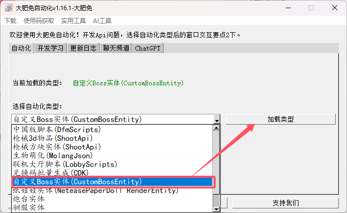
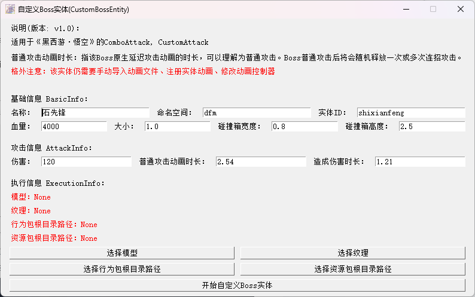
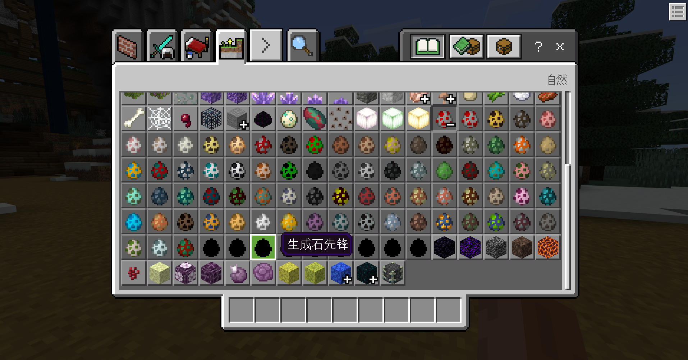

# 自定义Boss实体
> 关联信息：
> - 副包开发DLC-[黑西游-Boss开发](http://1.94.129.175:8000/docs/dlc_heixiyou_boss)

## 使用自动化程序创建Boss
- 选择自定义Boss实体自动化类型

- 根据资产命名规范填写内容，随后导入模型、纹理，选择行为包、资源包，最后点击开始纸娃娃即可

- 游戏内就会新增一个黑色的刷怪蛋，但此时他并没有动作等内容

