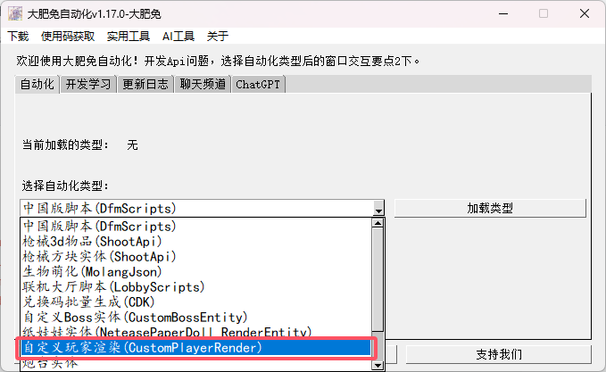
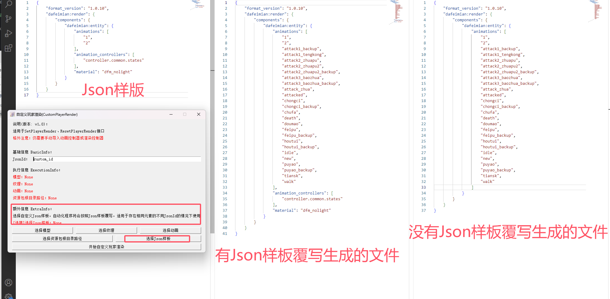

# 自定义玩家渲染
> 关联信息：
> - 配置组件-[基础说明](http://1.94.129.175:8000/docs/component-info)
> - 配置组件-[自定义玩家渲染](http://1.94.129.175:8000/docs/component-customplayerrender)
> - LAAPI-玩家-[SetPlayerRender](http://1.94.129.175:8000/docs/player#setplayerrender)
> - LAAPI-玩家-[ResetPlayerRender](http://1.94.129.175:8000/docs/player#resetplayerrender)

## 选择自定义玩家渲染
选择模型、纹理、动画、资源包路径即可生成配置文件

## [可选]按照Json样板覆写
自定义玩家渲染自动化程序的优先级最高，会覆盖Json样板的内容实现高效同类型文件创建。

