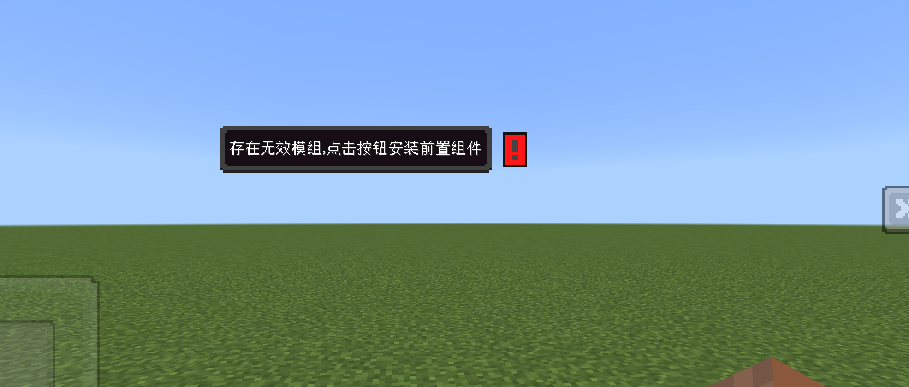
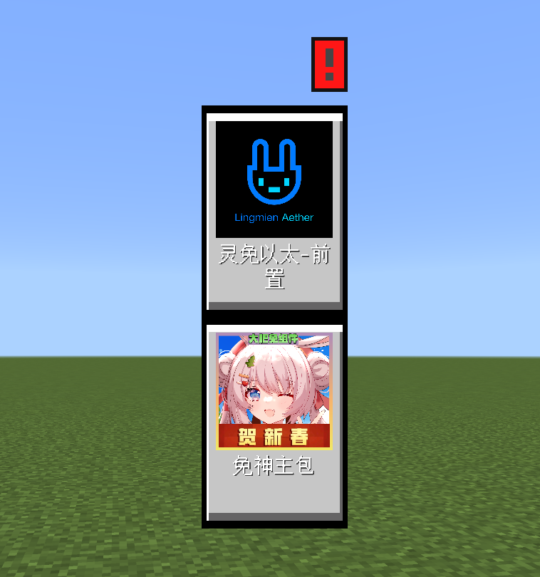

# 自定义依赖组件

:::info{title=消息}
- 默认创建中国版脚本时会创建自定义依赖组件相关内容，并指向`灵免以太-前置`，此行为会产生覆盖。
:::

## 描述
可以用于提示玩家装载前置组件




## 示例
```json
{
  "format_version": "1.2.0",
  "dafeimian:config": {
    "components": {
      "dafeimian:require_mod": {
        "tips": "存在无效模组，点击按钮安装前置组件",
        "mod_list": [
          {
            "mod_name": "灵免以太-前置",
            "mod_id": "4674390375086536983",
            "mod_icon_path": "textures/ui/LingmienAetherIcon",
            "mod_scripts_name": "LingmienAether",
            "mod_client_name": "LingmienAetherProxyClientSystem",
            "mod_key": "0358804"
          },
          {
            "mod_name": "免神主包",
            "mod_id": "4671101882660732820",
            "mod_icon_path": "textures/ui/MianShenIcon",
            "mod_scripts_name": "cyzs3",
            "mod_client_name": "cyzs3ClientSystem",
            "mod_key": "4014"
          }
        ]
      }
    }
  }
}
```

## components
<Badge type="info">json</Badge>该Json类型的组件库，可以选择一些组件来组装功能，并不是需要全部填写。

### dafeimian:require_mod
<Badge type="error">必需</Badge><Badge type="info">json</Badge>依赖组件

|名称|  类型  |默认值|      描述      |
|:-:|:----:|:-:|:------------:|
|tips| str  |"存在无效模组，点击按钮安装前置组件"| 缺失依赖组件时的提示文字 |
|mod_list| list ||    依赖组件列表    |

#### mod_list
依赖模组列表

|名称|类型| 默认值 |      描述      |
|:-:|:-:|:---:|:------------:|
|mod_name|str|     |   依赖组件显示名称   |
|mod_id|str|     | 依赖组件id(开平后台) |
|mod_icon_path|str|     |   依赖组件封面路径   |
|mod_scripts_name|str|     |  依赖组件脚本modname  |
|mod_client_name|str|     |     依赖组件脚本客户端系统名称      |
|mod_key|str|     |     依赖组件搜索组件码      |
