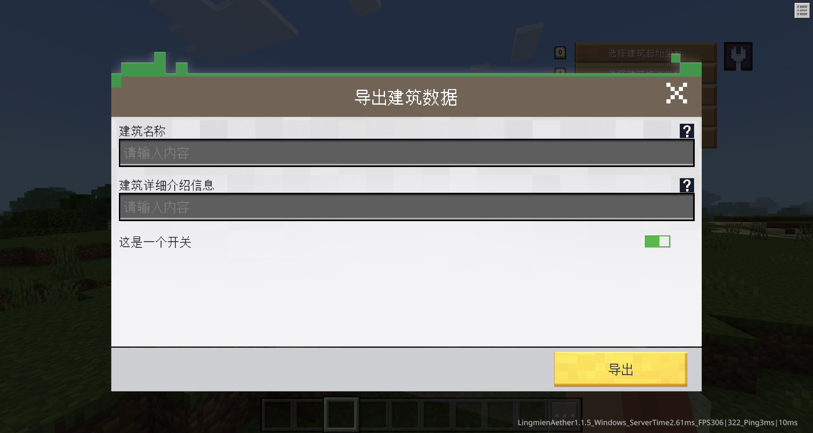

# 自定义表单事件

:::info{title=消息}
- 后续会将`自动化程序`升级为`灵免以太开发系统`，将本功能的UI化制作嵌入进去。
:::

## 描述
可以自定义表单并根据玩家填写的表单信息并执行函数，使用[CreateFormByJsonId](http://1.94.129.175:8000/docs/common#createformbyjsonid)接口创建表单


## 示例
```json
{
  "format_version": "1.1.5",
  "dafeimian:form": {
    "description": {
      "name": "导出建筑数据",
      "mod_name": "mod",
      "client_system_name": "modClientSystem"
    },
    "components": {
      "dafeimian:form_data": {
        "commit_function_name": "RealOutPutBuildingJson",
        "commit_name": "导出",
        "content": [
          {
            "key": "name",
            "type": "input_text",
            "information": "建筑名称",
            "tips": "填写这个建筑的名称，用于自己区分，不做任何作用",
            "default_value": "自定义建筑"
          },
          {
            "key": "information",
            "type": "input_text",
            "information": "建筑详细介绍信息",
            "tips": "这个建筑的详细介绍，一定要详细详细再详细！"
          }
        ]
      }
    }
  }
}
```

## description
<Badge type="info">json</Badge>该Json所需描述信息

### name
<Badge type="info">str</Badge>表单标题，不填写则默认为`表单`

### mod_name
<Badge type="info">str</Badge>组件中绑定触发函数所在的mod名称

### client_system_name
<Badge type="info">str</Badge>组件中绑定触发客户端函数所在的mod客户端实例名称

## components
<Badge type="info">json</Badge>该Json类型的组件库，可以选择一些组件来组装功能，并不是需要全部填写。

### dafeimian:form_data
<Badge type="error">必需</Badge><Badge type="info">json</Badge>表单数据

|名称|类型|默认值|描述|
|:-:|:-:|:-:|:-:|
|commit_function_name|str||表单提交时执行的函数名称，接收一个dict参数(填写的表单数据)|
|commit_name|str|"提交"|表单提交按钮显示的文字|
|content|list||表单元素列表|

#### content
表单元素列表内填写表单元素数据

|名称|类型|默认值|描述|
|:-:|:-:|:-:|:-:|
|key|str||表单元素数据key，与函数接收的dict参数一致|
|type|str||表单元素类型|
|information|str||介绍文字|
|tips|str|""|提示信息，支持富文本|
|default_value|any|null|默认值|

#### 表单元素类型列表

|元素类型|元素名称|描述|
|:-:|:-:|:-:|
|input_text|单行输入框||
|bool|开关||