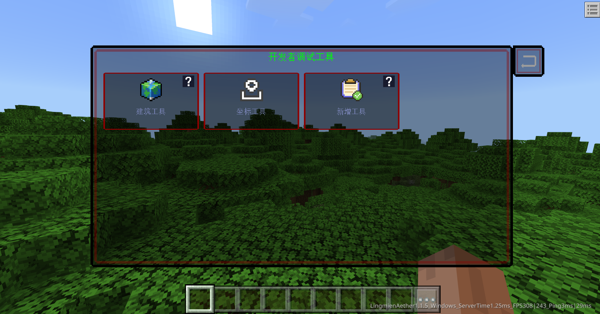
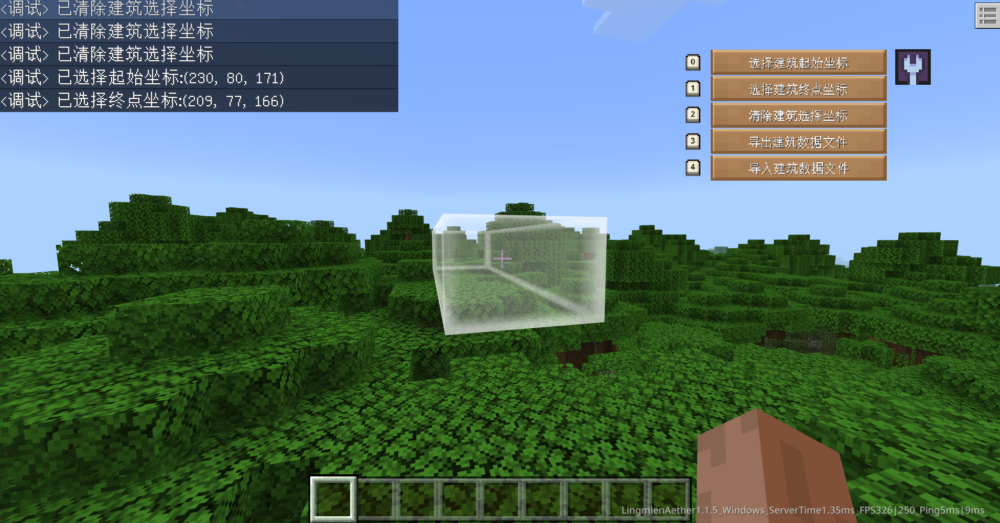
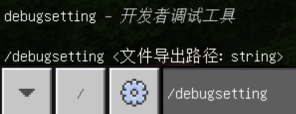

# 基础说明
:::info{title=下载提示}
调试工具内容为内嵌于灵免以太引擎，后续会推出添加自己的自定义debug工具
:::

## 打开调试工具
按下`Tab`键(暂不支持手机端通过UI触控或指令的方式打开，除非你接入了键盘)即可打开开发者调试工具内容，选中你想要使用的工具，当再次选中该工具时，将退出该调试工具。



## 使用调试工具
按下`alt`键即可打开该工具功能菜单快捷键模式，功能菜单左侧会自动显示快捷键



## 设置调试工具
- 调试工具可能会使用到一些文件导出功能，由于游戏运行环境特殊，默认导出在网易的根目录路径，不过你可以通过`debugsetting`指令来设置文件导出位置(不存档，本地存储网易目前还有一些概率性bug)。
- 注意路径是字符串，需要双引号包裹，并以`/`结尾，否则无法认定此为文件夹类型路径（网易禁用了os模块）



```
/debugsetting "D:/MyFiles/"
```

## 拓展调试工具
使用接口[RegisterDebugTool](http://1.94.129.175:8000/docs/common#registerdebugtool)动态注册调试工具：

```python
self.LA.RegisterDebugTool('新增工具', 'textures/ui/research_2', '简单的介绍', '不支持IOS', '1.0.0', [
    {
        'ModName': 'Demo',
        'ClientSystemName': 'DemoClientSystem',
        'ButtonName': '发送消息按钮',
        'FunctionName': 'Msg'
    }
])
```