# 免神-角色开发

:::success{title=高效！非常高效}
- 该功能为使用简单的Json配置(python dict)，即可轻松实现《免神》新角色注册
- 原本需要3~5天的开发周期，现仅需***5小时***！
- 现已支持使用*灵免以太*接口
:::

## 附件列表
|版本|文件名称|上传时间|大小|下载|
|:-:|:-:|:-:|:-:|:-:|
|3.8.1|免神-测试环境|2024-10-24|149M|<a href="https://lingxi.office.163.com/share/#type=file&id=28500031340018&from=QIYE&parentResourceId=19000007899963&spaceId=510845429&ref=546025059">下载</a>|
|3.7.5|免神-崩溃修复工具|2024-10-18|802K|<a href="https://lingxi.office.163.com/share/#type=file&id=19000019039174&from=QIYE&parentResourceId=19000014296451&spaceId=510845429&ref=546025021">下载</a>|
|3.7.5|Cyzs3Lib|2024-10-18|2.55K|<a href="https://lingxi.office.163.com/share/#type=file&id=19000019036883&from=QIYE&parentResourceId=19000014296451&spaceId=510845429&ref=546025021">下载</a>|
|3.7.5|物品列表源码|2024-10-18|13.6K|<a href="https://lingxi.office.163.com/share/#type=file&id=19000019039175&from=QIYE&parentResourceId=19000014296451&spaceId=510845429&ref=546025021">下载</a>|
|1.0.0|免神-鲨鱼妹妹|2024-10-18|7.42M|<a href="https://lingxi.office.163.com/share/#type=file&id=19000019038213&from=QIYE&parentResourceId=19000014296451&spaceId=510845429&ref=546025021">下载</a>|


## 副包脚本文件结构

<Tree>
  <ul>
    <li>
      ***Scripts<small>脚本文件夹</small>
      <ul>
      <li>***Common<ul>
        <li>__init__.py</li>
        <li>config.py<small>脚本配置文件</small></li>
      </ul></li>
      <li>ModClient<small>客户端文件夹</small><ul>
        <li>__init__.py</li>
        <li>ClientEventList<small>客户端监听事件列表(使用监听装饰器，不推荐在此处编写监听事件)</small></li>
        <li>EventApi.py<small>客户端监听事件装饰器</small></li>
        <li>GlobalClientSystem.py<small>客户端系统</small></li>
      </ul></li>
      <li>ModServer<small>服务端文件夹</small><ul>
        <li>__init__.py</li>
        <li>EventApi.py<small>服务端监听事件装饰器</small></li>
        <li>ServerEventList<small>服务端监听事件列表(使用监听装饰器，不推荐在此处编写监听事件)</small></li>
        <li>mianshen.py<small>免神副包数据信息</small></li>
        <li>GlobalServerSystem.py<small>服务端系统</small></li>
      </ul></li>
      <li>__init__.py</li>
      <li>modMain.py<small>脚本系统(不推荐在此处编写代码)</small></li>
      </ul>
    </li>
  </ul>
</Tree>

## 资产规范及导入
### 资产命名规范
:::error{title=特别注意}
一定要确保必要资产内容正确命名，否则直接在游戏内测试会出现异常！
:::

|名称|命名格式|示例|备注|
|:-:|:-:|:-:|:-:|
|自定义动画控制器|controller.animation.{RenderId}.states|controller.animation.ailian.states|配置文件声明后才需要这个<br>[动画控制器教程-基岩版开发社区](https://bedrock.dev/docs/1.20.0.0/1.20.10.1/Animations#Animation%20Controllers)<br>[动画控制器教程-基岩版Wiki](https://wiki.bedrock.dev/animation-controllers/animation-controllers-intro.html)<br>[动画控制器教程-微软官方](https://learn.microsoft.com/zh-cn/minecraft/creator/reference/content/animationsreference/examples/animationcontroller?view=minecraft-bedrock-stable)|
|自定义动画|animation.{RenderId}.{animationname}|animation.ailian.pose2|配置文件声明后才需要这个|
|第三人称动画样式|animation.{RenderId}.third_person_{animationname}|animation.ailian.third_person_attack1|大部分第三人称都是加一个<br>third_person_|
|角色大小动画|animation.{RenderId}.scale|animation.ailian.scale|必要|
|角色待机动画|animation.{RenderId}.idle|animation.ailian.idle|必要|
|第一人称待机动画|animation.{RenderId}.first_person_idle|animation.ailian.first_person_idle|必要|
|角色走路动画|animation.{RenderId}.walk|animation.ailian.walk|必要|
|第三人称走路动画|animation.{RenderId}.third_person_walk|animation.ailian.third_person_walk|必要|
|角色跑步动画|animation.{RenderId}.sprint|animation.ailian.sprint|必要|
|第三人称跑步动画|animation.{RenderId}.third_person_sprint|animation.ailian.third_person_sprint|必要|
|角色潜行中动画|animation.{RenderId}.sneak_idle|animation.ailian.sneak_idle|必要|
|第三人称潜行中动画|animation.{RenderId}.third_person_sneak_idle|animation.ailian.third_person_sneak_idle|必要|
|角色潜行移动动画|animation.{RenderId}.sneak|animation.ailian.sneak|必要|
|第三人称潜行移动中动画|animation.{RenderId}.third_person_sneak|animation.ailian.third_person_sneak|必要|
|角色游泳动画|animation.{RenderId}.swim|animation.ailian.swim|必要|
|第三人称游泳动画|animation.{RenderId}.third_person_swim|animation.ailian.third_person_swim|必要|
|角色坠落动画|animation.{RenderId}.fall|animation.ailian.fall|必要|
|第三人称坠落动画|animation.{RenderId}.third_person_fall|animation.ailian.third_person_fall|必要|
|角色无武器状态动画|animation.{RenderId}.no_weapon|animation.ailian.no_weapon|必要，如果不想用可以设置为空动画|
|第三人称无武器状态动画|animation.{RenderId}.third_person_no_weapon|animation.ailian.third_person_no_weapon|必要，如果不想用可以设置为空动画|
|角色闪避动画|animation.{RenderId}.shanbi|animation.ailian.shanbi|必要，但目前没作用|
|第三人称闪避动画|animation.{RenderId}.third_person_shanbi|animation.ailian.third_person_shanbi|必要，但目前没作用|
|角色攻击动画|animation.{RenderId}.attack{attacktime}|animation.ailian.attack1|必要，假设配置文件AttackTimes为3，则需要有attack1,attack2,attack3动画|
|第三人称攻击动画|animation.{RenderId}.third_person_attack{attacktime}|animation.ailian.third_person_attack1|必要，假设配置文件AttackTimes为3，则需要有attack1,attack2,attack3动画|
|角色技能动画|animation.{RenderId}.skill|animation.ailian.skill|必要|
|第三人称技能动画|animation.{RenderId}.third_person_skill|animation.ailian.third_person_skill|必要|
|角色终极技能动画|animation.{RenderId}.bishaji|animation.ailian.bishaji|必要|
|第三人称终极技能动画|animation.{RenderId}.third_person_bishaji|animation.ailian.third_person_bishaji|必要|
|纸娃娃实体命名空间|dfm|dfm|只能是这个|
|纸娃娃实体ID|{RenderId}|ailian|纸娃娃的创建一定要使用自动化程序的“纸娃娃实体”|
|角色头像贴图|{RenderId}.png|ailian.png|置于资源包textures/ui/render_icon下|
|角色立绘贴图|{RenderId}.png|ailian.png|置于资源包textures/ui/render_icon下，一定要拉瘦比例，否则容易显示异常|
|角色抽卡界面贴图|{Key}.png|Ailian.png|置于资源包textures/ui/wish下|
|角色抽卡选项贴图|{Key}_icon.png|Ailian_icon.png|置于资源包textures/ui/wish下|

### 资产内容规范
#### 模型骨骼规范
- 需要根据下图所示，新建这些空组(骨骼)，当然，你也可以直接从已有的副包模型上复制这些组过来

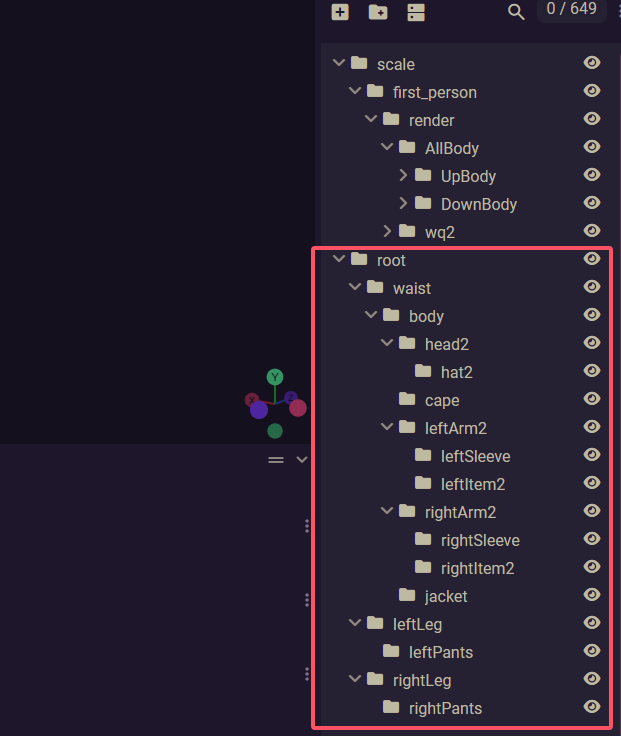

- 根据下图所示，角色所有模型应当命名为`render`，随后在其上级创建`scale`(调控模型整体大小用，专门给scale动画),`first_person`（调控模型第一人称用，专门给first_person_idle用）组<br>
    - 其中`scale`的*枢轴*应当在(0, 0, 0)处

    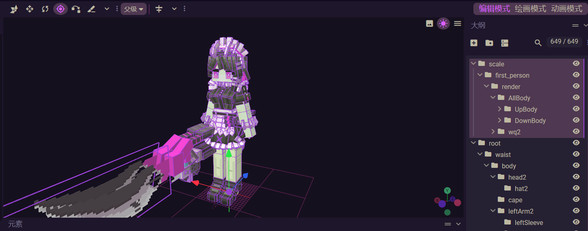

    - 其中`first_person`的*枢轴*应当在*脖子*处

    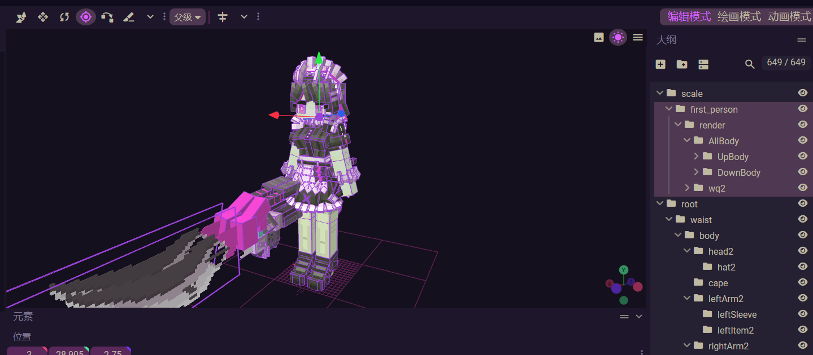

#### 动画关键帧规范
:::warning{title=注意}
一定要严加检查该内容
:::

每个动画一定要确保首尾都有关键帧，否则游戏内实际表现将会异常

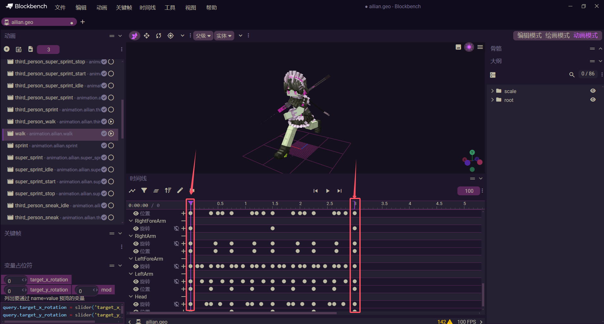

如果没有，需要手动先点击“将所有修改后的动画放入时间轴”，随后选择关键帧位置，再到关键帧选项中点击创建关键帧列

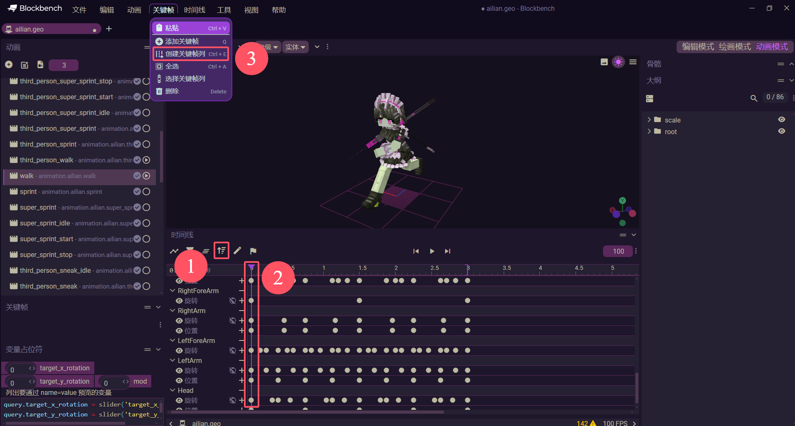

#### 攻击动画规范
为保证动画的流畅性，建议attack等与`ResetTimer`(见[角色数据信息](#角色数据信息))有关的动画应该拉长`ResetTimer`的时长，以保证动作的连贯性，如下图所示，3.25秒-5秒动作是一样的，都是尾帧

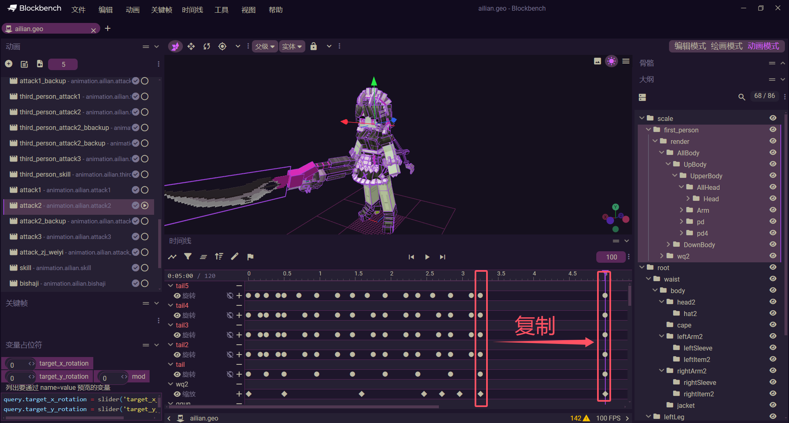

## 使用自动化程序创建角色纸娃娃
- 选择纸娃娃实体自动化类型
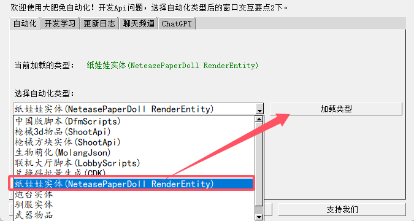
- 根据资产命名规范填写内容，随后导入模型、纹理，选择行为包、资源包，最后点击开始纸娃娃即可

- 游戏内就会新增一个黑色的刷怪蛋，这个纸娃娃实体没有具体的功能，唯一的功能就是可以配置她的对话内容
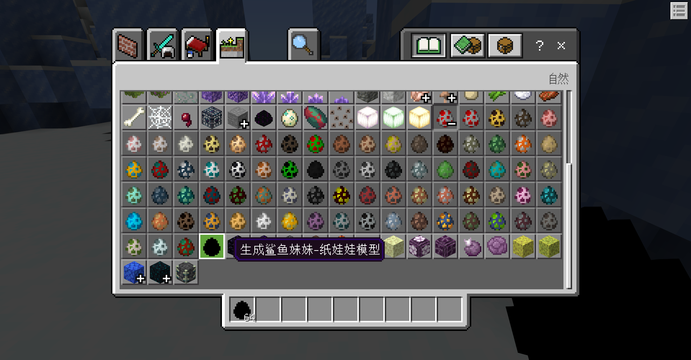
- 配置对话示例(目前无法在副包配置对话)
```python
ChatDict = {
    'Identifier': 'diaolingkulou',
    'Name': '幽蝶',
    'InteractButton': ['「幽蝶」'],
    '「幽蝶」': {
        'PlayerSoundName': None,
        'RenderSoundName': 'diaolingkulou_nihao',
        'RenderSoundTimer': 1.5,
        'RenderText': '你好呀，今天你要做什么呢？(CV感冒了)',
        'InteractButton': ['西南方', '听不清楚', '新角色「阿坤」是谁？', '你说话为什么这么像AI']
    },
    '西南方': {
        'PlayerSoundName': 'xinanfang',
        'RenderSoundName': 'niguoguan',
        'RenderSoundTimer': 0.5,
        'RenderText': '你过关！'
        # 如果没有 InteractButton 表示结束
    },
    '听不清楚': {
        'PlayerSoundName': 'tingbuqingchu',
        'RenderSoundName': 'gaifa',
        'RenderSoundTimer': 0.5,
        'RenderText': '该罚！'
    },
    '新角色「阿坤」是谁？': {
        'PlayerSoundName': None,
        'RenderSoundName': 'diaolingkulou_akun',
        'RenderSoundTimer': 11,
        'RenderText': '「阿坤」啊...她是由「主世界」鸡萌化而来的，虽然我是「亡灵军团」的队长，但武力方面有大石镐武器的「阿坤」更甚一筹。',
        'InteractButton': ['她会打篮球吗？', '我想到了篮球和鸡']
    },
    '她会打篮球吗？': {
        'PlayerSoundName': None,
        'RenderSoundName': 'diaolingkulou_xiaoheizi',
        'RenderSoundTimer': 0.5,
        'RenderText': '啊？你是小黑子！'
    },
    '我想到了篮球和鸡': {
        'PlayerSoundName': None,
        'RenderSoundName': 'diaolingkulou_lanqiuheji',
        'RenderSoundTimer': 0.5,
        'RenderText': '篮球和鸡？'
    },
    '你说话为什么这么像AI': {
        'PlayerSoundName': None,
        'RenderSoundName': 'diaolingkulou_ai',
        'RenderSoundTimer': 0.5,
        'RenderText': '像AI怎么了嘛！我们「亡灵」生物就是不喜欢表达情绪，除了跟你对话~'
    }
}
```

## 编写数据信息
`mianshen.py`内是专门写数据信息的地方，当然，也允许自定义一个python文件，只需要将数据导入注册主包就可以了。

### 抽卡数据信息

- WishDictList键值说明

|key|数据类型|说明|对应标点|
|:-:|:-:|:-:|:-:|
|Title|str|抽卡标题文字|1|
|Key|str|卡池id，用来绑定相关图片等资源|2,3|
|Date|tuple|截止时间(已弃用)|-|
|Reward|dictlist|卡池奖励|-|

- Reward奖励dict键值说明

|key|数据类型|说明|对应标点|
|:-:|:-:|:-:|:-:|
|Id|str|奖励内容名称|-|
|Stars|int|奖励内容品质等级(5颗星)|-|
|Type|str|奖励内容类型|-|
|Weight|int|奖励内容权重(仅限当前品质等级权重计算)|-|

- 奖励内容类型说明

|值|说明|
|:-:|:-:|
|Render|角色类型|
|Item|物品类型|


- 示例
```python
WishDictList = [
    {
        'Title': '维多鲨鲨',
        'Key': 'Ailian',
        'Date': None,
        'Reward': [
            {
                'Id': 'ailian',
                'Stars': 5,
                'Type': 'Render',
                'Weight': 2
            },
            {
                'Id': 'diaolingkulou',
                'Stars': 5,
                'Type': 'Render',
                'Weight': 1
            },
            {
                'Id': 'ji',
                'Stars': 5,
                'Type': 'Render',
                'Weight': 1
            },
            {
                'Id': '4',
                'Stars': 4,
                'Type': 'Item',
                'Weight': 2
            },
            {
                'Id': 'cuzhijian',
                'Stars': 3,
                'Type': 'Item',
                'Weight': 2
            },
            {
                'Id': 'changgong',
                'Stars': 3,
                'Type': 'Item',
                'Weight': 2
            },
            {
                'Id': 'cucaofazhang',
                'Stars': 3,
                'Type': 'Item',
                'Weight': 2
            },
            {
                'Id': 'dabang',
                'Stars': 3,
                'Type': 'Item',
                'Weight': 2
            },
            {
                'Id': 'dafu',
                'Stars': 3,
                'Type': 'Item',
                'Weight': 2
            }
        ]
    }
]
```

### 角色数据信息

- RenderList键值说明

:::warning{title=概念区分注意}
旧时代Minecraft由于国内外翻译问题，通常将材质、纹理混为一谈，如材质包，实际名称为资源包或纹理包，其中纹理包仅对贴图进行修改调整。

而材质是指渲染层面的material！
:::

|key|数据类型|说明|对应标点|
|:-:|:-:|:-:|:-:|
|Name|str|角色名字|-|
|Identifier|str|角色id，用来绑定相关资产(模型、纹理、动画等)|-|
|RenderMaterial|str|角色材质(选填)|-|
|DebugRender|bool|角色是否为调试外观形角色(选填)|-|
|DebugMaterial|str|角色调试材质，当DebugRender为True时生效(选填)|-|
|RenderControllerList|strlist|指定角色渲染控制器(选填)|-|
|MaterialsDictListByRenderController|dictlist|角色材质适配制定角色渲染控制器(选填)|-|
|IsLocked|bool|角色是否锁定以禁止使用|-|
|LockedInfo|str|角色锁定后的弹窗提示消息内容|-|
|DamageType|str|角色属性|-|
|Level|int|角色品级(1~5)|-|
|Info|str|角色简介文字|-|
|CV|str|角色CV名字|-|
|AttackTimes|int|角色普通攻击段数|-|
|ResetAttackTimer|float|角色普通攻击后恢复重置攻击次数的时间(似乎已弃用，建议默认填写1.5)|-|
|ModName|str|角色所在副包的mod名称|-|
|ClientSystem|str|角色所在副包的客户端系统实例名称|-|
|ServerSystem|str|角色所在副包的服务端系统实例名称|-|
|IsMainPackPlayerAttack|bool|是否使用主包的攻击逻辑，若为False，则需要伪继承逻辑函数|-|
|IsMainPackPlayerSkill|bool|是否使用主包的技能逻辑，若为False，则需要伪继承逻辑函数|-|
|IsMainPackPlayerShanBi|bool|是否使用主包的闪避逻辑，若为False，则需要伪继承逻辑函数|-|
|IsMainPackPlayerBiShaJi|bool|是否使用主包的终极技能逻辑，若为False，则需要伪继承逻辑函数|-|
|IsMainPackPlayerAttackSound|bool|是否使用主包的攻击音效逻辑|-|
|IsMainPackAnimationController|bool|是否使用主包的states动画控制器，若为False，则默认使用名为controller.animation.{Identifier}.states的动画控制器|-|
|RenderAnimationList|strlist|额外补充的动画列表|-|
|RenderAnimationControllerList|strlist|额外补充的动画控制器列表|-|
|RenderSoundName|str|角色待机音效名称|-|
|RenderAttackSoundName|str|角色攻击音效名称(已弃用)|-|
|RenderBeAttackedSoundName|str|角色受击音效名称，当角色所受到的伤害达到最大生命值的10%，将有概率播放|-|
|AttackDict|dictdict|角色攻击配置|-|
|AdvanceItemList|dictlistlist|角色突破所需材料配置|-|
|RenderInfoList|dictlist|角色资料介绍信息|-|


- 角色属性类型说明

|值|说明|
|:-:|:-:|
|Dark|暗|
|Fire|火|
|Ice|冰|
|Grass|草|
|Light|电|
|Physics|无|
|Stone|土|
|Water|水|
|Wind|风|

- 主包逻辑伪继承说明
请看后续[编写伪继承脚本逻辑](#编写伪继承脚本逻辑)

- 默认角色使用的动画列表

|名称|命名格式|示例|备注|
|:-:|:-:|:-:|:-:|
|角色大小动画|animation.{RenderId}.scale|animation.ailian.scale|必要|
|角色待机动画|animation.{RenderId}.idle|animation.ailian.idle|必要|
|第一人称待机动画|animation.{RenderId}.first_person_idle|animation.ailian.first_person_idle|必要|
|角色走路动画|animation.{RenderId}.walk|animation.ailian.walk|必要|
|第三人称走路动画|animation.{RenderId}.third_person_walk|animation.ailian.third_person_walk|必要|
|角色跑步动画|animation.{RenderId}.sprint|animation.ailian.sprint|必要|
|第三人称跑步动画|animation.{RenderId}.third_person_sprint|animation.ailian.third_person_sprint|必要|
|角色潜行中动画|animation.{RenderId}.sneak_idle|animation.ailian.sneak_idle|必要|
|第三人称潜行中动画|animation.{RenderId}.third_person_sneak_idle|animation.ailian.third_person_sneak_idle|必要|
|角色潜行移动动画|animation.{RenderId}.sneak|animation.ailian.sneak|必要|
|第三人称潜行移动中动画|animation.{RenderId}.third_person_sneak|animation.ailian.third_person_sneak|必要|
|角色游泳动画|animation.{RenderId}.swim|animation.ailian.swim|必要|
|第三人称游泳动画|animation.{RenderId}.third_person_swim|animation.ailian.third_person_swim|必要|
|角色坠落动画|animation.{RenderId}.fall|animation.ailian.fall|必要|
|第三人称坠落动画|animation.{RenderId}.third_person_fall|animation.ailian.third_person_fall|必要|
|角色无武器状态动画|animation.{RenderId}.no_weapon|animation.ailian.no_weapon|必要，如果不想用可以设置为空动画|
|第三人称无武器状态动画|animation.{RenderId}.third_person_no_weapon|animation.ailian.third_person_no_weapon|必要，如果不想用可以设置为空动画|
|角色攻击动画|animation.{RenderId}.attack{attacktime}|animation.ailian.attack1|必要，假设配置文件AttackTimes为3，则需要有attack1,attack2,attack3动画|
|第三人称攻击动画|animation.{RenderId}.third_person_attack{attacktime}|animation.ailian.third_person_attack1|必要，假设配置文件AttackTimes为3，则需要有attack1,attack2,attack3动画|

- 角色攻击配置说明
    - key为int数字时，表示普通攻击第几次所使用的配置。
    - key为skill时，表示技能所使用的配置
    - key为bishaji时，表示终极技能所使用的配置

|key|数据类型|说明|备注|
|:-:|:-:|:-:|:-:|
|AttackTimer|float|攻击所需的时长|-|
|DamagePercent|float|造成多少百分比攻击力的伤害|-|
|DamageTimerList|floatlist|造成伤害的时间列表|需要去BlockBench根据动作填写|
|ResetTiemr|float|角色普通攻击后恢复重置攻击次数的时间|推荐为1.5|
|SoundName|str|角色攻击音效名|根据SoundTimerList播放|
|RenderSoundName|str|角色攻击说话音效名，50%概率播放|根据SoundTimerList播放|
|SoundTimerList|floatlist|延迟多少秒音效播放||
|Radius|float|攻击距离|最小为3|
|BetweenAngle|float|攻击角度|0.0~360.0|
|MotionPercent|floattuple|攻击位移|在造成伤害时玩家会位移，x，y为正时向前|
|SfxDict|dictlist|攻击特效列表||
|ColdDownTimer|float|冷却时间|仅限于key为skill使用|
|Energy|int|所需能量|仅限于key为bishaji的使用|
|Perspective|int|释放终极技能时摄像机切换的人称|仅限于key为bishaji的使用|

- 攻击特效配置说明
目前仅支持序列帧特效！

|key|数据类型|说明|备注|
|:-:|:-:|:-:|:-:|
|FaceCamara|bool|是否面向摄像机|-|
|SfxId|str|特效Id|-|
|Offset|tuple|特效坐标偏移|三元数组|
|Rot|tuple|特效角度偏移|三元数组|
|Scale|tuple|特效大小乘积|三元数组|

- 角色突破所需材料配置说明
AdvanceItemList内必须有6个dictlist，表示角色养成中6个突破分别需要的材料

|key|数据类型|说明|备注|
|:-:|:-:|:-:|:-:|
|Id|str|物品id|-|
|Type|str|类型|直接填写为Item|
|Num|int|所需数量||

- 角色资料介绍信息
dictlist，游戏内会根据RenderInfoList自上而下排序，每个dict的介绍：

|key|数据类型|说明|备注|
|:-:|:-:|:-:|:-:|
|Title|str|标题|-|
|Type|str|类型|没有用直接填写为Sound|
|SoundName|str|播放的音效|没有用直接填写为'SoundName'|
|Content|str|内容||


```python
RenderList = [
    {
        'Name': '鲨鱼妹妹',  # 角色名字
        'Identifier': 'ailian',  # 命名空间固定为GlobalConfig.NameSpace
        'RenderMaterial': 'entity_alphatest_netease',     # 材质，不填则默认描边模式
        'DebugMaterial': 'entity_alphatest_netease',    # 调试材质
        'RenderControllerList': ['controller.render.al'],   # 渲染控制器，为空表示使用默认渲染控制器
        # 当RenderControllerList存在，则materials也修改
        'MaterialsDictListByRenderController': [
            {
                'Key': 'al_hs',
                'Value': 'dfm_al_hs_leg'
            },
            {
                'Key': 'al_hs_up',
                'Value': 'dfm_al_hs_legup'
            }
        ],
        'IsLocked': False,
        'DebugRender': True,
        'LockedInfo': '加班一周，通宵了，实在赶不赢，希望理解，下次开放！',
        'DamageType': 'Ice',
        'Level': 5,
        'Info': '维多家政公司\ncv:魏婴',
        'CV': '魏婴',
        'AttackTimes': 4,
        'ResetAttackTimer': 1.5,
        # 这个角色所在的副包实例信息
        'ModName': 'ailian',
        'ClientSystem': 'ailianClientSystem',
        'ServerSystem': 'ailianServerSystem',
        # 是否使用主包的逻辑执行，反之直接给到副包Client中执行。因为继承这边很难操作，这样做一个伪继承
        'IsMainPackPlayerAttack': False,
        'IsMainPackPlayerSkill': False,
        'IsMainPackPlayerShanBi': True,
        'IsMainPackPlayerBiShaJi': False,
        # 是否使用主包攻击音效逻辑，不包含角色音效
        'IsMainPackPlayerAttackSound': True,
        # 是否使用主包的states动画控制器,为False则默认使用controller.animation.{Identifier}.states,scale和weapon照常
        'IsMainPackAnimationController': False,
        # 额外补充动画
        'RenderAnimationList': [
            'newidle',
            'skill',
            'third_person_skill',
            'bishaji',
            'third_person_bishaji',
            'pose2',
            'third_person_pose2',
            'super_sprint_start',
            'super_sprint_idle',
            'super_sprint_stop',
            'third_person_super_sprint_start',
            'third_person_super_sprint_idle',
            'third_person_super_sprint_stop'
        ],
        # 额外补充动画控制器
        'RenderAnimationControllerList': [],
        # 攻击等数据信息
        'RenderSoundName': 'ailian_pose',  # 角色待机说话的声音
        'RenderAttackSoundName': 'None',  # 命中目标的音效，没用
        'RenderBeAttackedSoundName': 'None',   # 受击音效
        'AttackDict': {
            # 如果IsMainPackPlayerAttack为False，那么可以自定义一些AttackDict参数来实现攻击的效果
            # AttackTimer攻击动画的时间
            # DamagePercent 伤害百分比
            # DamageTimer伤害处罚的时间
            # ResetTimer恢复攻击状态为0的间隔时间
            # SoundName攻击音效
            # MotionPercent (x, z)位移比例
            1: {
                'AttackTimer': 0.63,
                'DamagePercent': 0.35,
                'DamageTimerList': [0.33],
                'ResetTimer': 2.00,
                'SoundName': 'ailian_dao',
                'RenderSoundName': 'ailian_attack2',
                'SoundTimerList': [0],
                'Radius': 5,
                'BetweenAngle': 120.0,
                'MotionPercent': (0.35, 0.35),
                'SfxDict': []
            },
            2: {
                'AttackTimer': 1,
                'DamagePercent': 0.30,
                'DamageTimerList': [0.61, 0.71, 0.88, 0.96, 1.04],
                'ResetTimer': 2.33,
                'SoundName': 'ailian_dao',
                'RenderSoundName': 'ailian_attack2',
                'SoundTimerList': [0.50],
                'Radius': 5,
                'BetweenAngle': 120.0,
                'MotionPercent': (0.45, 0.45),
                'SfxDict': []
            },
            3: {
                'AttackTimer': 1.54,
                'DamagePercent': 0.40,
                'DamageTimerList': [0.42, 0.46, 0.54, 0.63, 0.71, 0.75, 0.80, 0.92, 1.00, 1.05, 1.10, 1.15, 1.20, 1.25, 1.30],
                'ResetTimer': 1.46,
                'SoundName': 'ailian_dao3',
                'RenderSoundName': 'ailian_attack2',
                'SoundTimerList': [0.53],
                'Radius': 12.5,
                'BetweenAngle': 120.0,
                'MotionPercent': (0.2, 0.2),
                'SfxDict': []
            },
            4: {
                'AttackTimer': 0.05,
                'DamagePercent': 0.00,
                'DamageTimerList': [],
                'ResetTimer': 0.05,
                'SoundName': 'None',
                'RenderSoundName': 'None',
                'SoundTimerList': [0.33],
                'Radius': 8.5,
                'BetweenAngle': 60.0,
                'MotionPercent': (0, 0),
                'SfxDict': []
            },
            # 本来是这样，但是这个已经是在副包继承了，所以这里参数无意义！
            'skill': {
                'AttackTimer': 1.5,
                'DamagePercent': 0.65,
                'DamageTimerList': [1.08],
                'ResetTimer': 0.10,
                'SoundName': 'ailian_skill',
                'RenderSoundName': 'None',
                'SoundTimerList': [0.0],
                'Radius': 7.0,
                'BetweenAngle': 120.0,
                'MotionPercent': (2, 2),
                'ColdDownTimer': 4,
                'SfxDict': [
                    {
                        'FaceCamara': False,
                        'SfxId': 'ailian_attack',
                        'Offset': (-1, -0.5, 0),
                        'Rot': (-30, -10, 45),
                        'Scale': (3.5, 2.5, 2.5)
                    },
                    {
                        'FaceCamara': False,
                        'SfxId': 'ailian_attack',
                        'Offset': (0, -0.5, 0),
                        'Rot': (-100, -10, 45),
                        'Scale': (3, 3, 3)
                    },
                    {
                        'FaceCamara': False,
                        'SfxId': 'ailian_attack',
                        'Offset': (0, -0.5, 0),
                        'Rot': (-30, 0, 45),
                        'Scale': (3, 3, 3)
                    },
                    {
                        'FaceCamara': False,
                        'SfxId': 'ailian_attack',
                        'Offset': (0, -0.5, 0),
                        'Rot': (-30, 10, 45),
                        'Scale': (3, 3, 3)
                    },
                    {
                        'FaceCamara': True,
                        'SfxId': 'ailian_skill',
                        'Offset': (-3, 5, 0),
                        'Rot': (-30, 10, 45),
                        'Scale': (15, 15, 15)
                    },
                    {
                        'FaceCamara': True,
                        'SfxId': 'ailian_boom',
                        'Offset': (-2.9, -0.5, 0),
                        'Rot': (-30, 10, 45),
                        'Scale': (3, 3, 3)
                    },
                    {
                        'FaceCamara': True,
                        'SfxId': 'ailian_boom2',
                        'Offset': (-2.6, -0.5, 0),
                        'Rot': (-30, 10, 45),
                        'Scale': (4, 4, 4)
                    }
                ]
            },
            'bishaji': {
                'AttackTimer': 3.0,
                'DamagePercent': 3.0,
                'Perspective': 1,
                'DamageTimerList': [1.00, 1.05, 1.10, 1.15, 1.20, 1.25, 1.30, 1.35, 1.40, 1.45, 1.50, 1.55, 1.60, 1.63],
                'ResetTimer': 0.15,
                'SoundName': 'ailian_bishaji2',
                'RenderSoundName': 'None',
                'SoundTimerList': [0.5],
                'Radius': 10.0,
                'BetweenAngle': 120.0,
                'MotionPercent': (0, 0),
                'Energy': 20,
                'SfxDict': []
            }
        },
        # 角色突破所需材料信息
        'AdvanceItemList': [
            [
                {
                    'Id': 'bingya',
                    'Type': 'Item',
                    'Num': 5
                },
                {
                    'Id': 'bingguan',
                    'Type': 'Item',
                    'Num': 1
                }
            ],
            [
                {
                    'Id': 'bingya',
                    'Type': 'Item',
                    'Num': 7
                },
                {
                    'Id': 'bingguan',
                    'Type': 'Item',
                    'Num': 3
                }
            ],
            [
                {
                    'Id': 'bingya',
                    'Type': 'Item',
                    'Num': 10
                },
                {
                    'Id': 'bingguan',
                    'Type': 'Item',
                    'Num': 5
                },
                {
                    'Id': 'bingjing',
                    'Type': 'Item',
                    'Num': 3
                }
            ],
            [
                {
                    'Id': 'bingya',
                    'Type': 'Item',
                    'Num': 15
                },
                {
                    'Id': 'bingguan',
                    'Type': 'Item',
                    'Num': 8
                },
                {
                    'Id': 'bingjing',
                    'Type': 'Item',
                    'Num': 6
                },
                {
                    'Id': 'binghexin',
                    'Type': 'Item',
                    'Num': 3
                }
            ],
            [
                {
                    'Id': 'bingya',
                    'Type': 'Item',
                    'Num': 17
                },
                {
                    'Id': 'bingguan',
                    'Type': 'Item',
                    'Num': 11
                },
                {
                    'Id': 'bingjing',
                    'Type': 'Item',
                    'Num': 9
                },
                {
                    'Id': 'binghexin',
                    'Type': 'Item',
                    'Num': 5
                }
            ],
            [
                {
                    'Id': 'bingya',
                    'Type': 'Item',
                    'Num': 21
                },
                {
                    'Id': 'bingguan',
                    'Type': 'Item',
                    'Num': 14
                },
                {
                    'Id': 'bingjing',
                    'Type': 'Item',
                    'Num': 12
                },
                {
                    'Id': 'binghexin',
                    'Type': 'Item',
                    'Num': 9
                }
            ]
        ],
        # 资料信息
        'RenderInfoList': [
            {
                'Title': '尚未制作',
                'Type': 'Sound',
                'SoundName': 'diaolingkulou_attack',
                'Content': '受极端天气影响，开发组周五提前下班了'
            }
        ]
    }
]
```

## 编写脚本文件注册角色
- 根据副包脚本文件结构，在ModServer文件夹下创建mianshen.py文件，并在该python文件中定义WishDictList(dictlist)变量并填写抽卡数据信息、定义RenderList(dictlist)变量并填写角色数据信息。

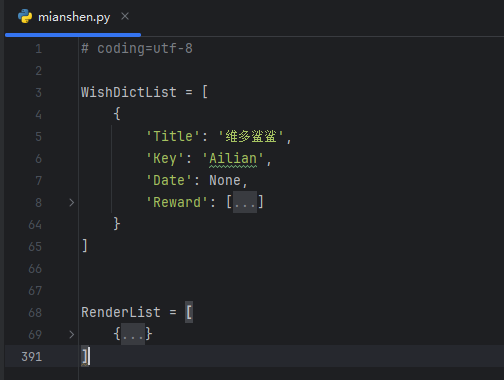

- 根据[资产规范及导入](#资产规范及导入)导入对应的资产文件，以下仅展示部分：

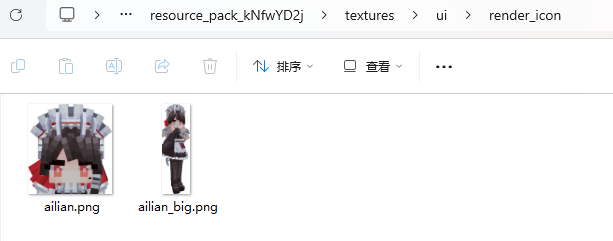

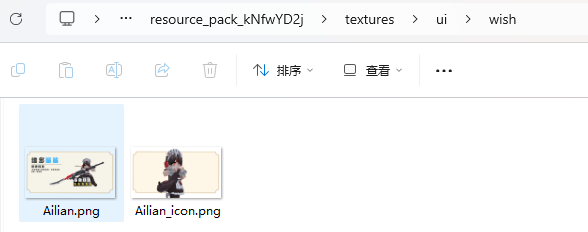

- 导入免神角色数据、抽卡数据
```python
from mianshen import RenderList, WishDictList
```

- 服务端代码<br>
获取主包服务端系统实例并注册角色数据、抽卡数据(过于传统)
```python {16,17}
def __init__(self, namespace, systemName):
    ...
    self.AddTimes = 0
    self.MianPack = None
    self.GetMainPackSystem()

def GetMainPackSystem(self):
    logging.debug('{0}'.format(self.AddTimes))
    try:
        self.MianPack = serverApi.GetSystem('cyzs3', 'cyzs3ServerSystem')
        if self.AddTimes <= 10:
            if not self.MianPack:
                compTimer.AddTimer(1.0, self.GetMainPackSystem)
                self.AddTimes += 1
            else:
                self.MianPack.AddOtherRenderList(RenderList)
                self.MianPack.AddOtherWishList(WishDictList)
    except:
        if self.AddTimes <= 10:
            compTimer.AddTimer(1.0, self.GetMainPackSystem)
```

- 客户端代码<br>
[点击此处](http://1.94.129.175/uploads/LingmienAether/dlc/Cyzs3Lib.zip)下载并解压出`Cyzs3Lib.py`文件，并在客户端继承。
```python
# 这里是因为将Cyzs3Lib.py放在了ModClient/cyzs3下，因此这样导入
from cyzs3.Cyzs3Lib import Cyzs3Lib

class ***ClientSystem(ClientSystem, Cyzs3Lib):
    ...
```

## 编写脚本文件角色必要属性
:::warning{title=注意}
这三个函数只有RenderLevel变量有用，其他的还是空壳。
:::
由于免神底层代码问题，目前需要在服务端、客户端定义3个函数(GetRenderHealth, GetRenderDamage, GetRenderExp)来定义角色属性。

- 客户端代码<br>
由于客户端系统继承了`Cyzs3Lib`，可以直接触发这3个函数的补全库，因此直接在客户端定义这3个函数
```python
def GetRenderHealth(self, RenderLevel=1):
    Health = 20.0
    AddPercent = 1.0735
    if RenderLevel <= 80:
        for i in range(0, RenderLevel):
            Health *= AddPercent
    else:
        for i in range(0, 80):
            Health *= AddPercent
        for i in range(0, RenderLevel - 80):
            Health *= 1.013
    return int(Health)

def GetRenderDamage(self, RenderLevel=1, AttackLevel=1, RenderId=None):  # type: (int, int, any) -> float
    Damage = 10.0
    AddPercent = 1.070
    if RenderLevel <= 80:
        for i in range(0, RenderLevel):
            Damage *= AddPercent
    else:
        for i in range(0, 80):
            Damage *= AddPercent
        for i in range(0, RenderLevel - 80):
            Damage *= 1.0175
    return int(Damage)

def GetRenderExp(self, RenderLevel=1):  # type: (int) -> float
    Exp = 1000.0
    AddPercent = 1.10
    LastAddPercent = 1.15
    if RenderLevel <= 80:
        for i in range(0, RenderLevel):
            Exp *= AddPercent
    else:
        for i in range(0, 80):
            Exp *= AddPercent
        for i in range(0, RenderLevel - 80):
            Exp *= LastAddPercent
    return int(Exp)
```

- 服务端代码<br>
直接将客户端的这段代码复制到服务端即可
```python
def GetRenderHealth(self, RenderLevel=1):
    Health = 20.0
    AddPercent = 1.0735
    if RenderLevel <= 80:
        for i in range(0, RenderLevel):
            Health *= AddPercent
    else:
        for i in range(0, 80):
            Health *= AddPercent
        for i in range(0, RenderLevel - 80):
            Health *= 1.013
    return int(Health)

def GetRenderDamage(self, RenderLevel=1, AttackLevel=1, RenderId=None):  # type: (int, int, any) -> float
    Damage = 10.0
    AddPercent = 1.070
    if RenderLevel <= 80:
        for i in range(0, RenderLevel):
            Damage *= AddPercent
    else:
        for i in range(0, 80):
            Damage *= AddPercent
        for i in range(0, RenderLevel - 80):
            Damage *= 1.0175
    return int(Damage)

def GetRenderExp(self, RenderLevel=1):  # type: (int) -> float
    Exp = 1000.0
    AddPercent = 1.10
    LastAddPercent = 1.15
    if RenderLevel <= 80:
        for i in range(0, RenderLevel):
            Exp *= AddPercent
    else:
        for i in range(0, 80):
            Exp *= AddPercent
        for i in range(0, RenderLevel - 80):
            Exp *= LastAddPercent
    return int(Exp)
```
:::success{title=基本完成}
普通角色写到这里便基本完成了制作，更高级的角色逻辑需要根据这篇手动[编写伪继承脚本逻辑](#编写伪继承脚本逻辑)
:::

## 编写伪继承脚本逻辑
当编写[角色数据信息](#角色数据信息)并拒绝使用主包逻辑时，需要手动编写伪继承逻辑，否则对应功能将会失效。这些伪继承函数在客户端`Cyzs3Lib`拥有继承函数补全库。以下是对照表：

|角色数据信息Key|该Key的Value|副包客户端伪继承函数名|
|:-:|:-:|:-:|
|IsMainPackPlayerAttack|False|PlayerAttack|
|IsMainPackPlayerSkill|False|PlayerSkill|
|IsMainPackPlayerShanBi|False|该项暂未更新|
|IsMainPackPlayerBiShaJi|False|PlayerBiShaJi|

- 使用伪继承时，推荐在客户端系统实例的`__init__`函数中添加主包ModName和主包ClientSystem，以方便获取：
```python
def __init__(self, namespace, systemName):
    ...
    self.MainPackModName = 'cyzs3'
    self.MainPackClientSystem = 'cyzs3ClientSystem'
```

- 当伪继承后仍然需要使用原版功能，然后自己再额外添加一些触发功能，这个时候就派上用场了：

|参数名|数据类型|说明|
|:-:|:-:|:-:|
|RenderDict|dict|该副包角色数据|
|Type|str|该按钮触发模式：弹起('Up') 还是按下('Down')，可以用于制作蓄力|

下面的方法便是最为典型的`仍然需要使用原版功能`并额外添加一些功能：
:::info{title=提示}
如果想要完全重写，就可以自己在这个函数中从0开始写逻辑
:::
```python
def PlayerBiShaJi(self, RenderDict, Type):  # type: (dict, str) -> None
    # 获取主包客户端系统实例
    MainPackClient = clientApi.GetSystem(self.MainPackModName, self.MainPackClientSystem)
    # 暂时使用主包逻辑
    RenderDict['IsMainPackPlayerBiShaJi'] = True
    # 重新调用主包逻辑，这样就不会因为IsMainPackPlayerBiShaJi为False而再来到这个函数中
    MainPackClient.PlayerBiShaJi(RenderDict, Type)
    # 调用完主包逻辑后，恢复伪继承
    RenderDict['IsMainPackPlayerBiShaJi'] = False
    # 额外添加的一些小功能
    self.NotifyToServer('BroadcastToAllClientEvent', {
        'EventName': 'BiShaJiSfxEvent',
        'Dict': playerId
    })
```

## 测试你的免神副包
前往[附件列表](#附件列表)下载测试环境，点击开发测试时勾选同步加载，不要忘记勾选*灵免以太*，随后检测各项功能是否完好：

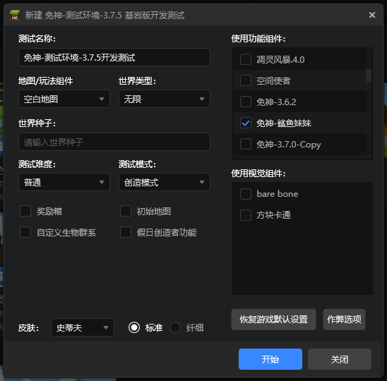

## 编写并调试角色第一人称
:::warning{title=注意}
注意先检查[模型骨骼规范](#模型骨骼规范)
:::
- idle,first_person_idle 根据[模型骨骼规范](#模型骨骼规范)
    - first_person_idle关键帧应当直接隐藏头，防止在第一人称下被头遮挡，即缩放为(0, 0 ,0)

    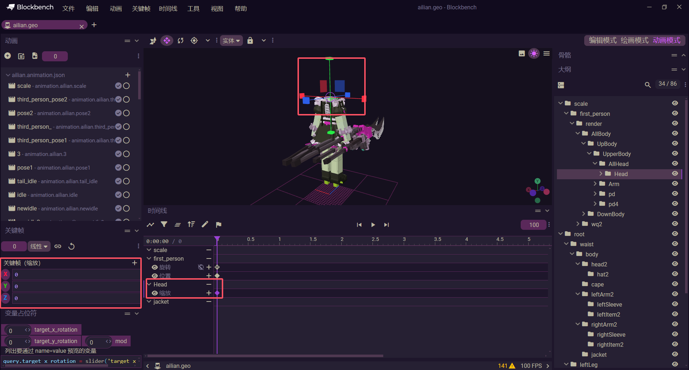

    - first_person_idle的first_person骨骼的*旋转*应当固定填写为(-query.mod.dfm_cyzs3_rot, -180, 0)

    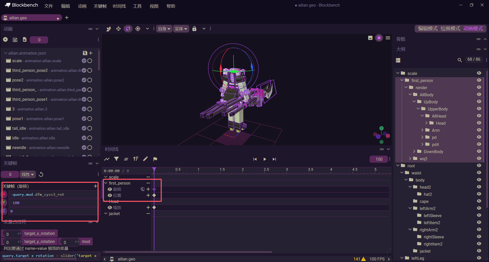

    - first_person_idle的first_person骨骼的*位置*应当暂时填写为非零值，例如(1, 1, 1)

    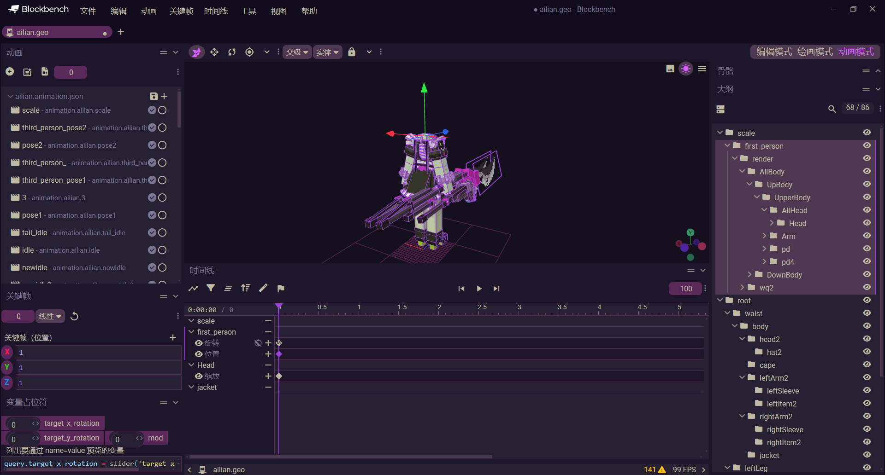

    - 进入游戏，进行实时调整first_person骨骼的*位置*，以达到合适位置
        - 进入游戏后一直按F3或者F4来切换调试信息到如下图<br>
            第一次会显示如下样式，点击`Search Windows`

        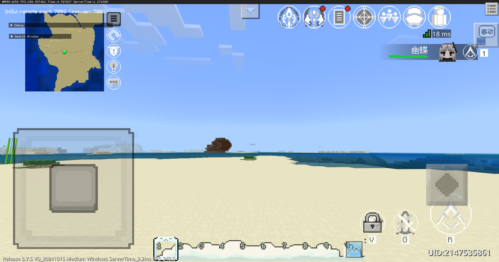

        - 随后点击`Animation`内的`Open Editor`打开`Animation Editor`(动画编辑器)

        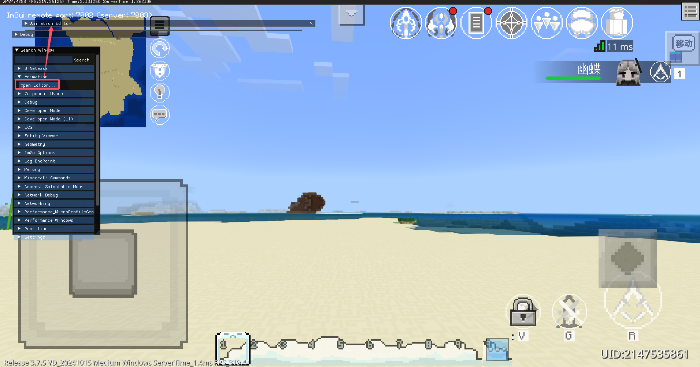

        - 将`Animation Editor`展开，并点击右下角的小三角拉大界面以显示动画内容

        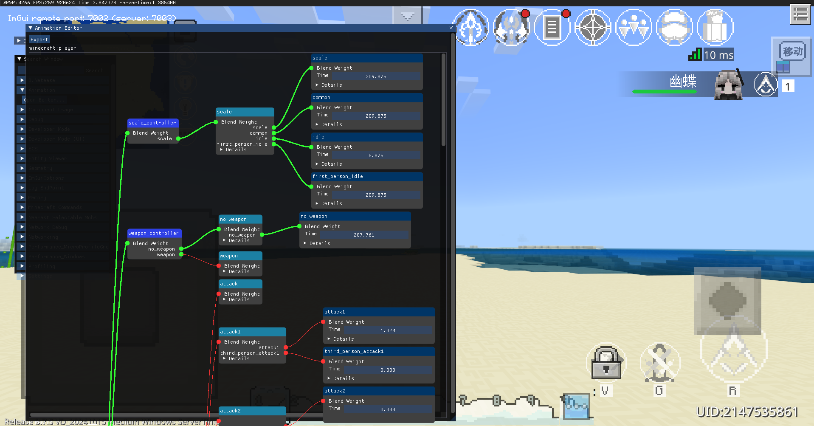

        - 变身副包角色后，第一人称垂直看向地面，并在`Animation Editor`找到`first_person_idle`动画，并持续展开动画信息，找到`Bone Animations`(骨骼动画)，然后找到我们之前创建的`first_person`骨骼并展开，找到`position`(位置/坐标)，可以手动输入下面的xyz坐标，也可以用鼠标按住颜色块左右拖拽来调整。<br>
            最终调整到正确合理的第一人称视角，并记录xyz坐标，手动输入在blockbench中的first_person_idle动画中的first_person的位置的坐标，这样下次启动就正常的视角了！

        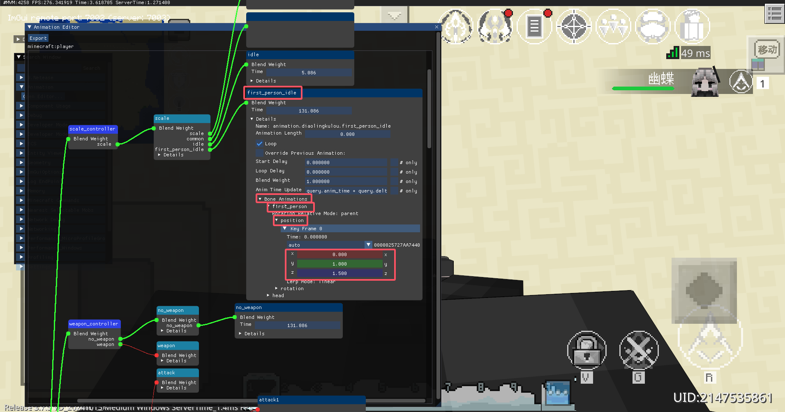

- 除了idle,first_person_idle外，其余的动画都应当根据关键帧拆出并命名为third_person_{animationname}，如果无法理解，可阅读[资产命名规范](#资产命名规范)。

    - 拆分原则<br>
    凡是角色身体移动、旋转等会影响到第一人称观感的关键帧动画，都应当拆分

    - 操作步骤
        1. 根据动画名称{animationname}新建third_person_{animationname}的空动画
        2. 将会影响到第一人称观感的关键帧框选，按下ctrl+x剪切
        3. 粘贴在新建的third_person_{animationname}中
        4. 检查两个动画时长*和动画类型*是否统一及规范性([资产内容规范](#资产内容规范))，若不统一应当以{animationname}为准
        <video width="100%" controls><source src="http://1.94.129.175/uploads/LingmienAether/dlc/dlc-9.mp4">你的浏览器不支持HTML5视频</video>
    <!-- - [操作视频](./picture/dlc-9.mp4) -->

## 大功告成！
大功告成，测试检查模组包体就可以了！

## 免神物品id列表
详见[附件列表](#附件列表)