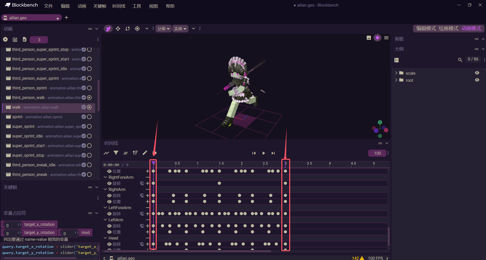
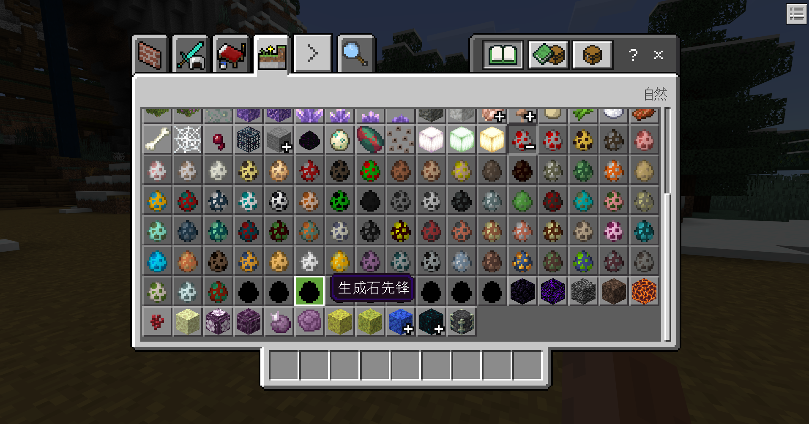

# 黑西游-Boss开发

:::success{title=高效！非常高效}
- 该功能为使用简单的Json配置(python dict)，即可轻松实现《黑西游》新Boss注册
- 原本需要2~3天的开发周期，现仅需***2小时***！
- 现已支持使用*灵免以太*接口
:::

## 附件列表
:::warning{title=注意}
- 由于早期框架问题，测试时必须要加载“黑西游-黑风山下”，“黑西游-广智”，“黑西游-虎先锋”
:::

|版本|文件名称|上传时间|大小|下载|
|:-:|:-:|:-:|:-:|:-:|
|2.2.1|黑西游-测试环境|2024-11-02|61.3M|<a href="https://lingxi.office.163.com/share/#type=file&id=19000019037532&from=QIYE&parentResourceId=19000014296450&spaceId=510845429&ref=546025021">下载</a>|
|1.0.0|黑西游-黑风山下|2024-11-07|265K|<a href="https://lingxi.office.163.com/share/#type=file&id=19000019039172&from=QIYE&parentResourceId=19000014296450&spaceId=510845429&ref=546025021">下载</a>|
|1.0.0|黑西游-广智|2024-11-07|262K|<a href="https://lingxi.office.163.com/share/#type=file&id=19000019038211&from=QIYE&parentResourceId=19000014296450&spaceId=510845429&ref=546025021">下载</a>|
|1.0.0|黑西游-小妖I|2024-11-07|180K|<a href="https://lingxi.office.163.com/share/#type=file&id=19000019036879&from=QIYE&parentResourceId=19000014296450&spaceId=510845429&ref=546025021">下载</a>|
|1.0.0|黑西游-虎先锋|2024-11-07|340K|<a href="https://lingxi.office.163.com/share/#type=file&id=19000019038212&from=QIYE&parentResourceId=19000014296450&spaceId=510845429&ref=546025021">下载</a>|
|1.0.1|黑西游-石先锋|2024-11-02|188K|<a href="https://lingxi.office.163.com/share/#type=file&id=19000019036878&from=QIYE&parentResourceId=19000014296450&spaceId=510845429&ref=546025021">下载</a>|

<!--  -->
<video width="100%" controls><source src="http://1.94.129.175:8000/dlc-31.mp4">你的浏览器不支持HTML5视频</video>

## 调试设置
由于微软mojang原版沙子实体多线程bug，致使游戏持续弹出断言而崩溃游戏，需要前往`菜单`-`设置`-`调试`-`断言显示一个模式对话`关闭！


## 副包脚本文件结构

<Tree>
  <ul>
    <li>
      ***Scripts<small>脚本文件夹</small>
      <ul>
      <li>***Common<ul>
        <li>__init__.py</li>
        <li>config.py<small>脚本配置文件</small></li>
      </ul></li>
      <li>ModClient<small>客户端文件夹</small><ul>
        <li>__init__.py</li>
        <li>ClientEventList<small>客户端监听事件列表(使用监听装饰器，不推荐在此处编写监听事件)</small></li>
        <li>EventApi.py<small>客户端监听事件装饰器</small></li>
        <li>GlobalClientSystem.py<small>客户端系统</small></li>
      </ul></li>
      <li>ModServer<small>服务端文件夹</small><ul>
        <li>__init__.py</li>
        <li>EventApi.py<small>服务端监听事件装饰器</small></li>
        <li>ServerEventList<small>服务端监听事件列表(使用监听装饰器，不推荐在此处编写监听事件)</small></li>
        <li>heishenhua.py<small>黑西游副包数据信息</small></li>
        <li>GlobalServerSystem.py<small>服务端系统</small></li>
      </ul></li>
      <li>__init__.py</li>
      <li>modMain.py<small>脚本系统(不推荐在此处编写代码)</small></li>
      </ul>
    </li>
  </ul>
</Tree>

## 资产规范及导入
### 资产命名规范
:::error{title=特别注意}
一定要确保必要资产内容正确命名，否则直接在游戏内测试会出现异常！
:::

|名称|命名格式|示例|备注|
|:-:|:-:|:-:|:-:|
|自定义动画|animation.{RenderId}.{animationname}|animation.ailian.pose2|选择性注意，只需要保证正常注册实体动画即可。但推荐强制规范！|
|待机动画|animation.{RenderId}.idle|animation.ailian.idle|必要|
|行走动画|animation.{RenderId}.walk|animation.ailian.walk|必要|
|普通攻击动画|animation.{RenderId}.attack|animation.ailian.attack|必要|
|死亡动画|animation.{RenderId}.death|animation.ailian.death|必要|

### 资产内容规范
#### 动画关键帧规范
:::warning{title=注意}
一定要严加检查该内容
:::

每个动画一定要确保首尾都有关键帧，否则游戏内实际表现将会异常



如果没有，需要手动先点击“将所有修改后的动画放入时间轴”，随后选择关键帧位置，再到关键帧选项中点击创建关键帧列


#### 死亡动画规范
尸体死亡动画，即death动画的尾帧应当延长至`3.5`秒处！


## 使用自动化程序创建Boss
- 选择自定义Boss实体自动化类型


- 根据资产命名规范填写内容，随后导入模型、纹理，选择行为包、资源包，最后点击开始纸娃娃即可


- 游戏内就会新增一个黑色的刷怪蛋，但此时他并没有动作等内容



## 导入动画文件并处理实体动画
### 文件结构
<Tree>
  <ul>
    <li>
      behavior_pack_***<small>行为包</small><ul></ul>
    </li>
    <li>
      resource_pack_***<small>资源包</small>
      <ul>
        <li>
            animation_controllers<small>动画控制器文件夹</small>
            <ul>
                <li>
                    {EntityId}.animation_controllers.json<small>实体动画控制器文件</small>
                </li>
            </ul>
        </li>
        <li>
            animations<small>动画文件夹(如果没有需要手动创建)</small>
            <ul>
                <li>
                    {EntityId}.animation.json<small>实体动画文件</small>
                </li>
            </ul>
        </li>
        <li>
            entity<small>实体外观文件夹</small>
            <ul>
                <li>
                    death<small>实体的尸体外观文件夹</small>
                    <ul>
                        {EntityId}.json<small>实体的尸体外观文件</small>
                    </ul>
                </li>
                <li>
                    {EntityId}.json<small>实体外观文件</small>
                </li>
            </ul>
        </li>
      </ul>
    </li>
  </ul>
</Tree>

### 导入动画文件
- 使用blockbench打开实体bbmodel工程文件，并将实体动画导出，并将文件命名满足上面文件结构中的格式：{EntityId}.animation.json


- 打开所导出的动画文件，复制至上面文件结构中对应的位置。打开并根据[资产命名规范](#资产命名规范)来对`动画id`进行修改


### 注册实体动画
- 打开`实体外观文件`，注册实体*连招*动画，在`"animations"`中输入`key: 动画id`，其中`key`为该实体动画唯一标识符，指向了`动画id`，可以理解为`key`是对`动画id`的重命名行为。<br>
将你认为合适的连招动作，注册在该`实体外观文件`中，如7-12行所示，共6个连招动画。

```json {7-12}
{
    "format_version": "1.10.0",
    "minecraft:client_entity": {
        "description":{
            ...
            "animations": {
                "attack1": "animation.shixianfeng.attack1",
                "attack2": "animation.shixianfeng.attack2",
                "attack4": "animation.shixianfeng.attack4",
                "attack5": "animation.shixianfeng.attack5",
                "attack6": "animation.shixianfeng.attack6",
                "attack7": "animation.shixianfeng.attack7",

                "look_at_target": "animation.dfm_common.look_at_target",
                "idle": "animation.shixianfeng.idle",
                "walk": "animation.shixianfeng.walk",
                "attack": "animation.shixianfeng.attack3",
                "death": "animation.shixianfeng.death",
                "states_controller": "controller.animation.shixianfeng.states"
            },
            ...
        }
    }
}
```

### 修改动画控制器
- 打开`实体动画控制器文件`，`states`下所有的都是该实体的动画机状态，每个状态有对应的动画，转化条件等。<br>
找到`combo_attack`动画机状态的`animations`列表，根据格式，依次添加连招动画，其中`key`为[注册实体动画](#注册实体动画)中的重命名，`value`为条件，格式为`query.mod.combo == n`，n为连超动画数量、次第取值，从1开始(包含1)，步距为1.

:::warning{title=注意}
自带的`custom_combo_attack": "query.mod.combo == 1`应当进行删除
:::

```json {9-26}
{
	"format_version": "1.10.0",
	"animation_controllers": {
		"controller.animation.shixianfeng.states": {
			"initial_state": "idle",
			"states": {
				"combo_attack": {
					"animations": [
						{
							"attack1": "query.mod.combo == 1"
						},
						{
							"attack2": "query.mod.combo == 2"
						},
						{
							"attack4": "query.mod.combo == 3"
						},
						{
							"attack5": "query.mod.combo == 4"
						},
						{
							"attack6": "query.mod.combo == 5"
						},
						{
							"attack7": "query.mod.combo == 6"
						}
					],
					"transitions": [
						{
							"idle": "!query.mod.combo"
						}
					],
					"blend_transition": 0.15
				},
                ...
            }
        }
    }
}
```

## 编写Boss数据信息
- 在[副包脚本文件结构](#副包脚本文件结构)中的`heishenhua.py`文件中编写Boss数据信息

:::warning{title=连招顺序}
根据[修改动画控制器](#修改动画控制器)中的`动画id`对应的`value`的`query.mod.combo == n`，根据n的数字从小到大排列
:::

|key|数据类型|说明|
|:-:|:-:|:-:|
|ModName|str|副包模组名称|
|ClientSystemName|str|副包客户端名称|
|ServerSystemName|str|副包服务端名称|
|CustomAttackFunctionName|str|重写Boss实体攻击逻辑，需要在副包服务端定义一个同名函数并接收一个EntityId的参数|
|CustomFeatureRule|str|Boss生成的结构规则名称|
|CustomSpawnOffset|tuple(float, float)|Boss生成的结构对应点位的偏移|
|ComboTimer|list|连招动画时间列表，根据[修改动画控制器](#修改动画控制器)中按照n的从小到大填写该连招动画的时长|
|AttackCD|float|延迟连招逻辑|
|DamageTimerList|list[list]|对应连招顺序填写该连招动画造成伤害的时间|
|AttackDict|list[dict]|对应连招顺序填写该连招攻击的配置信息|

- AttackDict 连招攻击配置说明

|key|数据类型|说明|备注|
|:-:|:-:|:-:|:-:|
|Radius|float|攻击距离|最小为3|
|IsCanSee|bool|是否可视才造成攻击|-|
|Damage|int|造成的伤害|-|
|BetweenAngle|float|攻击角度|0.0~360.0|
|SfxDict|dictlist|攻击特效列表|-|

- 攻击特效列表说明<br>

|key|数据类型|说明|备注|
|:-:|:-:|:-:|:-:|
|FaceCamara|bool|是否面向摄像机|-|
|Id|str|特效Id|-|
|Offset|tuple|特效坐标偏移|三元数组|
|Rot|tuple|特效角度偏移|三元数组|
|Scale|tuple|特效大小乘积|三元数组|
|IsJson|bool|是否根据json播放特效||

- CustomFeatureRule填写说明
    - 使用接口[GetCustomFeatureRulesByPos](http://1.94.129.175:8000/docs/building#getcustomfeaturerulesbypos)获取Boss需要生成的`CustomFeatureRule`
    - 启动测试环境，在游戏内挑选*黑西游建筑群的合适Boss生成坐标*并填写进GetCustomFeatureRulesByPos接口参数中，随后根据下表填写接口的CustomFeatureRuleId参数，print获取的特征id结果，将结果复制到ComboAttackEntityDict的CustomFeatureRule处

        |建筑群|多结构自定义特征id|
        |:-:|:-:|
        |黑风山(上)|custom:heifengshan2_1_106aa1e63ed7409d8a05acd27f34bc49|
        |黑风山(下)|custom:heifengshan3_1_fbb32b30c05b4db2a15dbc955a7e0d42|
        |黄风岭|custom:huangfengling_1_c265f52ba53e4df698764da218665648|

    - 随后使用接口[GetCustomFeatureRulesPos](http://1.94.129.175:8000/docs/building#getcustomfeaturerulespos)，获取特征坐标，忽略y坐标考虑，仅需对xz坐标进行计算，得出xz偏移位置：CustomSpawnOffset


```python
# -*- coding:utf-8 -*-
ComboAttackEntityDict = {
    'ModName': 'shixianfeng',
    'ClientSystemName': 'shixianfengClientSystem',
    'ServerSystemName': 'shixianfengServerSystem',
    # 'CustomAttackFunctionName': 'BaiYiXiuShiAttack',  # 一个参数EntityId，不填则使用默认连招模式
    'CustomFeatureRule': 'custom:huangfengling_1489_c265f52ba53e4df698764da218665648',  # 自定义生成特征的区块位置
    'CustomSpawnOffset': (0, -6),  # 区块对应的xz偏移位置
    'ComboTimer': [5.25, 5, 4.5, 2.54, 2.5, 2.54],  # 连招动画时间
    'AttackCD': 0,  # 延迟几秒再连击
    'DamageTimerList': [
        [2.04, 3.88],
        [1.04, 2.63, 3.63],
        [2.08, 3.38],
        [1.38],
        [1.5],
        [1.38]
    ],  # 连招伤害触发时间
    'AttackDict': [
        {
            'Radius': 7.5,
            'IsCanSee': True,
            'Damage': 80,
            'BetweenAngle': 150,
            'SfxList': [
                {
                    'Id': 'youhun_attack',
                    'FaceCamara': True,
                    'Offset': (-3, 3, 0),
                    'Rot': (0, 0, 0),
                    'Scale': (3, 3, 3),
                    'IsJson': True
                },
                {
                    'Id': 'youhun_attack2',
                    'FaceCamara': True,
                    'Offset': (-4, 3, 0),
                    'Rot': (0, 0, 0),
                    'Scale': (2.5, 2.5, 2.5),
                    'IsJson': True
                }
            ]
        },
        {
            'Radius': 7.5,
            'IsCanSee': True,
            'Damage': 80,
            'BetweenAngle': 150,
            'SfxList': [
                {
                    'Id': 'youhun_attack',
                    'FaceCamara': True,
                    'Offset': (-3, 3, 0),
                    'Rot': (0, 0, 0),
                    'Scale': (3, 3, 3),
                    'IsJson': True
                },
                {
                    'Id': 'youhun_attack2',
                    'FaceCamara': True,
                    'Offset': (-4, 3, 0),
                    'Rot': (0, 0, 0),
                    'Scale': (2.5, 2.5, 2.5),
                    'IsJson': True
                }
            ]
        },
        {
            'Radius': 7.5,
            'IsCanSee': True,
            'Damage': 80,
            'BetweenAngle': 150,
            'SfxList': [
                {
                    'Id': 'youhun_attack',
                    'FaceCamara': True,
                    'Offset': (-3, 3, 0),
                    'Rot': (0, 0, 0),
                    'Scale': (3, 3, 3),
                    'IsJson': True
                },
                {
                    'Id': 'youhun_attack2',
                    'FaceCamara': True,
                    'Offset': (-4, 3, 0),
                    'Rot': (0, 0, 0),
                    'Scale': (2.5, 2.5, 2.5),
                    'IsJson': True
                }
            ]
        },
        {
            'Radius': 7.5,
            'IsCanSee': True,
            'Damage': 80,
            'BetweenAngle': 150,
            'SfxList': [
                {
                    'Id': 'youhun_attack',
                    'FaceCamara': True,
                    'Offset': (-3, 3, 0),
                    'Rot': (0, 0, 0),
                    'Scale': (3, 3, 3),
                    'IsJson': True
                },
                {
                    'Id': 'youhun_attack2',
                    'FaceCamara': True,
                    'Offset': (-4, 3, 0),
                    'Rot': (0, 0, 0),
                    'Scale': (2.5, 2.5, 2.5),
                    'IsJson': True
                }
            ]
        },
        {
            'Radius': 7.5,
            'IsCanSee': True,
            'Damage': 80,
            'BetweenAngle': 150,
            'SfxList': [
                {
                    'Id': 'youhun_attack',
                    'FaceCamara': True,
                    'Offset': (-3, 3, 0),
                    'Rot': (0, 0, 0),
                    'Scale': (3, 3, 3),
                    'IsJson': True
                },
                {
                    'Id': 'youhun_attack2',
                    'FaceCamara': True,
                    'Offset': (-4, 3, 0),
                    'Rot': (0, 0, 0),
                    'Scale': (2.5, 2.5, 2.5),
                    'IsJson': True
                }
            ]
        },
        {
            'Radius': 7.5,
            'IsCanSee': True,
            'Damage': 80,
            'BetweenAngle': 150,
            'SfxList': [
                {
                    'Id': 'youhun_attack',
                    'FaceCamara': True,
                    'Offset': (-3, 3, 0),
                    'Rot': (0, 0, 0),
                    'Scale': (3, 3, 3),
                    'IsJson': True
                },
                {
                    'Id': 'youhun_attack2',
                    'FaceCamara': True,
                    'Offset': (-4, 3, 0),
                    'Rot': (0, 0, 0),
                    'Scale': (2.5, 2.5, 2.5),
                    'IsJson': True
                }
            ]
        }
    ]
}
```

## 服务端脚本注册Boss实体
获取主包服务端实例，使用`RegisterBoss`接口进行注册。

### <a id="register"></a>RegisterBoss
<font color=red>服务端</font><br>
- 描述<br>
  向黑西游·悟空主包注册自定义Boss

- 参数

|key|数据类型|说明|
|:-:|:-:|:-:|
|EntityIdStr|str|实体IdStr名称，例如"minecraft:zombie"|
|ComboAttackEntityDict|dict|[编写Boss数据信息](#编写boss数据信息)|

- 返回值<br>
  无

- 备注<br>
  无

- 示例
```python {3,17-19,30}
# -*- coding:utf-8 -*-
import ...

from heishenhua import ComboAttackEntityDict

compFactory = serverApi.GetEngineCompFactory()
ServerSystem = serverApi.GetServerSystemCls()
levelId = serverApi.GetLevelId()
compTimer = serverApi.GetEngineCompFactory().CreateGame(levelId)
compCmd = serverApi.GetEngineCompFactory().CreateCommand(levelId)

class shixianfengServerSystem(ServerSystem, ServerLingmienAether):

    def __init__(self, namespace, systemName):
        ...
        self.LA = self.GetLASys('密钥')
        self.AddTimes = 0
        self.MianPack = None
        self.GetMainPackSystem()

    def GetMainPackSystem(self):
        logging.debug('{0}'.format(self.AddTimes))
        try:
            self.MianPack = serverApi.GetSystem('heishenhua', 'heishenhuaServerSystem')
            if self.AddTimes <= 10:
                if not self.MianPack:
                    compTimer.AddTimer(1.0, self.GetMainPackSystem)
                    self.AddTimes += 1
                else:
                    self.MianPack.RegisterBoss('dfm:shixianfeng', ComboAttackEntityDict)
        except Exception as e:
            if self.AddTimes <= 10:
                compTimer.AddTimer(1.0, self.GetMainPackSystem)
                logging.critical('异常：{0}'.format(e))
```

## 大功告成，进行测试

