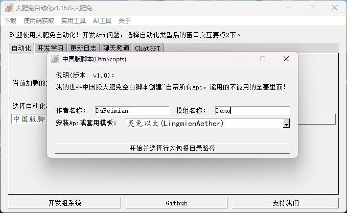

:::warning{title=版权警示}
Lingmien Aether受软件著作权保护！
:::

## 简介
旨在高效开发产品所用，集成优秀常用功能！推荐与自动化软件协作使用！
:::success{title=统计信息}
- 功能接口：152
- 配置组件：5
- 自动化开发：4
- 副包开发(DLC)：3
- 开发指南：23
:::

### 更好的管理界面


## 使用说明
:::success{title=太棒了}
- 现在使用始于2023年11月的自动化程序，可以直接完成客户端代码、服务端代码、依赖文件、注册模组信息。再也不用担心忘记了！
- 从2024年11月29日开始，获取接口数据需要使用密钥，并将于2024年12月22日正式废弃原有获取方案
- 现在调用接口系统后，补全库将不再需要注释就可以使用了！
:::

:::code-group

```python {2,4,8,10} [客户端]
import ...
from ClientLingmienAether import ClientLingmienAether

class ***ClientSystem(ClientSystem, ClientLingmienAether):  # 继承补全库，方便接口补全编写代码
  def __init__(self, namespace, systemName):
    ...
    # 调用接口系统
    self.LA = self.GetLASys('密钥')
    # 使用接口CreateDefaultUI注册并创建UI
    print self.LA.CreateDefaultUI(config.ModName, GlobalConfig.UIStartName, config.ScriptsName, True)
```

```python {2,4,8,11} [服务端]
import ...
from ServerLingmienAether import ServerLingmienAether

class ***ServerSystem(ClientSystem, ServerLingmienAether):  # 继承补全库，方便接口补全编写代码
  def __init__(self, namespace, systemName):
    ...
    # 调用接口系统
    self.LA = self.GetLASys('密钥')
    # 使用接口ServerMsg给所有玩家发送消息
    for PlayerId in serverApi.GetPlayerList():
      self.LA.ServerMsg(PlayerId, '这是一条自定义消息')
```

:::

使用***自动化程序***来创建脚本文件！



### 注册模组信息(必要)
在UiInitFinished(客户端)事件下使用InitLingmienAetherMod(服务端)接口来注册你的mod信息
```python {16}
@Event.ClientEvent('UiInitFinished')
def UiInitFinished(self, *args):
  ModData = {
      'ModName': 'Lingmien Aether',
      'Version': '1.0.2',
      'LogoPath': 'textures/ui/LA/logo_text',
      'Content': 'Lingmien Aether(灵免以太)'
                  '\n版本：1.0.2'
                  '\n制作人员：大肥免开发组\n'
                  '\nLAAPI Mod前置组件管理器',
  }
  self.LA.UseServerApi('InitLingmienAetherMod', [ModData])
```

## 文件结构

<Tree>
  <ul>
    <li>
      ***Scripts<small>脚本文件夹</small>
      <ul>
      <li>***Common<ul>
        <li>__init__.py</li>
        <li>config.py<small>脚本配置文件</small></li>
      </ul></li>
      <li>ModClient<small>客户端文件夹</small><ul>
        <li>uiScript<small>UI脚本文件夹</small><ul>
          <li>__init__.py</li>
          <li>{UIName}.py<small>对应{UIName}的脚本文件</small></li>
        </ul></li>
        <li>__init__.py</li>
        <li>ClientEventList<small>客户端监听事件列表(使用监听装饰器，不推荐在此处编写监听事件)</small></li>
        <li>ClientLingmienAether.py<small>灵免以太客户端补全库</small></li>
        <li>EventApi.py<small>客户端监听事件装饰器</small></li>
        <li>GlobalClientSystem.py<small>客户端系统</small></li>
      </ul></li>
      <li>ModServer<small>服务端文件夹</small><ul>
        <li>__init__.py</li>
        <li>EventApi.py<small>服务端监听事件装饰器</small></li>
        <li>ServerEventList<small>服务端监听事件列表(使用监听装饰器，不推荐在此处编写监听事件)</small></li>
        <li>ServerLingmienAether.py<small>灵免以太服务端补全库</small></li>
        <li>GlobalServerSystem.py<small>服务端系统</small></li>
      </ul></li>
      <li>__init__.py</li>
      <li>modMain.py<small>脚本系统(不推荐在此处编写代码)</small></li>
      </ul>
    </li>
  </ul>
</Tree>

## 特殊概念说明
### 实体
任一`实体`皆可使用，包含`玩家`。因此部分玩家上的功能也可以使用到实体接口来实现。

### 建筑
指多个`方块组合`的内容，通常用于**大型内容**，该概念需要与`方块`区分开来。

### 行为
涉及范围包含`实体`，即包含了`玩家`，更为功能性，例如`检索敌人并造成伤害(GetAndAttackRadiusEntities)`接口。

## 示例
```python {9}
# -*- coding:utf-8 -*-
...

class testClientSystem(ClientSystem, ClientLingmienAether):

    def __init__(self, namespace, systemName):
        super(testClientSystem, self).__init__(namespace, systemName)
        ...
        self.LA = self.GetLASys('密钥')
        self.IsQuery = False

    def Timer(self):
        if self.IsQuery:
            self.LA.CameraMotionRun(5, 0.5, 30, 0.9, 0.9, 1.0)

    @Event.ClientEvent('UiInitFinished')
    def OnLocalPlayerStopLoading(self, *args):
        self.LA.Msg('灵免以太')
        self.LA.QueryInit(playerId, 'la', 1.0)
        self.LA.Msg('函数query.mod.la初始化完毕结果为：{0}\n现在开始视角摇晃'.format(self.LA.QueryGet('la')))
        self.IsQuery = True
        self.LA.UseServerApi('PlaySound', [playerId, 'random.click'])
        self.LA.Msg('{0}'.format(type(self.LA.GetLingmienAetherManifest())))
        self.LA.Msg('我自己的三维坐标是：{0}，在该坐标生成僵尸，玩家每5秒攻击周围的怪物'.format(self.LA.GetEntityPos(playerId)))
        self.LA.UseServerApi('SummonEntityByName', ['minecraft:zombie', self.LA.GetEntityPos(playerId)])
        compTimer.AddRepeatedTimer(5, self.LA.UseServerApi, 'GetAndAttackRadiusEntities', [playerId, 8, True, True, 3, 120.0])
```

## 如何进行开发/测试？

### 新建自己的项目
新建一个附加包，这就是你的模组项目。


### 使用自动化程序新建脚本文件夹
暂无自动化，需要手写。随后创建对测试环境的依赖配置。
在行为包`behavior_pack_***`的根目录中创建`config`文件夹(即和脚本文件夹同目录)，在文件夹内新建文件`netease_require.json`.给自己的脚本设置灵免一台`LingmienAether`的依赖项。

<Tree>
  <ul>
    <li>
      behavior_pack_***<small>行为包</small>
      <ul>
        <li>
          config
          <ul>
            <li>netease_require.json
            <small>这是需要编写的模组依赖配置文件</small>
            </li>
          </ul>
        </li>
          <li>***Scripts
          <small>脚本文件夹</small><ul></ul></li>
          <li>entities
          <small>原生基岩版Addon自带的必要的文件夹</small><ul></ul></li>
      </ul>
    </li>
    <li>
      resource_pack_***<small>资源包</small><ul></ul>
    </li>
  </ul>
</Tree>

```json
{
    "modName":"test",
    "modRequire":[
        "LingmienAether" 
    ]
}
```

|Key|数据类型|说明|
|:-:|:-:|:-:|
|modName|str|模组名称，自行定义，推荐定义为主脚本的Modmain.py文件中定义的名称|
|modRequire|strlist|必须包含`LingmienAether`|

例如下列代码中的`config.ModName`便是这里需要填写的modName

```python {7}
# -*- coding: utf-8 -*-
from mod.common.mod import Mod
import mod.server.extraServerApi as ServerApi
import mod.client.extraClientApi as ClientApi
from LACommon import config

@Mod.Binding(name=config.ModName, version=config.ModVersion)
class LAtest(object):
    def __init__(self):
        pass

    @Mod.InitServer()
    def LAServerInit(self):
        ServerApi.RegisterSystem(config.ModName, config.ServerSystemName, config.ServerSystemPath)

    @Mod.DestroyServer()
    def LAServerDestroy(self):
        pass

    @Mod.InitClient()
    def LAClientInit(self):
        ClientApi.RegisterSystem(config.ModName, config.ClientSystemName, config.ClientSystemPath)

    @Mod.DestroyClient()
    def LAClientDestroy(self):
        pass
```

### 下载并导入测试环境
点击顶部导航栏下载测试环境后，在MCS里导入它。


### 测试你的项目
写好脚本代码后，点击自己项目的开发测试，选择测试版本后，在右上角`使用功能组件`中勾选刚刚导入的测试环境组件一并运行即可正常测试。


## 在你的模组简介添加前置说明
由于模组需要有依赖文件，因此推荐在简介中作出如下说明

