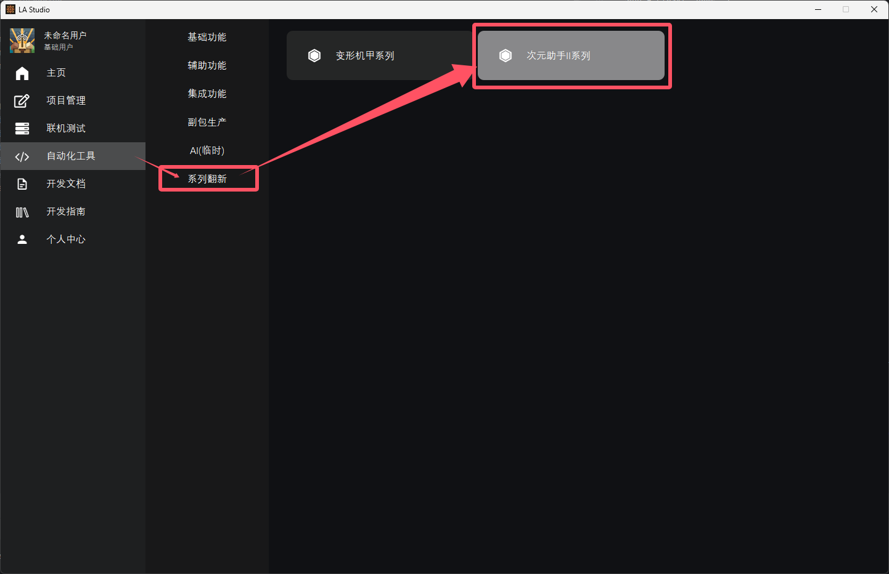

# 次元助手II兼容免神

## 附件列表

|版本|文件名称|上传时间|大小|下载|
|:-:|:-:|:-:|:-:|:-:|
|2.0.5|次元助手2前置-兼容免神|2025-03-21|64K|<a href="https://lingxi.office.163.com/share/#type=file&id=28500031077955&from=QIYE&parentResourceId=19000008358312&spaceId=510845429&ref=546025021">下载</a>|
|1.0.5|雷电使者-半成品参考包|2025-03-21|6.20M|<a href="https://lingxi.office.163.com/share/#type=file&id=28500031025089&from=QIYE&parentResourceId=19000008358312&spaceId=510845429&ref=546025059">下载</a>|

## 运行环境
启动包体的时候应同时运行`次元助手2前置-兼容免神`、`免神主包`

## 创建免神角色副包继承版
- 使用`灵免以太开发平台`中的自动化工具-系列翻新-`次元助手II系列`来创建免神角色副包所需的脚本文件夹及内容。
- 其中角色ID应当与次元助手II包体做出区分，例如次元助手II包体中角色Id叫做`leidianshizhe`，则这里我们可以填写为`leidianshizhe_mianshen`以便区分。
- 模型等资源直接选择次元助手II包体中已有的内容即可，若出现了贴图报错，手动复制一份并重新命名为`{RenderId}.png`即可，例如填写的角色ID为`leidianshizhe_mianshen`，则图片命名为`leidianshizhe_mianshen.png`。



## 角色逻辑、属性继承
:::warning{title=严重警告}
次元助手II不同包体代码不同，直接复制下面示例内容无效！需要一定的代码理解能力！
:::

- 使用`clientApi.GetSystem(ModName, ClientSystemName)`来获取次元助手II包体原有的脚本客户端系统实例。
- 在该实例中找到对应免神属性所需的函数、逻辑所需的函数，进行调用。
- `GetSkillColdDown`等函数皆为`Cyzs3Lib.py`中继承函数，包含了说明。


示例如下：
```python
# -*- coding: utf-8 -*-
import mod.client.extraClientApi as clientApi
import logging
from ClientEventList import EventList
import DaFeimianRaidenScripts.DaFeimianCommon.config as config
import EventApi as Event
from ClientLingmienAether import ClientLingmienAether
from cyzs3.Cyzs3Lib import Cyzs3Lib

ClientSystem = clientApi.GetClientSystemCls()
playerId = clientApi.GetLocalPlayerId()
levelId = clientApi.GetLevelId()
compFactory = clientApi.GetEngineCompFactory()
compTimer = compFactory.CreateGame(levelId)

class RaidenClientSystem(ClientSystem, ClientLingmienAether, Cyzs3Lib):

    def __init__(self, namespace, systemName):
        super(RaidenClientSystem, self).__init__(namespace, systemName)
        print "================GlobalClientSystemInit================"
        for Event in EventList:
            try:
                Func = getattr(self, Event['EventFunc'])
            except:
                logging.debug('EventApi ListenEvent')
                Func = Event['EventFunc']
            logging.debug("ClientListenEvent: {0}   {1}".format(Event["EventType"], Event["EventName"]))
            if Event["EventType"] == "Client":
                self.ListenForEvent(clientApi.GetEngineNamespace(), clientApi.GetEngineSystemName(), Event["EventName"], self, Func)
            else:
                self.ListenForEvent(config.ModName, config.ServerSystemName, Event["EventName"], self, Func)
        self.LA = self.GetLASys('V82JLCHJLEUH5A6I')

    @Event.ClientEvent('OnScriptTickClient')
    def ClientTick(self):
        pass

    def GetSkillColdDown(self):
        MainPackClient = clientApi.GetSystem('leidianshizhe', 'leidianshizheClientSystem')
        SkillColdDown = MainPackClient.GetSkillTime()
        return SkillColdDown

    def PlayerAttack(self, RenderDict, Type):  # type: (dict, str) -> None
        # 获取客户端系统实例
        MainPackClient = clientApi.GetSystem('leidianshizhe', 'leidianshizheClientSystem')
        MainPackClient.UpDateValue()
        MainPackClient.PlayerAttack(1)

    def PlayerSkill(self, RenderDict, Type):  # type: (dict, str) -> None
        MainPackClient = clientApi.GetSystem('leidianshizhe', 'leidianshizheClientSystem')
        MainPackClient.UpDateValue()
        MainPackClient.PlayerTeShuGongJi(1)

    def PlayerBiShaJi(self, RenderDict, Type):  # type: (dict, str) -> None
        MainPackClient = clientApi.GetSystem('leidianshizhe', 'leidianshizheClientSystem')
        MainPackClient.UpDateValue()
        MainPackClient.PlayerBiShaJi(1)

    def PlayerShanBi(self, RenderDict, Type):  # type: (dict, str) -> None
        MainPackClient = clientApi.GetSystem('leidianshizhe', 'leidianshizheClientSystem')
        MainPackClient.UpDateValue()
        MainPackClient.PlayerShanBi(1)

    def GetRenderHealth(self, RenderLevel=1):
        MainPackClient = clientApi.GetSystem('leidianshizhe', 'leidianshizheClientSystem')
        Health = MainPackClient.GetRenderData().get('Health', 20)
        return int(Health)

    def GetRenderDamage(self, RenderLevel=1, AttackLevel=1, RenderId=None):
        MainPackClient = clientApi.GetSystem('leidianshizhe', 'leidianshizheClientSystem')
        Damage = MainPackClient.GetRenderData().get('Damage', 10)
        return int(Damage)

    def GetRenderExp(self, RenderLevel=1):
        Exp = 1000.0
        AddPercent = 1.10
        LastAddPercent = 1.15
        if RenderLevel <= 80:
            for i in range(0, RenderLevel):
                Exp *= AddPercent
        else:
            for i in range(0, 80):
                Exp *= AddPercent
            for i in range(0, RenderLevel - 80):
                Exp *= LastAddPercent
        return int(Exp)
```


## 角色动作继承
结合[免神-角色开发](http://1.94.129.175:8000/docs/dlc-mianshen)和次元助手II包体内的动画控制器、动画调整至动作正常播放。参考方案如下：
1. 以免神动画逻辑为主，将次元助手II包体内的动画控制器、动画等添加进免神配置文件进行调试适配。
2. 以次元助手II包体逻辑为主。