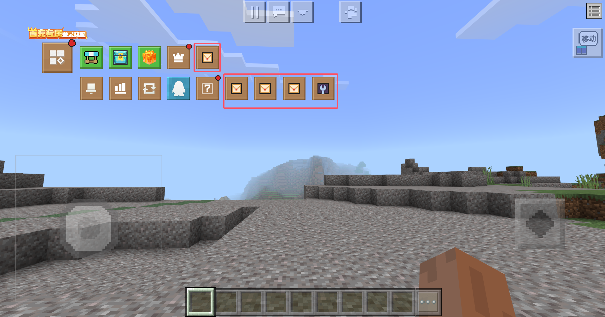
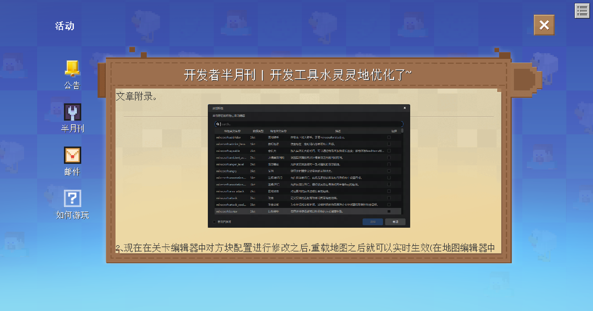
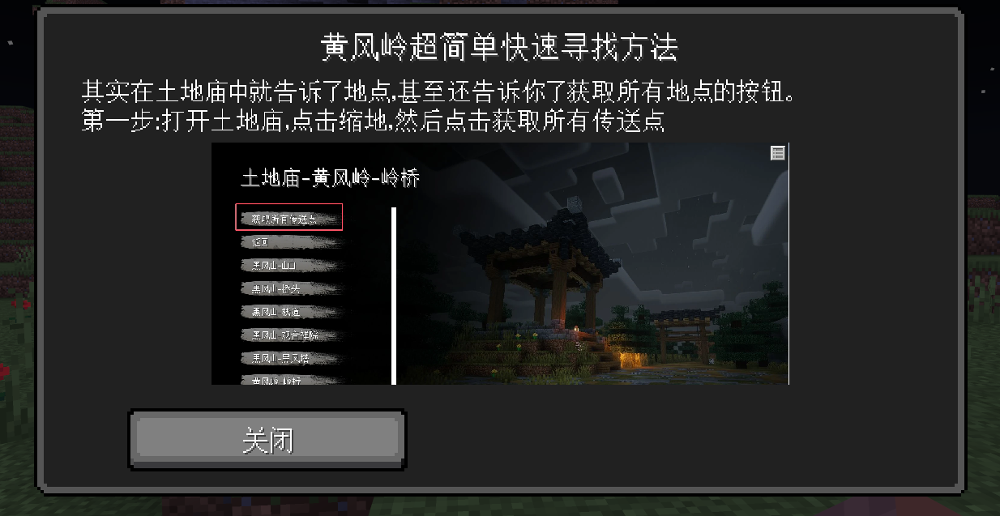

# v1.0.11<Badge type="success">Release</Badge>
## 主要更新
1. 联机大厅菜单支持注册自定义菜单按钮

    

2. 联机大厅活动处的文本类型支持富文本

    

3. 提示弹窗处的文本类型支持富文本

    

4. 活动类型支持自定义签到

    

## 次要更新
1. 修复了玩家切换维度后OpenTips异常的问题
2. <Badge type="info">1.0.11.2</Badge>修复了因联机大厅后台控制中心无法读取根级list类型数据问题而无法实时动态更新公告的问题，实际上是可以正常存储的
3. <Badge type="info">1.0.11.2</Badge>修复了因GetPlayerDataInLobby(服务端)接口“当该Key没有数据时，返回的参数不会携带该Key”而联机大厅签到无法解锁的问题

## 新增接口
1. 新增RegisterCustomLobbyNotice(服务端)，注册自定义联机大厅公告
2. 新增RegisterLobbyMenuButton(客户端)，注册自定义联机大厅菜单按钮
3. 新增RebindMenuButtonFunction(客户端)，重新绑定菜单按钮触发函数
4. 新增SelectNotice(客户端)，打开指定标题活动界面