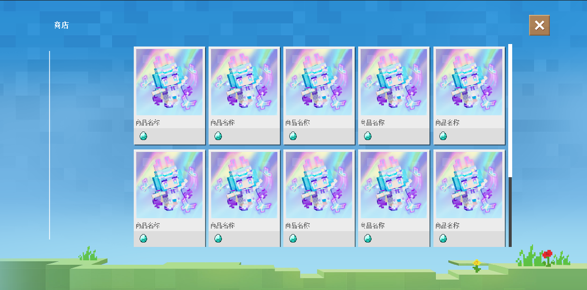

# v1.0.13<Badge type="success">Release</Badge>
## 主要更新
1. 联机大厅玩家背包现在可以跨存档存储
2. <Badge type="info">1.0.13.2</Badge>联机大厅自动统计玩家对充值类型货币充值了多少，玩家数据key为`All{PriceType}`，服务端排行榜数据key为`ChargedRank`下的`All{PriceType}Rank`

## 次要更新
1. 优化了联机大厅商店显示效果、凸显层次感

2. 修复了无需充值的货币类型无法正常刷新的问题
3. <Badge type="info">1.0.13.2</Badge>修复了签到类型公告活动领取异常的问题
4. <Badge type="info">1.0.13.4</Badge>修复了联机大厅因网易bug而影响的数据问题，即二次加载客户端GetAttr只能获取到None
5. <Badge type="info">1.0.13.3</Badge>联机大厅环境下，默认不启动灵免以太主界面
6. <Badge type="info">1.0.13.3</Badge>联机大厅环境下，隐藏玩家权限控制按钮，防止玩家利用微软漏洞作弊

## 新增接口
1. <Badge type="info">1.0.13.4</Badge>新增BindPlayerChargedFunctionInLobby(服务端)，绑定联机大厅玩家充值后触发函数

## 调整接口
1. <Badge type="success">对旧代码无影响</Badge>调整GetPlayerDataInLobby(服务端)，获取失败时将会在0.5后自动重试获取行为
2. <Badge type="success">对旧代码无影响</Badge>调整AddPlayerCoinInLobby(服务端)，新增参数以隐藏加载动画界面
3. <Badge type="info">1.0.13.4</Badge><Badge type="success">对旧代码无影响</Badge>调整ServerMsg(服务端)，参数将自动str化
4. <Badge type="info">1.0.13.4</Badge><Badge type="success">对旧代码无影响</Badge>调整Msg(客户端)，参数将自动str化

## 修复接口
1. <Badge type="info">1.0.13.3</Badge>修复RegisterRankInfoInLobby(客户端)，在联机大厅环境下因延迟较高而无法执行的问题