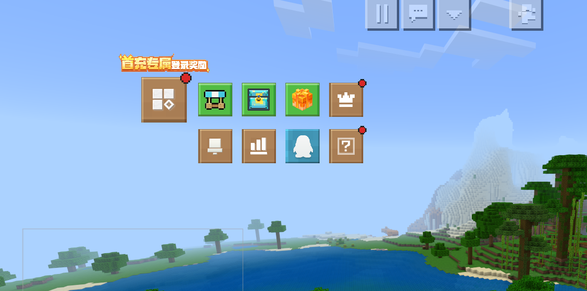
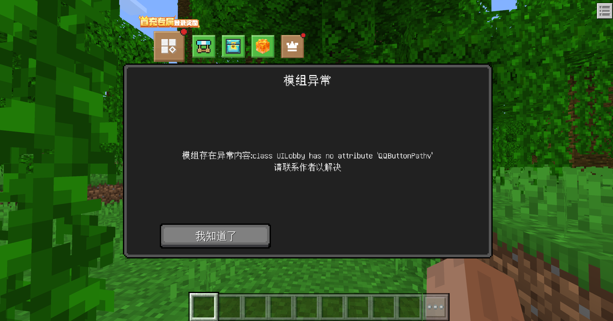

# v1.0.9<Badge type="success">Release</Badge>
## 主要更新
1. 新增联机大厅相关功能，包括：商店、抽奖、签到、会员、公告、排行榜、QQ、帮助等内容 
测试时需要使用`self.LA.SetIsDisable('IsLobby', True)`才会显示

    

    

2. 新增更多事件日志提示

    

## 新增接口
1. 新增SetIsDisable(服务端)，服务端设置，需要在服务端初始化后直接调用
2. 新增GetPlatForm(服务端)，获取服务端运行环境
3. 新增GetServerIsDisable(客户端，)获取服务端设置信息
4. <Badge type="info">1.0.9.2</Badge>新增SetPlayerDataInLobby(服务端)，设置联机大厅玩家/服务器存储数据(对应Key进行覆盖)
5. <Badge type="info">1.0.9.2</Badge>新增GetPlayerDataInLobby(服务端)，获取联机大厅玩家/服务器存储数据(可部分获取)，如果返回值为空，可以GetModRenderAttrByKey获取Key为'LobbyData'
6. <Badge type="info">1.0.9.2</Badge>新增GetPlayerLobbyUID(服务端)，获取玩家联机大厅UID
7. <Badge type="info">1.0.9.2</Badge>新增BindPlayerBuyItemFunction(服务端)，绑定联机大厅玩家购买商品事件函数，为防止作弊无法解绑
8. <Badge type="info">1.0.9.2</Badge>新增GetCustomFeatureRulesPos(服务端)，获取特征规则坐标
9. <Badge type="info">1.0.9.2</Badge>新增GetCustomFeatureRulesByPos(服务端)，根据当前坐标获取离自己最近的多结构自定义特征Id
10. <Badge type="info">1.0.9.2</Badge>新增GetDictExtremeValueKey(双端)，获取Dict中指定Key的极值对应的键

## 调整接口
1. <Badge type="info">1.0.9.3</Badge><Badge type="success">对旧代码无影响</Badge>调整GetPlayerDataInLobby(服务端)，新增参数指定返回值Key、Function

## 修复接口
1. <Badge type="error">对旧代码有影响</Badge>修复SortDictByNumberMagnitude(双端)，参数异常