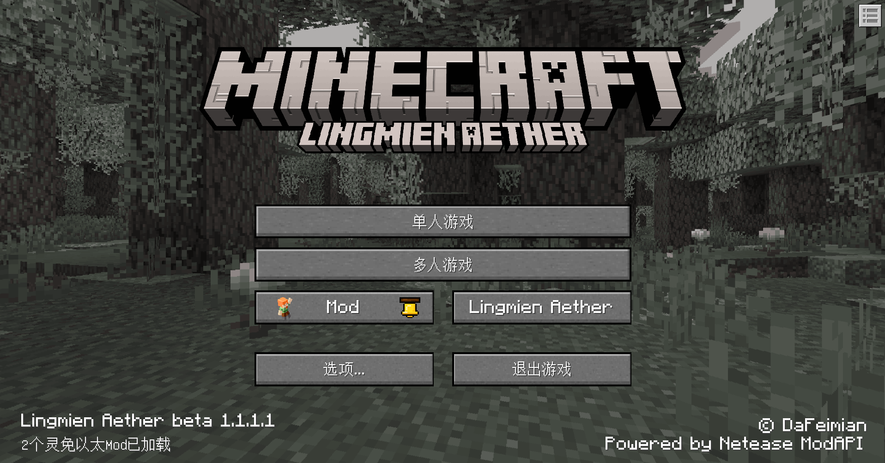
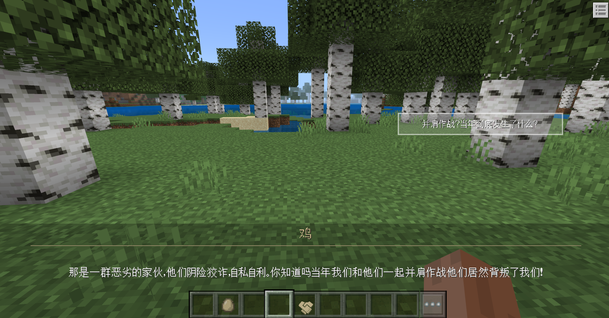

# v1.1.1<Badge type="success">Release</Badge>
## 主要更新
1. 主界面更换为最新背景盒
    

2. <Badge type="info">1.1.1.2</Badge>实体自定义聊天功能
    

## 次要更新
1. 大幅优化了灵免以太的启动速度，逻辑优化
2. <Badge type="info">1.1.1.3</Badge>优化了会话系统，现在可以进行加速跳过对话和关闭对话，而不是延迟2秒对话结束

## 新增接口
1. <Badge type="info">1.1.1.2</Badge>新增RegisterEntityChat(服务端)，注册实体自定义聊天

## 调整接口
1. <Badge type="error">对旧代码有影响</Badge>调整BindPlayerOnHandItemFunction(服务端)，新增ButtonText参数：默认为''，则绑定的函数在玩家切换成该物品时会立刻出发；若不为''，则会根据参数显示一个按钮，当玩家手动按下的时候才会触发函数

## 删除接口 
1. <Badge type="error">对旧代码有影响</Badge>删除PlayerUseLA(双端)，模拟玩家使用灵免以太控制中心物品
2. <Badge type="error">对旧代码有影响</Badge>删除StopPlayerUseLA(双端)，模拟玩家停止使用灵免以太控制中心物品