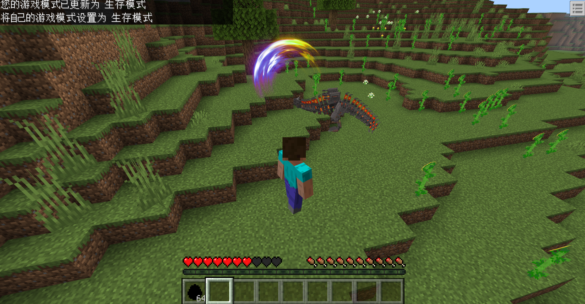

# v1.1.2<Badge type="success">Release</Badge>
## 主要更新
1. 实体配置组件Json、接口合并，并新增了连招配置功能
    

2. 新增[背包槽位](http://1.94.129.175:8000/guides/guide-26)介绍

<!-- 
1. 联机大厅新增玩家UID头显UI
2. 联机大厅新增玩家举报系统，全民评审 
3. 联机大厅新增封禁指令，依旧使用玩家名称，防止滥用UID封禁
4. 整合联机大厅控制中心，优化
-->

## 次要更新
1. <Badge type="info">1.1.2.2</Badge>优化了组件dafeimian:spawn_entity的参数dimension_id，可以自动兼容int类型
2. <Badge type="info">1.1.2.3</Badge>优化了组件dafeimian:combo_attack的参数attack_data未达到三个时实体逻辑异常
3. <Badge type="info">1.1.2.4</Badge>修复了组件dafeimian:combo_attack的参数attack_data中的sound_list异常的问题

## 新增接口
1. 新增RegisterEntityAbility(服务端)，注册自定义功能实体
2. <Badge type="info">1.1.2.3</Badge>新增SetPlayerItemByInvPos(服务端)，根据背包槽位设置玩家物品，会覆盖原有位置物品
3. <Badge type="info">1.1.2.3</Badge>新增RemovePlayerItemByInvPos(服务端)，根据背包槽位删除玩家物品
4. <Badge type="info">1.1.2.3</Badge>新增SetItemLayer(服务端)，设置物品层级贴图，仍需要手动将物品数据生成给玩家，因此使用该接口前需要清除传入的ItemDict物品

## 调整接口
1. <Badge type="info">1.1.2.4</Badge><Badge type="success">对旧代码无影响</Badge>调整SetItemLayer(服务端)，新增ExtraData参数用于自定义物品数据信息extraId，且调用该接口时，会自动给物品添加存储信息extraId ，key为Level，Value为TextureKey

