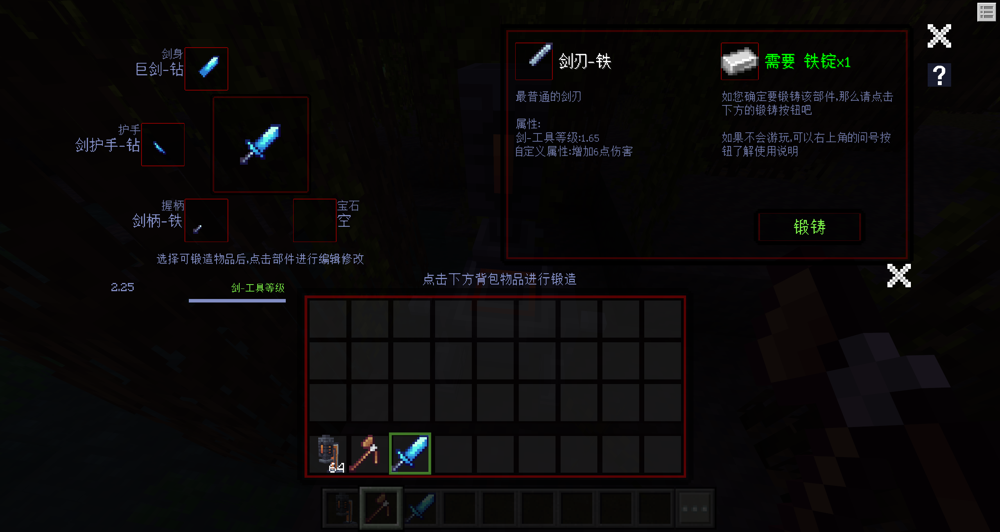

# v1.1.3<Badge type="success">Release</Badge>
## 主要更新
1. 实体配置组件Json的`dafeimian:combo_attack`现在可以对单个连招[绑定触发函数](http://1.94.129.175:8000/docs/component-customentityability#attack_data%E7%9A%84function_name%E5%AE%9E%E4%BD%93%E6%8B%9B%E5%BC%8F%E6%95%B0%E6%8D%AE%E5%8F%82%E6%95%B0)，用于制作一些特殊效果

2. 新增[源初传说:锻铸传奇](http://1.94.129.175:8000/docs/dlc_legend)接口，后续会考虑移植入灵免以太

## 次要更新
1. 优化了实体配置组件Json的`dafeimian:combo_attack`的音效参数类型，填写float 0.25将默认等效为[0.25]，而不是报错
2. <Badge type="info">1.1.3.2</Badge>实体配置组件Json的`dafeimian:spawn_entity`新增刷新实体数量的可选参数
3. <Badge type="info">1.1.3.2</Badge>修复实体配置组件Json的`dafeimian:spawn_entity`的offset参数异常的问题。旧有offset的参数为[x, z, y]，新的offset的参数为[x, y, z]，需要声明Json的format_version为1.1.3，旧有的1.1.2仍然为[x, z, y]，不受影响。
4. <Badge type="info">1.1.3.3</Badge>修复`dafeimian:spawn_entity`玩家退出游戏重进后会重复刷新的问题
5. <Badge type="info">1.1.3.5</Badge>优化了灵免以太的一些功能逻辑。

<!-- 
1. 联机大厅新增玩家UID头显UI
2. 联机大厅新增玩家举报系统，全民评审 
3. 联机大厅新增封禁指令，依旧使用玩家名称，防止滥用UID封禁
4. 整合联机大厅控制中心，优化
-->

