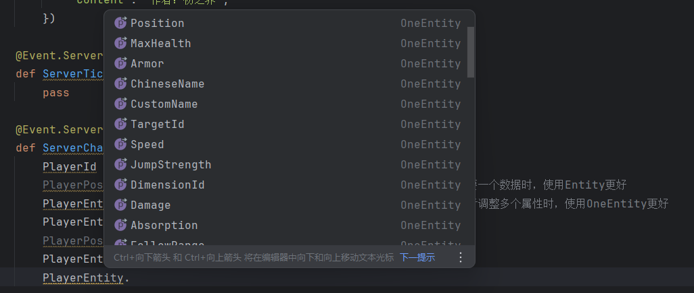

# v1.2.0<Badge type="success">Release</Badge>
## 主要更新
1. 接口动态化注册激活，游戏加载速度提升25%，新增接口使用率指标和指令`/lastates`
2. <Badge type="info">1.2.0.3</Badge>新增面向对象接口系统用法，以及实例化用法，且实现了实例化接口全动态化添加销毁，与旧版本写法仍然保持兼容！[点我查看](http://1.94.129.175:8000/docs/object-info)

```python
@Event.ServerEvent('ServerChatEvent')
def ServerChat(self, args):
    PlayerId = args['playerId']
    PlayerPos = LASystem.Entity(PlayerId).GetEntityPos()    # 当只需要一个数据时，使用Entity更好
    PlayerEntity = LASystem.OneEntity(PlayerId)     # 当需要多个属性或者调整多个属性时，使用OneEntity更好
    PlayerEntity.IsFire = True
    PlayerPos = PlayerEntity.Position
    PlayerEntity.Scale = random.uniform(0.25, 3.0)  # 不仅能获取，也可以实时修改它
```



## 次要更新
1. 修复了聊天系统优化后触控模式一场的问题
2. 优化了自定义方块交互PC操作卡顿
3. 优化了联机大厅商店的交互逻辑
4. <Badge type="info">1.1.2.4</Badge>修复了非交互CD无法交互的问题

## 调整接口
1. <Badge type="info">1.1.2.3</Badge><Badge type="success">对旧代码无影响</Badge>调整BindCustomBlockInteractFunction(服务端)，新增IsCoolDown参数用于调整交互是否有微小延迟，防止PC端交互Tick通信造成卡顿