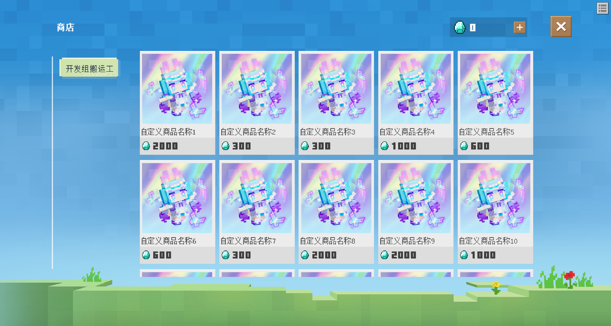
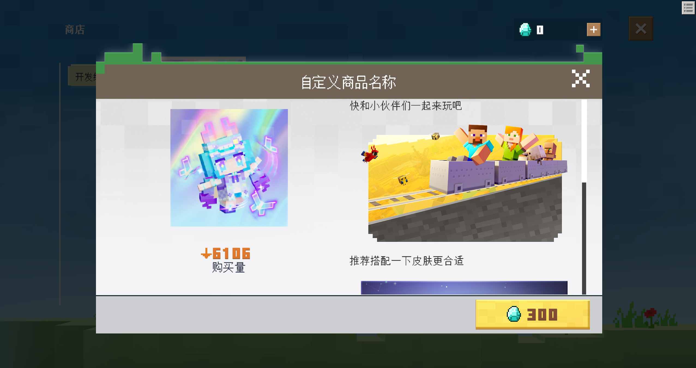

# v1.0.12<Badge type="success">Release</Badge>
## 主要更新
1. 联机大厅菜单支持注册自定义商店商品(根据标签自动分类)，这样仅需审核联机大厅货币商品，具体内容的购买内置在游戏内

    

2. 商品支持自定义介绍、统计购买量

    

    <video width="100%" controls><source src="http://1.94.129.175:8000/1012-5.mp4">你的浏览器不支持HTML5视频</video>

## 次要更新
1. 修复了因富文本首个字段为图片而无法正常显示的问题
2. 修复了签到类型在联机大厅出现异常的问题
3. <Badge type="info">1.0.12.2</Badge>修复了联机大厅刷新服务端数据冷却卡死的问题
4. <Badge type="info">1.0.12.2</Badge>修复了联机大厅刷新服务端数据导致商店公告异常显示的问题
5. <Badge type="info">1.0.12.2</Badge>修复了联机大厅商店云端价格无法发货的问题

## 新增接口
1. 新增RegisterCustomLobbyPriceType(服务端)，注册自定义联机大厅货币类型，自动绑定购买指令及发放函数，自动统计充值总额
2. 新增AddPlayerCoinInLobby(服务端)，为已注册的货币进行添加或减少，仅限于联机大厅
3. 新增RegisterCustomLobbyStore(服务端)，注册自定义联机大厅商品，需要提前注册货币
4. <Badge type="info">1.0.12.3</Badge>新增OpenStoreInLobby(客户端)，打开联机大厅商店界面

## 调整接口
1. <Badge type="error">对旧代码有影响</Badge>GetPlayerDataInLobby(服务端)，新增CallBack返回函数参数PlayerDataKeyList，将使用接口传参PlayerDataKeyList的值再次返回
2. <Badge type="success">对旧代码无影响</Badge>SetPlayerDataInLobby(服务端)，新增FunctionInstance来指定CallBack返回函数(一个dict参数)
3. <Badge type="info">1.0.12.3</Badge><Badge type="success">对旧代码无影响</Badge>RegisterCustomLobbyNotice(服务端)，签到活动类型奖励发放所绑定的函数调整为服务端函数以防止作弊行为，接受的一个dict参数会新增Key为PlayerId的玩家id参数

## 修复接口
1. <Badge type="error">对旧代码有影响</Badge>RegisterCustomLobbyNotice(服务端)，签到类型默认BindDataKey异常