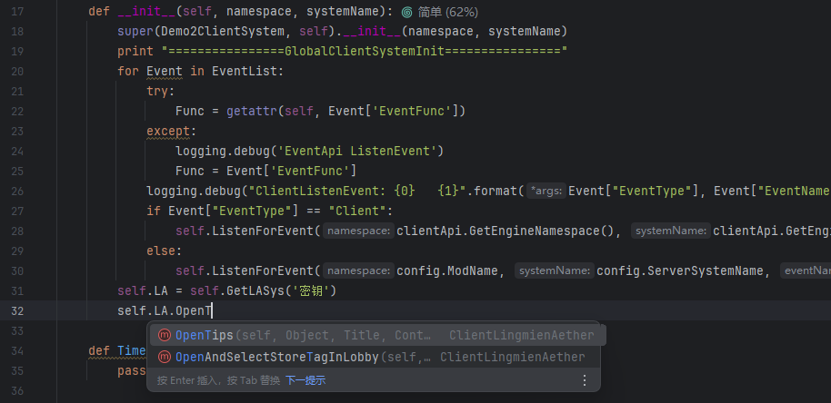
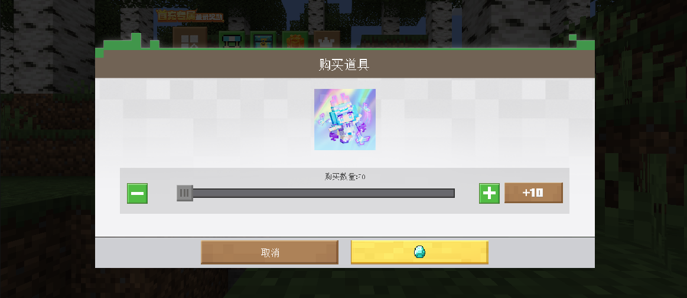
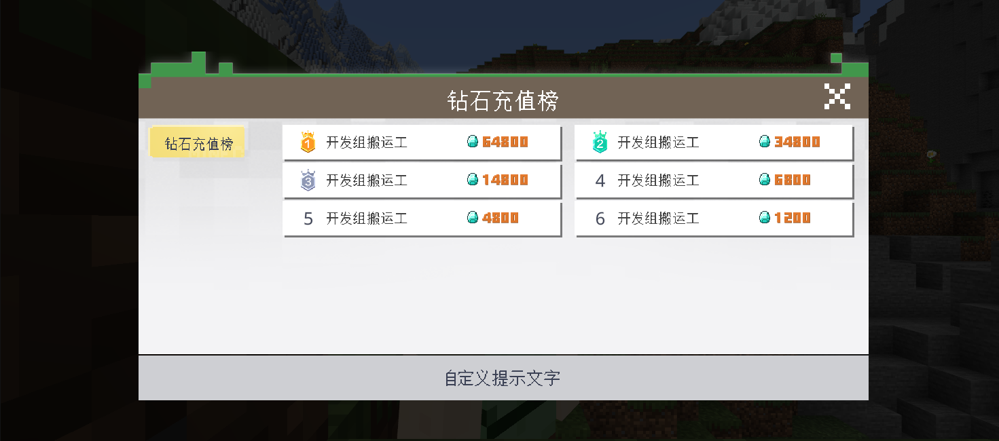

# v1.1.0<Badge type="success">Release</Badge>
:::error{title=废弃警告}
- 原有灵免以太接口系统获取将于2024年12月22日废弃
:::
## 主要更新
1. 灵免以太接口系统获取修改为密钥方式
  :::code-group

  ```python {2,4,8,10} [客户端]
  import ...
  from ClientLingmienAether import ClientLingmienAether

  class ***ClientSystem(ClientSystem, ClientLingmienAether):  # 继承补全库，方便接口补全编写代码
  def __init__(self, namespace, systemName):
      ...
      # 调用接口系统
      self.LA = self.GetLASys('密钥')
      # 使用接口CreateDefaultUI注册并创建UI
      print self.LA.CreateDefaultUI(config.ModName, GlobalConfig.UIStartName, config.ScriptsName, True)
  ```

  ```python {2,4,8,11} [服务端]
  import ...
  from ServerLingmienAether import ServerLingmienAether

  class ***ServerSystem(ClientSystem, ServerLingmienAether):  # 继承补全库，方便接口补全编写代码
  def __init__(self, namespace, systemName):
      ...
      # 调用接口系统
      self.LA = self.GetLASys('密钥')
      # 使用接口ServerMsg给所有玩家发送消息
      for PlayerId in serverApi.GetPlayerList():
          self.LA.ServerMsg(PlayerId, '这是一条自定义消息')
  ```

  :::

2. 灵免以太接口补全不再需要注释`self.LA`一行，而是可以直接补全
  
3. <Badge type="info">1.1.0.2</Badge>联机大厅商店现在支持自定义数量购买0~100份
  
5. <Badge type="info">1.1.0.2</Badge>联机大厅现在支持排行榜
  

## 次要更新
1. <Badge type="info">1.1.0.2</Badge>修复了联机大厅房间数据刷新导致玩家背包物品回档的问题
2. <Badge type="info">1.1.0.2</Badge>新增了联机大厅玩家等级跨存档存储
3. <Badge type="info">1.1.0.2</Badge>联机大厅反作弊升级规避微软漏洞
4. <Badge type="info">1.1.0.2</Badge>联机大厅更新封禁系统
5. <Badge type="info">1.1.0.2</Badge>联机大厅将会直接封禁`命令方块类`、`经验瓶`物品及相关实体，如需使用，须解除相关封禁
6. <Badge type="info">1.1.0.2</Badge>联机大厅新房间默认世界时间为0
7. <Badge type="info">1.1.0.3</Badge>修复联机大厅排行榜异常、商品批量购买货币扣除异常等恶性问题
8. <Badge type="info">1.1.0.4</Badge>修复了联机大厅房主为管理员时，退出游戏后退出房间后其他玩家权限将变为管理员的问题
<!-- 
1. 联机大厅新增玩家UID头显UI
2. 联机大厅新增玩家举报系统，全民评审 
3. 联机大厅新增封禁指令，依旧使用玩家名称，防止滥用UID封禁
4. 整合联机大厅控制中心，优化
-->

## 新增接口
1. 新增RegisterCustomLobbyRank(服务端)，注册联机大厅排行榜，使用GetModRenderAttrByKey接口Key为RankListBy{BindDataKey}获取排行榜list数据
2. 新增RegisterOPPlayerUIDInLobby(服务端)，注册联机大厅管理员UID

## 调整接口
1. <Badge type="success">对旧代码无影响</Badge>调整SetIsDisable(服务端)，新增设置项IsLobbyKick，是否限制玩家二次进入本房间/存档
2. <Badge type="info">1.1.0.3</Badge><Badge type="error">对旧代码有影响</Badge>调整RegisterCustomLobbyStore(服务端)，返回参数新增key BuyNumTimes，表示批量购买数量
3. <Badge type="info">1.1.0.5</Badge><Badge type="error">对旧代码有影响</Badge>调整GetPlayerDimension(服务端)，玩家维度数据加载策略