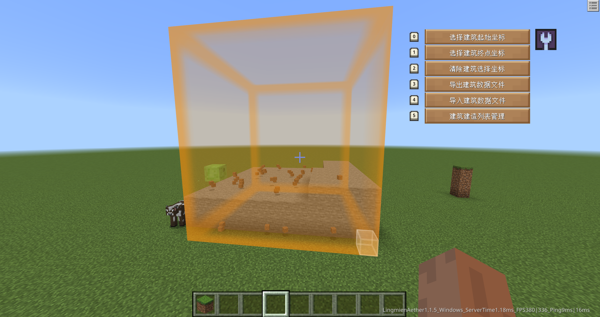
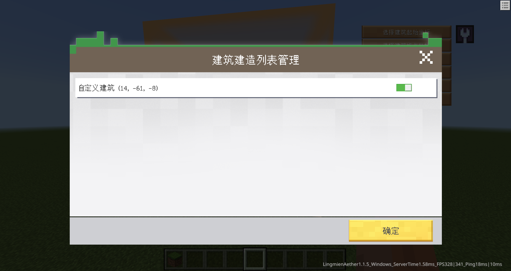
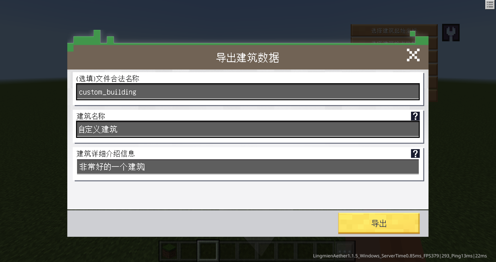

# v1.1.5<Badge type="success">Release</Badge>
## 主要更新
1. 新增自定义表单功能及配置组件`dafeimian:form`
2. 新增自定义调试工具注册功能
3. 新增指令`/debugtools`用于打开开发者调试工具
4. <Badge type="info">1.1.5.3</Badge>建筑工具新增暂停、继续功能，建造过程中，建造的区域会用橙色特效标注
  
  

## 次要更新
1. 优化BindGameHighTickFunction的性能，当不存在高Tick函数时，将不会执行损耗性能
2. 通过分帧、协程等了优化灵免以太性能
3. 优化了本地环境下开启灵免以太联机大厅模式的日志刷屏
4. 优化建筑工具导出的json文件，将会携带该建筑所需的方块数量信息、建筑大小信息
  ```json
  {
    ...   
    "dafeimian:building_require": {
      "minecraft:oak_planks:0": 3, 
      "minecraft:light_gray_wool:0": 2, 
      "minecraft:dirt:0": 1, 
      "minecraft:spruce_planks:0": 2, 
      "minecraft:stone_stairs:2": 1, 
      "minecraft:grass:0": 41, 
      "minecraft:stone_stairs:0": 2, 
      "minecraft:wooden_door:2": 1, 
      "minecraft:white_wool:0": 5, 
      "minecraft:stone_stairs:1": 1, 
      "minecraft:wooden_door:8": 1
    },
    "dafeimian:building_scale": [
        1, 
        0, 
        1
    ], 
    ...
  }
  ```
5. <Badge type="info">1.1.5.3</Badge>美化表单界面显示层次感
  
6. <Badge type="info">1.1.5.4</Badge>修复刚进入世界时身边有对话实体的时候卡对话交互的问题
7. <Badge type="info">1.1.5.4</Badge>修复重新进入加载界面时显示错误的问题
8. <Badge type="info">1.1.5.4</Badge>修复了对话系统重置错误的问题
9. <Badge type="info">1.1.5.4</Badge>优化联机大厅菜单显示


## 新增接口
1. 新增RegisterDebugTool(客户端)，动态注册自定义调试工具
2. 新增CreateFormByJsonId(客户端)，根据配置文件创建自定义表单
3. <Badge type="info">1.1.5.3</Badge>新增AreaSfx(客户端)，创建区域包围盒特效
4. <Badge type="info">1.1.5.3</Badge>新增ClearAreaSfx(客户端)，销毁区域包围盒特效
5. <Badge type="info">1.1.5.3</Badge>新增PlaceBuildingByJsonId(客户端)，根据配置组件放置建筑
6. <Badge type="info">1.1.5.3</Badge>新增PausePlaceBuilding(客户端)，暂停建筑建造
7. <Badge type="info">1.1.5.3</Badge>新增ContinuePlaceBuilding(客户端)，继续建筑建造
8. <Badge type="info">1.1.5.3</Badge>新增DebugPlaceBuildingList(客户端)，打开建筑建造列表管理界面
9. <Badge type="info">1.1.5.4</Badge>新增CreateTipsTitle(客户端)，创建并显示一个提示标题
10. <Badge type="info">1.1.5.4</Badge>新增CreateEntityChatUI(客户端)，创建实体自言自语UI
11. <Badge type="info">1.1.5.4</Badge>新增OpenDebugToolMenu(客户端)，打开调试工具指定工具菜单
12. <Badge type="info">1.1.5.4</Badge>新增CloseDebugToolMenu(客户端)，关闭调试工具指定工具菜单


