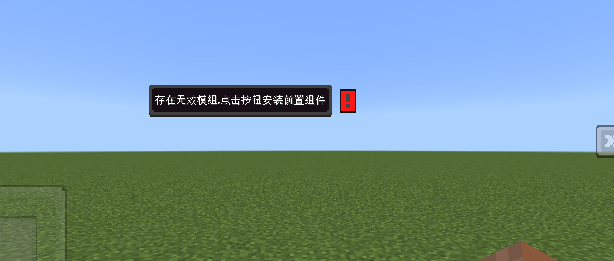
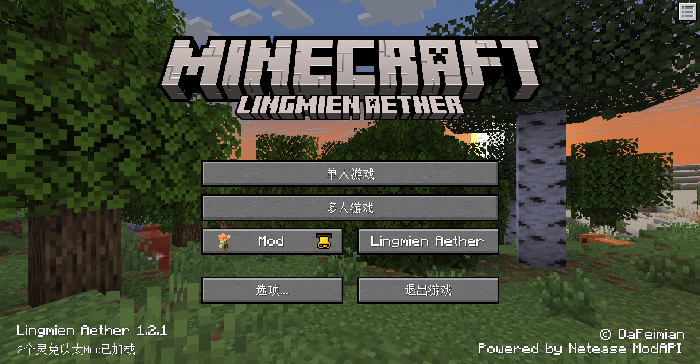
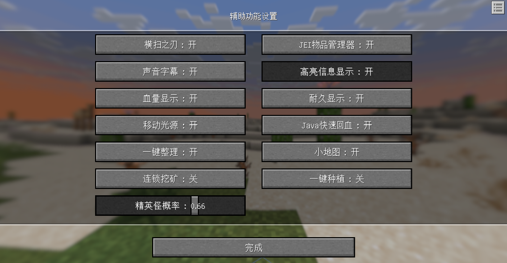

# v1.2.1<Badge type="success">Release</Badge>
## 主要更新
1. 新增了`Entity`实体对象、`Block`方块对象、`Item`物品对象、`OneItem`物品对象+流式接口
2. 新增了[自定义依赖组件](/docs/component-config)`dafeimian:require_mod`，可以方便快捷提示玩家需要安装前置组件

3. <Badge type="info">1.2.1.2</Badge>更新主界面背景盒

4. <Badge type="info">1.2.1.3</Badge>新增了组件配置功能，高效为组件制作自定义设置

5. <Badge type="info">1.2.1.4</Badge>新增了多人游戏功能内容，引流联机大厅组件

## 次要更新
1. OneEntity新增了`KnockBackResistance`, `JumpStrength`, `Armor`, `Name`, `DimensionId`, `OwnerId`, `TargetId`
2. <Badge type="info">1.2.1.2</Badge>优化了启动界面的手持物品显示
3. <Badge type="info">1.2.1.2</Badge>修复了OneItem空物品时ExtraId报错的问题
4. <Badge type="info">1.2.1.3</Badge>修复了主界面1像素偏差问题
5. <Badge type="info">1.2.1.3</Badge>同步了Java新版主界面按钮悬浮贴图
6. <Badge type="info">1.2.1.3</Badge>自定义玩家渲染dafeimian:entity中的自定义渲染控制器支持条件格式
```json
{
  "format_version": "1.2.1",
  "dafeimian:render": {
    "components": {
      "dafeimian:entity": {
        "animations": [
          "idle",
          "none"
        ],
        "animation_controllers": [
          "controller.animation.bgbox.idle"
        ],
        "render_controllers": [
          {
            "controller.render.la": "!query.mod.la"
          },
          {
            "controller.render.is_la": "query.mod.la"
          }
        ],
        "material_by_render_controller": {
          "la": "dfm_nolight"
        },
        "geometry_by_render_controller": {
          "la": "geometry.bgbox"
        },
        "texture_by_render_controller": {
          "la": "textures/entity/bgbox",
          "is_la": "textures/entity/bgbox_mohu"
        }
      }
    }
  }
}
```
7. <Badge type="info">1.2.1.4</Badge>原版下拉菜单新增模组配置按钮，点击可直接打开灵免以太界面
8. <Badge type="info">1.2.1.6</Badge>修复了吞掉报错提示的问题
9. <Badge type="info">1.2.1.6</Badge>修复了点击代理界面无法隐藏手部物品的问题


## 新增接口
1. <Badge type="info">1.2.1.2</Badge>新增了WorldPlaySfx(客户端)，真正的在世界中特效播放，不广播则只能自己看到
2. <Badge type="info">1.2.1.2</Badge>新增了WorldSfxToEveryBody(客户端)，在世界中播放特效(自动广播)
3. <Badge type="info">1.2.1.2</Badge>新增了GetRadiusEntities(双端)，获取实体Id的周围的实体列表
4. <Badge type="info">1.2.1.3</Badge>新增了RegisterModSettingConfig(客户端)注册模组设置配置
5. <Badge type="info">1.2.1.3</Badge>新增了GetModConfigValue(客户端)获取模组设置的值，没有则返回None

## 调整接口
1. <Badge type="info">1.2.1.1</Badge><Badge type="success">对旧代码无影响</Badge>OneEntity，新增IsLogging参数用于调整是否输出常规日志，默认为False
2. <Badge type="info">1.2.1.2</Badge><Badge type="success">对旧代码无影响</Badge>调整了PlaySfxToEveryBody(客户端)，新增可选参数SfxTimer用来调整特效的播放延迟

## 修复接口
1. <Badge type="info">1.2.1.2</Badge>修复了RealPlaySfx(客户端)，播放中国版粒子特效的绑定错误的问题
2. <Badge type="info">1.2.1.2</Badge>修复了PlaySfxToEveryBody(客户端)，播放中国版粒子特效的绑定错误的问题
3. <Badge type="info">1.2.1.2</Badge>修复了PlaySfxToEveryBody(客户端)，参数FaceCamara拼写错误，调整为FaceCamera，对旧有拼写仍然保证兼容。
4. <Badge type="info">1.2.1.5</Badge>修复l GetModConfigValue(客户端)，使用环境报错的问题